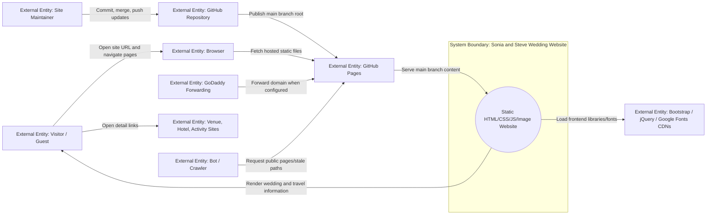
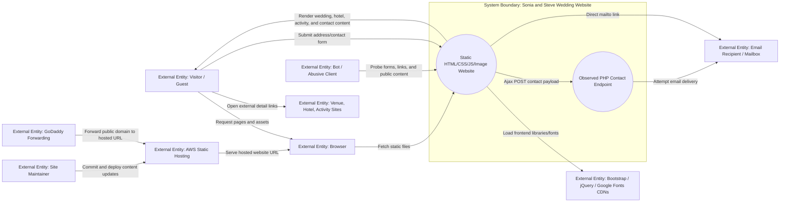
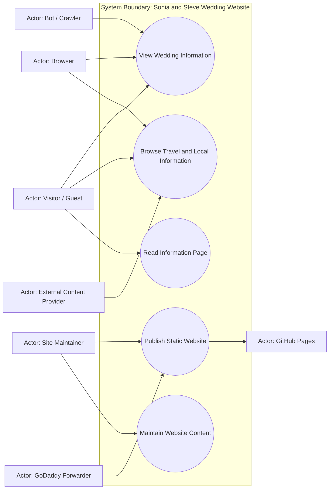
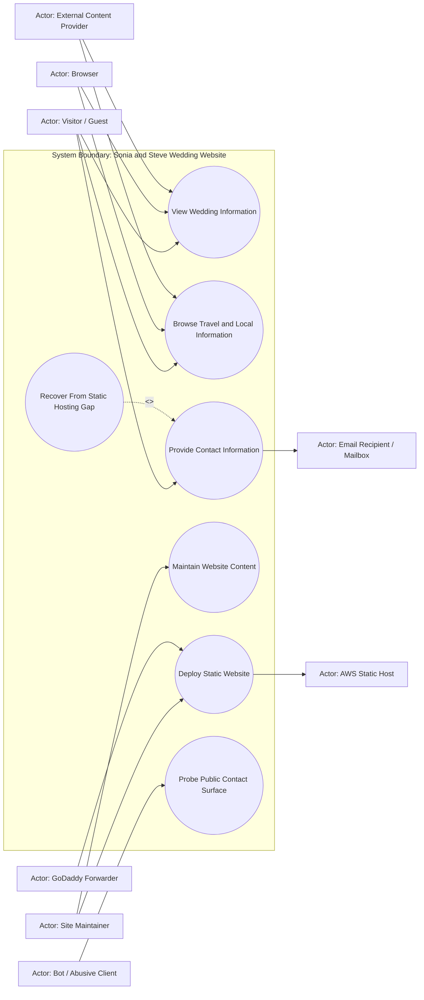
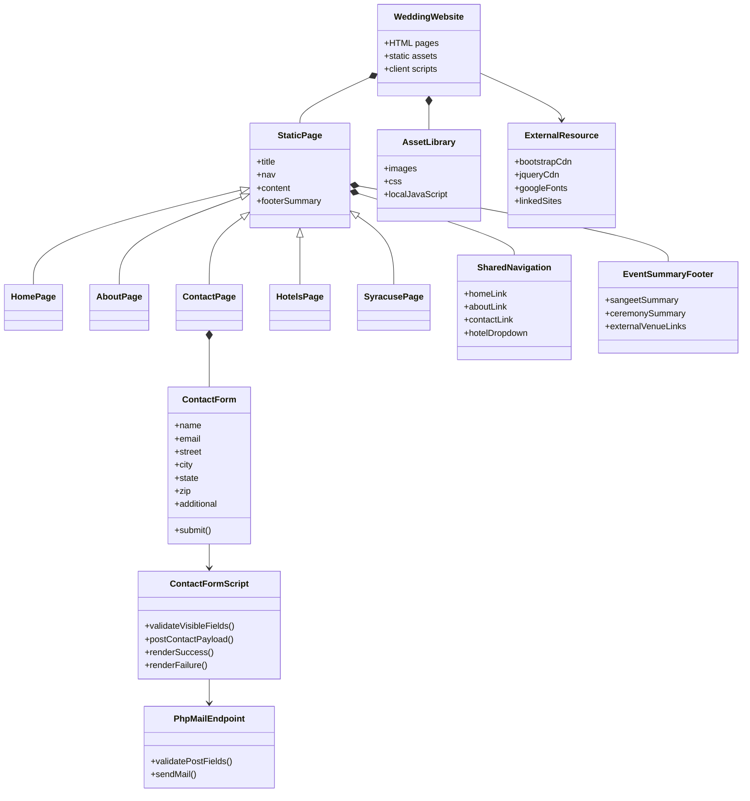
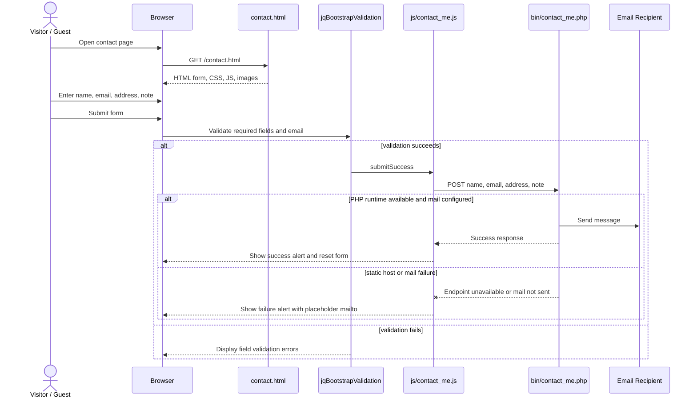
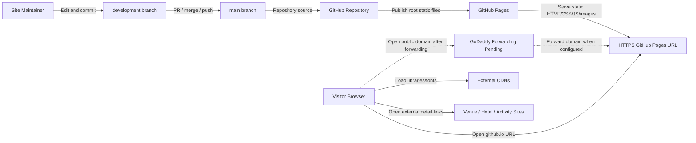

# Historical Documentation Archive - 2026-06-20

This file preserves older documentation sections that conflicted with the current canonical documentation. They were moved out of the durable source-of-truth files so the main documentation remains coherent while historical reasoning is still available.

## Archived Material From `documentation\requirements\current-state-design.md`

Moved from `current-state-design.md` on 2026-06-20. This material is historical and is not current source of truth.

## Historical Material Notice

Sections below this notice may include earlier AWS, PHP, contact-form, and case-mismatch analysis. Use the 2026-06-20 refresh above as the current source of truth unless a later section explicitly says it supersedes this refresh.

## Implementation Update
Current authoritative state as of the latest refresh: the website is a static GitHub Pages site published from `main` at `https://skeller01.github.io/wedding-website/`. `development` and `main` both point at commit `82487fd`.

The GitHub Pages publication sprint removed the obsolete PHP contact path from the public site. `contact.html` is now a static informational page, root HTML pages no longer load `js/contact_me.js` or `js/jqBootstrapValidation.js`, and `bin/contact_me.php` / `js/contact_me.js` were deleted.

The UX polish sprint changed the public site from an invitation/address collection workflow to an archival/static wedding information site. Current live behavior includes the `Info` and `Travel` navigation labels, a home CTA to hotel/Syracuse details, mobile viewport metadata, improved page titles and alt text, and hotel cost wording of `See hotel site`.

Remaining known work: GoDaddy forwarding is partially verified because it works on the user's phone but not yet from the user's home browser, several external hotel/activity links are stale or suspect, and unused countdown/validation assets remain in the repository. Mobile responsiveness has been observed on the user's phone. Older sections below may still describe AWS/PHP/form-era risks; treat the refresh notes at the top of each rerun section as authoritative for current planning.

## Context Diagram and Matrix

### Current Authoritative Snapshot

This rerun updates the context model from "AWS static hosting with a PHP/contact-form conflict" to "GitHub Pages static publication with stale external-link and domain-forwarding follow-up work."

#### Source Inputs
- Current repository state: root HTML/CSS/JS/image files on `development` and `main` at `82487fd`.
- Current live deployment: GitHub Pages from `main`, path `/`, HTTPS enforced.
- Static scan: 5 HTML pages, 65 local references resolved, 0 missing references, 0 server-side runtime references, 0 PHP files.
- User updates: GoDaddy forwarding works on phone but not yet from the user's home browser; mobile presentation looks responsive on phone; some travel/local links are stale, including Jefferson Clinton rebranding and the kayak business likely being closed.
- Planning artifacts: `documentation/planning/working/refactor-plan.md`, `documentation/planning/sprints/github-pages-publication.md`, `documentation/planning/working/prototype-lab.md`.

#### System Boundary
The system is the "Sonia and Steve Wedding Website": static HTML, CSS, JavaScript, and images served through GitHub Pages. The system includes public pages, local assets, client-side navigation/tooltip behavior, and the static no-collection information page. It excludes GoDaddy forwarding setup, third-party hotel/activity websites, and any RSVP/contact-form backend.

#### Inside the System
| Internal Element | Description | Evidence |
|---|---|---|
| Static HTML pages | Home, story, info, hotels, and Syracuse guide pages. | Root `*.html` files. |
| Styling and layout | Bootstrap CDN plus `css/style.css`. | HTML links and CSS file. |
| Client-side behavior | Bootstrap navigation/tooltips plus remaining legacy countdown code. | Script tags and `js/*`. |
| Image assets | Local image files used by pages. | `images/*`; static scan passes. |
| Static verification scripts | PowerShell/Python prototype scanners. | `documentation/planning/working/prototypes/*`. |
| Documentation workspace | Requirements, design, sprint, prototype, and refactor docs. | `documentation/*`. |

#### Outside the System
| External Entity | Type | Current Role |
|---|---|---|
| Visitor / Guest | Person | Reads public wedding, hotel, and Syracuse information. |
| Site Maintainer | Person | Edits content, verifies checks, and publishes through Git/GitHub. |
| Browser | Runtime | Requests and renders pages/assets. |
| GitHub Repository | External service | Stores source and branch history. |
| GitHub Pages | External host | Publishes the static site from `main`. |
| GoDaddy Forwarding | External service | Partially verified public-domain forwarding to GitHub Pages. |
| External CDNs | External services | Serve Bootstrap, jQuery, and Google Fonts. |
| Venue / Hotel / Activity Sites | External websites | Linked destinations; some are stale/suspect. |
| Bot / Crawler | Unintended actor | May request public pages or removed legacy paths. |

#### Mermaid Context Diagram



#### Context Matrix
| External Entity | Interaction | Direction | Category | Current Status / Constraint |
|---|---|---|---|---|
| Visitor / Guest | View wedding information | In/Out | Query/response | Implemented and live on GitHub Pages. |
| Visitor / Guest | Browse travel/local information | In/Out | Query/response | Implemented, but external destination freshness is pending. |
| Visitor / Guest | Read static info page | In/Out | Query/response | Implemented; no address, RSVP, or message collection. |
| Browser | Load local assets | In/Out | Startup/query | Static scan passes. |
| Browser | Load external CDN assets | Out/In | Startup/query | Required script URLs are HTTPS. |
| Site Maintainer | Update and publish content | In | Maintenance | `development` -> `main` workflow works; Pages publishes from `main`. |
| GitHub Pages | Serve public HTTPS site | Out | Runtime | Implemented; Pages API reports built/public/HTTPS-enforced. |
| GoDaddy Forwarding | Route public domain | In/Out | Network | Partially verified on phone; home browser still failing. |
| Venue / Hotel / Activity Sites | Provide offsite detail pages | Out/In | Query/response | Known risk: stale/rebranded/closed destinations. |

#### High-Value Use Case Candidates
| Priority | Use Case ID | Use Case | Primary Actor | Current Planning Note |
|---|---|---|---|---|
| High | UC-001 | View Wedding Information | Visitor / Guest | Implemented/live. |
| High | UC-002 | Browse Travel and Local Information | Visitor / Guest | Implemented, but link freshness needs a sprint. |
| Medium | UC-003 | Read Information Page | Visitor / Guest | Replaces old contact/address form use case. |
| High | UC-004 | Publish Static Website | Site Maintainer | Implemented for GitHub Pages; GoDaddy forwarding partially verified on phone. |
| Medium | UC-005 | Maintain Website Content | Site Maintainer | Next work: external links, dead assets, doc reconciliation. |

#### Current Gaps and Questions
- What exact GoDaddy domain should be recorded, and why does it work on phone but not home browser?
- Which stale external links should be replaced with durable Visit Syracuse/current hotel links versus removed?
- Should the `Info` page stay in navigation if there is no contact channel?
- Should unused countdown and validation assets be deleted in the next sprint?

### Source Inputs
- User goal: host the wedding website cheaply on AWS, then point a GoDaddy URL to the hosted link.
- Repository files: `index.html`, `about.html`, `contact.html`, `hotels.html`, `syracuse.html`.
- Supporting assets: `css/style.css`, `js/app.js`, `js/contact_me.js`, `js/jqBootstrapValidation.js`, `js/jquery.countdown.js`, `bin/contact_me.php`, `images/*`.
- Prototype evidence: `documentation/planning/working/prototypes/static_site_scan.ps1` found 5 HTML pages, 75 resolved local references, 1 case-sensitive asset issue, 1 PHP runtime dependency, and 15 external references.

### System Boundary
The system is the "Sonia and Steve Wedding Website": a small public website made of static HTML, CSS, JavaScript, and image assets, plus an observed PHP mail endpoint for the contact form. For the current AWS goal, the deployable system boundary should be treated as static web content unless a replacement contact-form backend is intentionally added.

### Inside the System
| Internal Element | Description | Evidence |
|---|---|---|
| Static HTML pages | Public pages for home, story, contact/address request, hotels, and Syracuse activities. | Observed in root `*.html` files. |
| Shared navigation/footer markup | Repeated Bootstrap navbar and event summary footer across pages. | Observed in all five HTML pages. |
| Styling layer | Custom CSS plus Bootstrap CDN styling and Google Fonts. | Observed in `css/style.css` and page `<link>` tags. |
| Image assets | Photos and decorative images used by the pages. | Observed in `images/*`; prototype found one case mismatch. |
| Client-side scripts | Bootstrap interactions, countdown code, validation plugin, contact form Ajax. | Observed in `js/*` and script tags. |
| Contact form UI | Address/contact form on `contact.html`. | Observed in `contact.html`. |
| PHP mail endpoint | Server-side endpoint for attempted email submission. | Observed in `bin/contact_me.php` and `js/contact_me.js`. |

### Outside the System
| External Entity | Type | Description | Evidence |
|---|---|---|---|
| Visitor / Guest | Person | Reads event, hotel, activity, story, and contact information. | Primary user implied by site content. |
| Site Maintainer | Person | Updates files, deploys site, and corrects broken links/content. | Repository ownership and GitHub workflow. |
| Browser | Runtime | Fetches HTML, CSS, JS, images, and external resources. | Static website architecture. |
| External CDNs | External service | Serve Bootstrap, jQuery, and Google Fonts. | External references in HTML scan. |
| Venue / hotel / activity sites | External websites | Destination links for event, hotel, and local activity details. | External references in HTML scan. |
| Email recipient / mailbox | External system | Receives direct mailto messages or PHP-generated contact messages. | `mailto:` link and PHP mail script. |
| AWS static host | External service | Proposed public hosting target for static assets. | User goal. |
| GoDaddy forwarding | External service | Proposed domain redirection to AWS URL. | User goal. |
| Bot / abusive client | Unintended actor | Could scrape contact address, submit spam, or probe endpoint paths. | Public website risk. |

### Mermaid Context Diagram



### Context Matrix
| External Entity | Interaction | Direction | Category | System Input | System Output | Frequency / Volume | Assumptions | Constraints |
|---|---|---|---|---|---|---|---|---|
| Visitor / Guest | View home page | In/Out | Query/response | Page request | Home content, hero image, event summary | Occasional public traffic | Wedding guests or invitees are primary users. | Must work on common browsers. |
| Visitor / Guest | Navigate pages | In/Out | Query/response | Link click | About, contact, hotel, local activity pages | Occasional | Navigation should remain simple. | Current nav markup is duplicated per page. |
| Visitor / Guest | Submit contact/address information | In | Command/input | Name, email, address, note | Success/failure UI; attempted email | Low volume | Current form intent is address collection. | Static hosting will not execute PHP. |
| Visitor / Guest | Use direct email link | Out | Response/command | Mailto click | Opens mail client | Low volume | Direct email can replace broken PHP in minimal static deployment. | Depends on visitor mail client. |
| Browser | Load local assets | In/Out | Startup/query | Asset requests | CSS, JS, images | Per page view | Assets should be path- and case-correct. | `images/kayak.jpg` mismatches `images/kayak.JPG`. |
| Browser | Load external CDN assets | Out/In | Startup/storage | CDN requests | Bootstrap, jQuery, fonts | Per page view | External CDNs stay available. | Mixed `http://` jQuery can fail or warn under HTTPS. |
| Venue / hotel / activity sites | Provide linked detail content | Out/In | Query/response | Link click | External pages | User-driven | External links may be stale. | Outside repository control. |
| Site Maintainer | Update and deploy content | In | Maintenance | Git changes | Published website update | Infrequent | Changes happen on `development` before main. | Deployment process not yet automated. |
| AWS static host | Serve site publicly | Out | Runtime | Deployed assets | Public HTTPS URL | Continuous | AWS Amplify is proposed minimal path. | Static host cannot run PHP. |
| GoDaddy forwarding | Route custom URL | In/Out | Network | User domain request | Redirect to AWS URL | Per visitor | User wants GoDaddy forwarding instead of DNS migration. | Forwarding behavior controlled in GoDaddy. |
| Bot / abusive client | Spam/probe public contact paths | In | Unintended use/security | Form posts, path probes | Errors, possible spam | Unknown | Public form attracts unwanted traffic if backend exists. | No auth or anti-spam controls currently exist. |

### High-Value Use Case Candidates
| Priority | Use Case ID | Use Case | Primary Actor | Trigger | System Response | Source Interaction | Notes |
|---|---|---|---|---|---|---|---|
| High | UC-001 | View Wedding Information | Visitor / Guest | Visitor opens site URL | Render home page and event summary | Page request | Core public value. |
| High | UC-002 | Browse Travel and Local Information | Visitor / Guest | Visitor selects hotel/local pages | Render hotel/activity details and external links | Navigation/link click | Important for guests planning travel. |
| High | UC-003 | Provide Contact Information | Visitor / Guest | Visitor opens contact page or submits form | Render contact form; currently attempts PHP mail POST | Contact form interaction | Needs decision before static deploy. |
| Medium | UC-004 | Maintain Website Content | Site Maintainer | Maintainer edits files | Updated content can be committed and deployed | Git/deploy workflow | Needed for future cleanup and hosting. |
| Medium | UC-005 | Deploy Static Website | Site Maintainer | Maintainer publishes from GitHub | AWS host serves public URL | AWS hosting goal | Captured in deployment footprint. |

### Secondary / Unintended Use Cases
| Priority | Use Case | Actor | Risk or Concern | Expected System Response |
|---|---|---|---|---|
| Medium | Probe Contact Endpoint | Bot / Abusive Client | Spam or endpoint discovery | Static deployment should avoid executable PHP endpoint. |
| Medium | Load Site Over HTTPS | Browser | Mixed `http://` jQuery can be blocked or downgraded | Use HTTPS CDN URLs or local vendor assets. |
| Low | Visit Stale External Link | Visitor / Guest | Linked third-party sites may change or disappear | Prefer current links where practical; failures are outside system control. |

### Assumptions
- The near-term deployment target is a public static website hosted cheaply on AWS.
- GoDaddy will forward the public URL rather than delegating DNS to AWS Route 53.
- The legacy PHP contact flow is not required for the first static hosting slice unless the user confirms otherwise.
- Existing wedding content is intentionally preserved unless a cleanup request changes it.

### Gaps and Questions
- Should the contact form be removed, converted to `mailto:`, or replaced with a backend later?
- Should outdated 2017 wedding-specific copy be preserved as archival content or refreshed?
- Should external `http://` links be upgraded where HTTPS equivalents exist?
- Should the repo keep vendored Bootstrap validation zip/source files?

### Follow-On Artifacts
- Use case diagram entries: UC-001 through UC-005.
- Behavioral matrices: UC-001, UC-002, UC-003, UC-005.
- Functional requirements: static page rendering, navigation, asset integrity, contact fallback, HTTPS-safe resources, deployment.
- FFBD and IDEF0: public browsing and static deployment flows.
- FMEA: contact failure, mixed content, broken image paths, stale links, deployment drift.

## Use Case Diagram

### Current Authoritative Snapshot

#### Source Inputs
- Refreshed Context Diagram and Matrix snapshot above.
- Current root HTML pages and navigation labels.
- GitHub Pages deployment state.
- User statement that GoDaddy forwarding works on phone but not home browser, mobile layout looks responsive, and travel/local links are stale.

#### System Boundary
System boundary: Sonia and Steve Wedding Website. The boundary includes static public content and client-side behavior served through GitHub Pages. It excludes third-party linked websites, GoDaddy account configuration, and any RSVP/contact backend.

#### Actors
| Actor ID | Actor | Type | Description | Source |
|---|---|---|---|---|
| A-001 | Visitor / Guest | Person | Reads public wedding, hotel, and Syracuse information. | Site content. |
| A-002 | Site Maintainer | Person | Updates content and publishes through Git/GitHub. | Current workflow. |
| A-003 | Browser | Runtime | Requests and renders pages/assets. | Static website behavior. |
| A-004 | External Content Provider | External system | CDN or linked venue/hotel/activity site. | External references. |
| A-005 | GitHub Pages | External service | Publishes `main` branch static content. | Current deployment. |
| A-006 | GoDaddy Forwarder | External service | Redirect from public domain to GitHub Pages; currently works on phone but not home browser. | User update. |
| A-007 | Bot / Crawler | Unintended actor | Requests public pages or removed legacy paths. | Public website risk. |

#### Use Cases
| Use Case ID | Use Case | Goal | Primary Actor | Priority | Source Interaction |
|---|---|---|---|---|---|
| UC-001 | View Wedding Information | Read names, date framing, story, and event summary. | Visitor / Guest | High | Page request/navigation. |
| UC-002 | Browse Travel and Local Information | Find hotel and Syracuse activity guidance. | Visitor / Guest | High | Travel navigation and external links. |
| UC-003 | Read Information Page | Understand the site is informational and not collecting addresses, RSVPs, or messages. | Visitor / Guest | Medium | `Info` page request. |
| UC-004 | Publish Static Website | Serve verified content through GitHub Pages. | Site Maintainer | High | Merge/push to `main`, Pages build. |
| UC-005 | Maintain Website Content | Refresh stale links, remove dead assets, and keep docs/checks current. | Site Maintainer | Medium | Git workflow. |

#### Mermaid Use Case Diagram



#### Relationship Notes
| Source | Relationship | Target | Meaning |
|---|---|---|---|
| UC-002 | Dependency note | External Content Provider | Travel/local pages can link outward, but external sites are outside system control. |
| UC-004 | Dependency note | GoDaddy Forwarder | GoDaddy verification is partially complete on phone; home-browser behavior still needs diagnosis. |
| UC-005 | Dependency note | UC-002 | Content maintenance should refresh stale hotel/activity links. |

#### Follow-On Behavioral Models
Highest-value behavioral matrices: UC-002 Browse Travel and Local Information, UC-004 Publish Static Website, and UC-005 Maintain Website Content. UC-001 and UC-003 are stable and simple.

### Source Inputs
- Context Diagram and Matrix section above.
- Repository files listed in Context Source Inputs.
- Prototype scan evidence from `documentation/planning/working/prototypes/static_site_scan.ps1`.

### System Boundary
System boundary: Sonia and Steve Wedding Website. The boundary includes public static content, client-side behavior, and the observed contact form UI. The PHP endpoint is documented as current repository content, but not considered compatible with the proposed static AWS deployment without additional runtime support.

### Actors
| Actor ID | Actor | Type | Description | Source |
|---|---|---|---|---|
| A-001 | Visitor / Guest | Person | Reads wedding information and may provide contact/address details. | Site content. |
| A-002 | Site Maintainer | Person | Updates content, fixes assets, and deploys the site. | GitHub/development workflow. |
| A-003 | Browser | Runtime | Requests and renders files. | Static website behavior. |
| A-004 | External Content Provider | External system | CDN or linked venue/hotel/activity site. | External references. |
| A-005 | Email Recipient / Mailbox | External system | Receives direct or submitted messages. | `mailto:` and PHP script. |
| A-006 | AWS Static Host | External service | Serves the deployed site. | User goal. |
| A-007 | GoDaddy Forwarder | External service | Redirects public domain traffic to the AWS URL. | User goal. |
| A-008 | Bot / Abusive Client | Unintended actor | Attempts spam, scraping, or endpoint probing. | Public website risk. |

### Use Cases
| Use Case ID | Use Case | Goal | Primary Actor | Priority | Source Interaction |
|---|---|---|---|---|---|
| UC-001 | View Wedding Information | Read event details, names, date, location, and story. | Visitor / Guest | High | Page request and navigation. |
| UC-002 | Browse Travel and Local Information | Find hotels, venue details, and Syracuse activity links. | Visitor / Guest | High | Hotel/local page navigation. |
| UC-003 | Provide Contact Information | Send address/contact information or contact the couple directly. | Visitor / Guest | High | Contact page form and `mailto:` link. |
| UC-004 | Maintain Website Content | Update site files and correct content/assets. | Site Maintainer | Medium | Git changes. |
| UC-005 | Deploy Static Website | Publish the website to a cheap public AWS URL. | Site Maintainer | High | AWS hosting goal. |
| UC-006 | Recover From Static Hosting Gap | Preserve user contact path when PHP is unavailable. | Site Maintainer | High | Static deployment constraint. |

### Mermaid Use Case Diagram



### Relationships
| Source | Relationship | Target | Meaning |
|---|---|---|---|
| UC-006 Recover From Static Hosting Gap | `<<extend>>` | UC-003 Provide Contact Information | Static hosting creates a conditional contact-form fallback or replacement need. |
| UC-005 Deploy Static Website | Association | AWS Static Host | Deployment publishes static assets to public hosting. |
| UC-005 Deploy Static Website | Association | GoDaddy Forwarder | Public domain forwards users to hosted URL. |

### Scope Notes
- Inside scope: public content, client-side rendering, static assets, contact page user experience, deployment documentation.
- Outside scope for minimal deployment: executable PHP mail hosting, database storage, authentication, custom DNS migration to Route 53.

### Secondary / Unintended Use Cases
| Use Case | Actor | Reason Included | Priority |
|---|---|---|---|
| Probe Public Contact Surface | Bot / Abusive Client | Public forms and mail endpoints can attract spam. | Medium |
| Experience Mixed Content Blocking | Browser | HTTP CDN scripts may be blocked on HTTPS hosting. | Medium |
| Encounter Broken Media | Visitor / Guest | Case-sensitive static hosts can fail on `kayak.jpg` vs `kayak.JPG`. | Medium |

### Assumptions
- AWS Amplify Hosting or equivalent static hosting is the preferred near-term mode.
- Visitors do not need accounts, personalization, or persistent state.
- A direct email fallback is acceptable unless the user asks for a real form backend.

### Gaps and Questions
- Confirm whether the address collection form still matters for the current audience.
- Confirm whether the public site should remain wedding-era content or become an archival page.

### Follow-On Behavioral Models
- Expand UC-001, UC-002, UC-003, and UC-005 into use case behavioral matrices.

## Mermaid Class Diagram

### Source Inputs
- Root HTML pages, `css/style.css`, `js/app.js`, `js/contact_me.js`, `bin/contact_me.php`.
- Current-state context and use case sections.

### System Summary
The repository is not an object-oriented application. Its structure is best represented as a set of static page artifacts, shared page regions, client-side scripts, external resources, image assets, and one observed server-side mail endpoint.

### Diagram Confidence
Mixed: page/module relationships are observed from code; class-like abstractions are inferred to explain the static architecture.

### Mermaid Class Diagram



### Key Classes
- `WeddingWebsite`: Top-level artifact collection. Evidence: inferred from repository structure.
- `StaticPage`: Shared shape for all root HTML pages. Evidence: observed repeated page structure.
- `SharedNavigation`: Repeated navbar across pages. Evidence: observed in all HTML files.
- `EventSummaryFooter`: Repeated lower event summary block. Evidence: observed in all HTML files.
- `AssetLibrary`: Local CSS, JS, and image files. Evidence: observed folders and scan.
- `ExternalResource`: CDN and third-party links. Evidence: observed external references.
- `ContactForm`: Contact/address form in `contact.html`. Evidence: observed.
- `ContactFormScript`: jQuery validation and Ajax behavior. Evidence: observed in `js/contact_me.js`.
- `PhpMailEndpoint`: Legacy server-side mail script. Evidence: observed in `bin/contact_me.php`.

### Architectural Notes
- The site is static-first, with no build step and no package manager.
- Page markup is duplicated, so nav/footer changes must be repeated across pages unless later refactored.
- Contact behavior crosses from static frontend into PHP runtime, which conflicts with static AWS hosting.
- External HTTP scripts and links are operational dependencies for HTTPS hosting and browser trust.

### Assumptions
- Refactoring to templates is deferred until after cheap hosting is proven.
- Existing page content is treated as source of truth for current-state documentation.

### Gaps and Questions
- Should `bin/contact_me.php` be removed, replaced, or kept for historical reference?
- Should repeated page regions be templated later with a static site generator?

### Change Recommendations
- Fix `syracuse.html` image path case or rename `images/kayak.JPG`.
- Replace `http://ajax.googleapis.com/...` with an HTTPS URL or local jQuery file.
- Replace or disable the PHP contact submission before static deployment.
- Consider later extracting shared nav/footer only if repeated edits become painful.

## Mermaid Sequence Diagram

### Source Inputs
- `contact.html`, `js/contact_me.js`, `bin/contact_me.php`, root HTML pages.
- Prototype static-site scan.

### Flow Summary
The most deployment-sensitive runtime flow is contact/address submission. In current code, a visitor submits the form, client-side validation runs, and JavaScript attempts an Ajax POST to `./bin/contact_me.php`. This flow requires a PHP runtime and therefore does not work on static-only hosting without modification.

### Diagram Confidence
Observed from code.

### Mermaid Sequence Diagram



### Participants
- Visitor / Guest: provides address/contact information. Evidence: contact page copy.
- Browser: renders the page and executes scripts. Evidence: static web runtime.
- `contact.html`: contains the form and email address. Evidence: observed.
- `jqBootstrapValidation`: validates required inputs. Evidence: script use.
- `js/contact_me.js`: gathers form data and sends Ajax POST. Evidence: observed.
- `bin/contact_me.php`: validates POST fields and calls PHP `mail()`. Evidence: observed.
- Email Recipient: destination for direct or submitted messages. Evidence: `mailto:` and PHP script.

### Key Messages
- `GET /contact.html`: loads static contact page.
- `submitSuccess`: validation plugin passes control to custom script.
- `POST ./bin/contact_me.php`: key static-hosting conflict.
- `mail(...)`: endpoint attempts server-side mail delivery.

### Alternatives and Errors
- Validation failure keeps the user on the form.
- Static hosting returns missing/unsupported endpoint behavior for PHP.
- PHP script uses `$to = '#'`, so successful PHP execution may still not send useful mail.
- Failure message points to `me@example.com`, which is placeholder content.

### Assumptions
- On AWS Amplify/S3 static hosting, `bin/contact_me.php` is served as a file or unavailable, not executed.
- Direct `mailto: rani@steveandsonia.com` is a viable minimal fallback if preserved.

### Gaps and Questions
- Decide desired contact behavior for the hosted version.
- Decide whether form-submitted address collection is still needed.

### Change Recommendations
- For minimal AWS static hosting, replace the Ajax submit path with a visible direct email fallback or `mailto:` behavior.
- If a real form is needed later, design a small serverless backend with spam controls rather than hosting PHP.

## Functional Flow Block Diagram

### Current Authoritative Snapshot

#### Source Inputs
- Refreshed Context Diagram and Matrix.
- Refreshed Use Case Diagram.
- Current GitHub Pages deployment and static scan results.
- User update: GoDaddy forwarding works on phone but not home browser; mobile presentation looks responsive; some hotel/activity links are stale.

#### Functional Flow Summary
The current system flow is a static browsing and publishing flow. Visitors request the GitHub Pages URL or GoDaddy-forwarded domain, the browser loads static pages and assets, visitors read internal content, and optional external links take them to third-party resources outside the system. Maintainers update content on `development`, verify it, merge/push to `main`, and GitHub Pages publishes it. Remaining flow risk is concentrated in stale external links and the split GoDaddy result: works on phone, not yet in the user's home browser.

#### Top-Level FFBD

```text
[F.1 Ref: Visitor URL Request]
          |
          v
+-----------------------------+
| Function 1                  |
| Serve Static Site           |
+-----------------------------+
          |
          v
+-----------------------------+
| Function 2                  |
| Present Wedding Information |
+-----------------------------+
          |
          v
+-----------------------------+
| Function 3                  |
| Support Visitor Navigation  |
+-----------------------------+
          |
          v
        [OR]
       /    \
      v      v
+-----------------------------+      +-----------------------------+
| Function 4                  |      | Function 5                  |
| Present Internal Travel     |      | Open External Resource      |
| and Info Content            |      | Link                        |
+-----------------------------+      +-----------------------------+
      |                                      |
      v                                      v
[F.2 Ref: Internal Content Viewed]   [F.3 Ref: Third-Party Site Opened]
```

#### Publishing FFBD

```text
[F.4 Ref: Maintainer Change]
          |
          v
+-----------------------------+
| Function 6                  |
| Edit Static Content         |
+-----------------------------+
          |
          v
+-----------------------------+
| Function 7                  |
| Verify Static Site          |
+-----------------------------+
          |
          v
        [AND]
       /     \
      v       v
+-----------------------------+      +-----------------------------+
| Function 8                  |      | Function 9                  |
| Merge and Push Main         |      | Verify GitHub Pages         |
+-----------------------------+      +-----------------------------+
          \                         /
           \                       /
            v                     v
        [F.5 Ref: Published HTTPS Site]
                    |
                    v
+-----------------------------+
| Function 10                 |
| Verify GoDaddy Forwarding   |
+-----------------------------+
                    |
                    v
[F.6 Ref: Public Domain Verified or Pending]
```

#### Function Dictionary
| Function | Name | Purpose | Inputs | Outputs | Preconditions | Failure Modes | Evidence |
|---|---|---|---|---|---|---|---|
| 1 | Serve Static Site | Return HTML/CSS/JS/images from GitHub Pages. | URL request | Static response | Pages enabled from `main`. | Pages disabled, wrong branch, CDN propagation delay. | Observed |
| 2 | Present Wedding Information | Show home/story/event information. | HTML/assets | Readable wedding content | Static assets resolve. | Broken images, unreadable mobile layout. | Observed |
| 3 | Support Visitor Navigation | Provide internal links among pages. | Link click | Requested page | Bootstrap/HTML links present. | Wider browser sweep still useful. | Observed/User verified on phone |
| 4 | Present Internal Travel and Info Content | Show hotel, Syracuse, and no-collection info pages. | Page request | Internal content | Pages exist. | Stale internal copy. | Observed |
| 5 | Open External Resource Link | Send visitor to third-party site. | Link click | External navigation | Link exists. | Destination moved, closed, or rebranded. | Observed/Pending refresh |
| 6 | Edit Static Content | Update HTML/CSS/docs. | Maintainer changes | Git worktree diff | Repo access. | Duplicated markup causes missed edits. | Observed |
| 7 | Verify Static Site | Run static scan/source/live checks. | Changed files | Pass/fail evidence | Scripts and network available. | Visual browser tooling unavailable. | Observed |
| 8 | Merge and Push Main | Publish verified content source. | Development commit | Updated `main` | Clean branch/remote. | Merge conflict or wrong branch. | Observed |
| 9 | Verify GitHub Pages | Confirm live URL and content. | Pages URL | Live evidence | Pages build complete. | Temporary edge/cache 404 during publish. | Observed |
| 10 | Verify GoDaddy Forwarding | Confirm public domain reaches site. | Domain URL | Forwarding pass/fail | GoDaddy setup complete. | Home-browser DNS/cache/propagation issue. | Partial |

#### Gate Logic Notes
- Function 3 branches with an OR: visitors can stay on internal pages or open third-party resources.
- Functions 8 and 9 are AND for release confidence: code should be pushed and the live GitHub Pages site should be verified.
- Function 10 is downstream of GitHub Pages publication and is partially complete because the GoDaddy link works on phone.

#### Reliability Notes
- Total public-site success currently depends on GitHub Pages serving the five internal pages and local assets.
- Core information does not depend on external hotel/activity sites, but travel usefulness does.
- GoDaddy forwarding is a release/discoverability function, not a blocker for the `github.io` URL.
- Mobile responsiveness has been observed on the user's phone; home-browser forwarding behavior remains the check gap.

#### Assumptions
- GitHub Pages remains the production hosting path.
- GoDaddy forwarding will target the GitHub Pages URL.
- No RSVP/contact backend will be reintroduced.

#### Gaps and Questions
- Which external destinations should replace stale hotel/activity links?
- Should stale business-specific links be replaced with durable Visit Syracuse hub pages?
- Should dead countdown/form-era assets be removed before the domain is advertised?

### Source Inputs
- Current-state context and use case sections.
- Repository files and prototype scan.

### Functional Flow Summary
The system enables visitors to load public wedding content, navigate supporting pages, optionally attempt contact/address submission, and follow external detail links. A maintainer can update and deploy static assets to a public host.

### Top-Level FFBD

```text
[F.1 Ref: Visitor Page Request]
          |
          v
+----------------------+
| Function 1           |
| Serve Public Content |
+----------------------+
          |
          v
+----------------------+
| Function 2           |
| Support Navigation   |
+----------------------+
          |
          v
      [OR]
       / \
      v   v
+----------------------+     +----------------------+
| Function 3           |     | Function 4           |
| Provide Contact Path |     | Open External Detail |
+----------------------+     +----------------------+
       \                    /
        \                  /
         v                v
+----------------------+
| Function 5           |
| Maintain and Deploy  |
+----------------------+
          |
          v
[F.5 Ref: Public Hosted Website]
```

### Decomposed FFBDs

#### Function 1 Decomposition

```text
+----------------------+
| Function 1.1         |
| Receive Page Request |
+----------------------+
          |
          v
+----------------------+
| Function 1.2         |
| Load Static Assets   |
+----------------------+
          |
          v
+----------------------+
| Function 1.3         |
| Render Page Content  |
+----------------------+
```

#### Function 3 Decomposition

```text
+--------------------------+
| Function 3.1             |
| Capture Contact Fields   |
+--------------------------+
          |
          v
+--------------------------+
| Function 3.2             |
| Validate Contact Fields  |
+--------------------------+
          |
          v
      [OR]
       / \
      v   v
+--------------------------+   +--------------------------+
| Function 3.3             |   | Function 3.4             |
| Submit To Mail Endpoint  |   | Provide Direct Email     |
+--------------------------+   +--------------------------+
```

#### Function 5 Decomposition

```text
+--------------------------+
| Function 5.1             |
| Commit Website Changes   |
+--------------------------+
          |
          v
+--------------------------+
| Function 5.2             |
| Publish Static Assets    |
+--------------------------+
          |
          v
+--------------------------+
| Function 5.3             |
| Forward Public Domain    |
+--------------------------+
```

### Function Dictionary
| Function | Purpose | Inputs | Outputs | Preconditions | Failure Modes | Evidence |
|---|---|---|---|---|---|---|
| 1 Serve Public Content | Display website pages. | Page requests | Rendered pages | Assets deployed | Missing page, blocked CDN, broken image | Observed |
| 2 Support Navigation | Let visitors move among pages. | Link clicks | Target page requests | Links valid | Broken internal link | Observed |
| 3 Provide Contact Path | Let visitors send contact/address information. | Form fields or mailto click | Submitted data or email draft | Contact path configured | PHP unavailable, placeholder recipient | Observed |
| 4 Open External Detail | Send visitors to venue/hotel/activity details. | External link click | External site opened | External site exists | Stale or insecure link | Observed |
| 5 Maintain and Deploy | Publish updated site. | Git changes, AWS config, GoDaddy config | Hosted public website | Repo and hosting configured | Wrong branch, stale deploy, bad redirect | Proposed/Observed |

### Gate Logic Notes
- Function 3 uses an OR gate because either a working backend submission or a direct email path can satisfy minimal contact capability.
- Function 4 is optional for the main page-view flow.

### Reliability Notes
- Functions 1 and 2 are required for total visitor success.
- Function 3 is required only if address/contact collection remains in scope.
- Function 5 is required to meet the AWS hosting goal.

### Assumptions
- Static deployment is the first release target.
- Contact backend replacement can be deferred if direct email remains visible.

### Gaps and Questions
- Confirm whether the contact form should remain active.
- Confirm branch-to-environment strategy in AWS Amplify.

### Change Recommendations
- Add a repeatable static scan to future deployment checks.
- Fix the image path and contact behavior before public hosting.

## IDEF0 ICOM Model

### Source Inputs
- Current-state context, use cases, FFBD, repository files, prototype scan.

### IDEF0 Node Tree

```text
A0: Provide Wedding Website
|-- A1: Present Wedding Content
|-- A2: Support Guest Navigation
|-- A3: Provide Contact Channel
|-- A4: Link External Information
`-- A5: Publish Website
```

### A0 Context Table
| Function | Inputs | Outputs | Controls | Mechanisms |
|---|---|---|---|---|
| A0: Provide Wedding Website | Visitor requests; maintainer changes; contact information | Rendered pages; external link exits; contact messages; hosted public site | User goal; static hosting constraint; browser behavior; repository content | HTML/CSS/JS files; image assets; browser; GitHub; AWS host; GoDaddy forwarding |

### Decomposition Table
| Parent | Function | Inputs | Outputs | Controls | Mechanisms |
|---|---|---|---|---|---|
| A0 | A1: Present Wedding Content | Visitor page requests; repository content | Home, about, event, hotel, and local pages | Browser standards; asset paths | HTML pages; CSS; images; external fonts |
| A0 | A2: Support Guest Navigation | Visitor link selections | Page transitions; menu interactions | Bootstrap behavior; internal link targets | Navbar markup; Bootstrap JS/CSS; browser |
| A0 | A3: Provide Contact Channel | Contact fields; email clicks | Contact submission attempt; email draft | Validation rules; static hosting constraint; recipient configuration | Contact form; validation plugin; contact JS; PHP endpoint or mail client |
| A0 | A4: Link External Information | Venue/hotel/activity link clicks | External website navigation | Third-party URL availability | Anchor links; browser |
| A0 | A5: Publish Website | Maintainer changes; GitHub repository | Public AWS URL; GoDaddy-forwarded URL | Branch policy; AWS hosting configuration; cost goal | Git; GitHub; AWS Amplify/static host; GoDaddy forwarding |

### ICOM Dictionary
| ICOM | Role | First Produced By | Reused By | Notes |
|---|---|---|---|---|
| Visitor requests | Input | External visitor | A1, A2, A3, A4 | Browser-initiated requests. |
| Repository content | Input/Control | Maintainer | A1, A5 | Current source of truth. |
| Rendered pages | Output | A1 | Visitor | Primary product output. |
| Contact information | Input | Visitor | A3 | Potentially sensitive enough to avoid casual public storage. |
| Static hosting constraint | Control | User goal/deployment decision | A3, A5 | Drives PHP replacement decision. |
| Public AWS URL | Output | A5 | GoDaddy forwarding, visitors | Target for domain forwarding. |
| GoDaddy-forwarded URL | Output | A5 | Visitors | Desired public access path. |

### Tunnel Notes
- External CDN availability is modeled as a mechanism/control for page presentation but not decomposed as an internal function.
- Bot/spam behavior is modeled in FMEA rather than as an intended IDEF0 function.

### Assumptions
- AWS static hosting is chosen for cost and simplicity.
- GoDaddy forwarding remains outside the deployed website itself.

### Gaps and Questions
- Contact channel decision remains the main ICOM uncertainty.

## Functional FMEA

### Source Inputs
- FFBD and IDEF0 sections.
- Repository scan and code review.
- Deployment goal for AWS static hosting.

### Functional FMEA Purpose
Analyze functional failures that could prevent guests from viewing the website, using the contact path, or reaching the hosted public URL after a minimal AWS deployment.

### Subsystem Function List
| Subsystem | Function ID | Function Name | Function Purpose | Source |
|---|---|---|---|---|
| Static Content | F1 | Serve Public Content | Render HTML, CSS, JS, and images. | FFBD Function 1 |
| Navigation | F2 | Support Navigation | Move visitors across pages and dropdowns. | FFBD Function 2 |
| Contact | F3 | Provide Contact Path | Capture or route guest contact/address information. | FFBD Function 3 |
| External Links | F4 | Open External Detail | Send visitors to hotel, venue, and activity sites. | FFBD Function 4 |
| Deployment | F5 | Maintain and Deploy | Publish site to AWS and route GoDaddy URL. | FFBD Function 5 |

### Functional FMEA Table
| Subsystem | Item / Function | Failure Mode | Potential Impact | Possible Cause | Corrective Action | Severity | Likelihood | Risk Score | Priority |
|---|---|---|---|---|---|---:|---:|---:|---|
| Contact | F3 Provide Contact Path | Contact form cannot submit on static host | Visitors think address/contact info was not received; poor trust | PHP endpoint not executable on Amplify/S3 static hosting | Replace form submit with `mailto:` or serverless form backend | 4 | 4 | 16 | High |
| Static Content | F1 Serve Public Content | Image fails on AWS/Linux/CDN path handling | Syracuse activity tile image broken | `images/kayak.jpg` references `images/kayak.JPG` with case mismatch | Rename file or update HTML path | 3 | 4 | 12 | Medium |
| Static Content | F1 Serve Public Content | Browser blocks jQuery under HTTPS | Bootstrap interactions/contact validation may fail | `http://ajax.googleapis.com/...` script on HTTPS page | Use `https://ajax.googleapis.com/...` or local jQuery | 4 | 3 | 12 | Medium |
| Contact | F3 Provide Contact Path | Failure message points to wrong email | Visitor sends message to placeholder address | `me@example.com` in `js/contact_me.js` | Replace with real email or remove failure branch | 3 | 3 | 9 | Medium |
| Contact | F3 Provide Contact Path | PHP sends to invalid recipient | Submitted form data is lost | `$to = '#'` in `bin/contact_me.php` | Configure real backend or remove PHP path | 4 | 3 | 12 | Medium |
| External Links | F4 Open External Detail | Third-party link is stale or unavailable | Visitor cannot access additional info | Old wedding-era external URLs | Review and update high-value external links | 2 | 3 | 6 | Low |
| Deployment | F5 Maintain and Deploy | Wrong branch is deployed | Published site omits intended fixes | Amplify branch misconfiguration | Document and verify branch mapping | 3 | 2 | 6 | Low |
| Deployment | F5 Maintain and Deploy | GoDaddy forwarding points at wrong URL | Public domain does not show site | Manual forwarding mistake | Verify final forwarded URL after setup | 4 | 2 | 8 | Medium |
| Navigation | F2 Support Navigation | Mobile menu/dropdown stops working | Visitors cannot reach secondary pages easily | Bootstrap JS or jQuery load failure | Fix HTTPS resource loading and verify mobile nav | 3 | 3 | 9 | Medium |

### Highest-Risk Items
- Contact form cannot submit on static host: risk score 16.
- Case-sensitive image path and mixed-content jQuery issues: risk score 12 each.
- Invalid PHP recipient and placeholder failure email: risk score 12 and 9.

### Corrective Action Plan
| Priority | Action | Owner / Role | Target Evidence | Related Function |
|---|---|---|---|---|
| High | Decide and implement minimal contact path for static hosting. | Site Maintainer | Contact page works without PHP. | F3 |
| Medium | Fix `images/kayak.jpg` case mismatch. | Site Maintainer | Static scan reports zero missing local references. | F1 |
| Medium | Upgrade HTTP CDN script to HTTPS. | Site Maintainer | HTTPS-hosted page loads scripts without mixed-content warning. | F1/F2 |
| Medium | Verify Amplify branch and GoDaddy forwarding. | Site Maintainer | Public URL and forwarded domain both load site. | F5 |

### Assumptions
- Contact submission is less critical than public content for the first hosting slice.
- Guest traffic is modest, so CDN scale is not a limiting factor.

### Gaps and Questions
- Whether to retain a form or simplify to direct email.
- Whether to modernize stale content before first public deploy.

### Test Implications
- Add or keep a static reference scan before deployment.
- Manually verify page load, mobile navigation, contact page behavior, and GoDaddy forwarding after AWS setup.


---

## Archived Material From `documentation\requirements\use-case-requirements.md`

Moved from `use-case-requirements.md` on 2026-06-20. This material is historical and is not current source of truth.

## Current Refresh Summary
This refresh supersedes the older AWS/contact-form assumptions in this document without deleting the historical analysis below.

Current use case set:

| Use Case ID | Use Case Name | Priority | Current Status | Notes |
|---|---|---|---|---|
| UC-001 | View Wedding Information | High | Implemented / live | GitHub Pages serves the home/story/event content. |
| UC-002 | Browse Travel and Local Information | High | Partially implemented | Internal pages work; stale external hotel/activity links remain. |
| UC-003 | Read Information Page | Medium | Implemented / live | Replaces old contact/address submission use case; no collection path is intended. |
| UC-004 | Publish Static Website | High | Partially implemented | GitHub Pages publication works; GoDaddy forwarding works on phone but not yet from the user's home browser. |
| UC-005 | Maintain Website Content | Medium | Ongoing | Next likely work: external link refresh, dead asset cleanup, documentation reconciliation. |

## Refreshed Behavioral Matrices

### UC-002: Browse Travel and Local Information

#### Use Case Summary
| Field | Value |
|---|---|
| Use Case ID | UC-002 |
| Use Case Name | Browse Travel and Local Information |
| Primary Actor | Visitor / Guest |
| Trigger | Visitor selects Travel, Hotels, or Local Entertainment/Syracuse content. |
| Goal | Visitor can read useful hotel and Syracuse guidance and avoid obviously stale/dead external destinations. |
| Priority | High |
| Preconditions | GitHub Pages site is reachable. |
| Postconditions | Visitor has viewed current internal travel/local guidance or intentionally opened a current external resource. |
| Evidence | Internal behavior observed; external freshness partially unknown/stale. |

#### Main Success Scenario
| Step | Actor / Operator | System | External Entity | Behavior | Interface / Message | Candidate Requirement ID | Candidate Requirement | Evidence |
|---|---|---|---|---|---|---|---|---|
| 1 | Visitor | Navigation | Browser | Visitor opens the Travel menu. | Bootstrap dropdown / links | UC-002-CR-001 | The system shall be able to expose hotel and local entertainment page links from the shared navigation. | Observed |
| 2 | Visitor | Hotels page | Browser | System renders lodging names, context, distances, and cost guidance. | `hotels.html` | UC-002-CR-002 | The system shall be able to present lodging information for visitors. | Observed |
| 3 | Visitor | Syracuse page | Browser | System renders local activity thumbnails and guidance. | `syracuse.html` | UC-002-CR-003 | The system shall be able to present local entertainment information for visitors. | Observed |
| 4 | Visitor | External link | Third-party site | Visitor opens a hotel, venue, or activity link. | Outbound URL | UC-002-CR-004 | The system shall be able to provide outbound links to relevant venue, hotel, and local activity resources. | Observed |
| 5 | Maintainer | Content | External websites | Maintainer updates or removes stale links before public-domain promotion. | Link audit | UC-002-CR-007 | The system shall keep visitor-facing external travel and activity links current enough to avoid known closed, rebranded, or dead destinations. | Proposed |

#### Alternate Flows
| Flow ID | Condition | Steps | System Response | Candidate Requirement ID | Candidate Requirement | Evidence |
|---|---|---|---|---|---|---|
| UC-002-A1 | Specific business link is stale or closed | Maintainer replaces it with a durable official destination hub. | Travel page remains useful without promising an obsolete business. | UC-002-CR-008 | The system shall allow stale business-specific external links to be replaced with durable official destination or tourism resources. | Proposed |
| UC-002-A2 | External site is temporarily unavailable | Visitor still reads internal hotel/event context. | Core internal content remains available. | UC-002-CR-005 | The system shall keep core travel and event information available without requiring third-party links to load. | Inferred |

#### Exception Flows
| Flow ID | Failure / Exception | System Response | Recovery / Mitigation | Candidate Requirement ID | Candidate Requirement | Evidence |
|---|---|---|---|---|---|---|
| UC-002-E1 | Local thumbnail path is missing or case-mismatched | Static scan fails or hosted image breaks. | Correct asset reference before release. | UC-002-CR-006 | The system shall use case-correct image references for travel and local information pages. | Implemented |
| UC-002-E2 | Known stale link remains | Visitor may reach a closed/rebranded business or dead page. | Audit and patch `hotels.html` / `syracuse.html`. | UC-002-CR-009 | The system shall identify known stale external travel/local links before advertising the public domain. | Proposed |

#### Test Implications
| Test ID | Behavior or Requirement | Test Idea | Method |
|---|---|---|---|
| TEST-004 | Travel/local pages render | Open `hotels.html` and `syracuse.html`. | Demonstration |
| TEST-005 | Local image refs resolve | Run static scan and expect no missing references. | Automated script |
| TEST-012 | External links are current enough | Audit outbound travel/local URLs and record keep/update/remove decisions. | Manual/web-assisted review |

### UC-003: Read Information Page

#### Use Case Summary
| Field | Value |
|---|---|
| Use Case ID | UC-003 |
| Use Case Name | Read Information Page |
| Primary Actor | Visitor / Guest |
| Trigger | Visitor opens `contact.html` through the `Info` navigation item. |
| Goal | Visitor understands the site is informational and is not collecting addresses, RSVPs, or messages. |
| Priority | Medium |
| Preconditions | GitHub Pages site is reachable. |
| Postconditions | Visitor does not encounter a broken form or misleading submission path. |
| Evidence | Observed in current `contact.html`. |

#### Main Success Scenario
| Step | Actor / Operator | System | External Entity | Behavior | Interface / Message | Candidate Requirement ID | Candidate Requirement | Evidence |
|---|---|---|---|---|---|---|---|---|
| 1 | Visitor | Info page | Browser | Visitor opens `contact.html`. | Page request | UC-003-CR-001 | The system shall be able to present an information page from the primary navigation. | Observed |
| 2 | Visitor | Info page | Browser | System states that addresses, RSVPs, and messages are not collected through the website. | Static page copy | UC-003-CR-011 | The system shall clearly state when no visitor message, RSVP, or address collection path is available. | Observed |
| 3 | Visitor | Info page | Browser | Visitor can navigate back to wedding, hotel, or Syracuse information. | Internal links/nav | UC-003-CR-012 | The system shall preserve internal navigation from the information page. | Observed |

#### Exception Flows
| Flow ID | Failure / Exception | System Response | Recovery / Mitigation | Candidate Requirement ID | Candidate Requirement | Evidence |
|---|---|---|---|---|---|---|
| UC-003-E1 | Old form/contact code is reintroduced | Static scan/source search should flag PHP/form dependencies. | Remove backend-dependent flow or make it a deliberate new feature. | UC-003-CR-004 | The system shall not depend on a PHP runtime when deployed as a static website. | Implemented |
| UC-003-E2 | Placeholder contact destination appears | Source search should fail release checks. | Remove placeholder destination. | UC-003-CR-009 | The system shall avoid displaying placeholder contact destinations in visitor-facing states. | Implemented |

#### Test Implications
| Test ID | Behavior or Requirement | Test Idea | Method |
|---|---|---|---|
| TEST-006 | Info page clarity | Verify no form exists and no-collection copy is present. | Inspection/demonstration |
| TEST-007 | No placeholder email | Search visitor-facing assets for `me@example.com`. | Inspection |
| TEST-008 | PHP independence | Static scan flags no required PHP runtime path. | Automated script |

### UC-004: Publish Static Website

#### Use Case Summary
| Field | Value |
|---|---|
| Use Case ID | UC-004 |
| Use Case Name | Publish Static Website |
| Primary Actor | Site Maintainer |
| Trigger | Maintainer wants updated content publicly visible. |
| Goal | GitHub Pages serves verified static content over HTTPS; GoDaddy forwarding is verified when available. |
| Priority | High |
| Preconditions | GitHub repository and Pages configuration exist. |
| Postconditions | GitHub Pages URL serves expected content; public domain forwarding is either verified or explicitly pending. |
| Evidence | GitHub Pages implemented; GoDaddy partially verified on phone. |

#### Main Success Scenario
| Step | Actor / Operator | System | External Entity | Behavior | Interface / Message | Candidate Requirement ID | Candidate Requirement | Evidence |
|---|---|---|---|---|---|---|---|---|
| 1 | Maintainer | Repository | GitHub | Maintainer commits verified static files. | Git commit | UC-004-CR-001 | The system shall maintain deployable static website files in the GitHub repository. | Observed |
| 2 | Maintainer | Repository | GitHub Pages | Maintainer merges/pushes to `main`. | Git push | UC-004-CR-002 | The system shall be deployable to GitHub Pages from the GitHub repository. | Observed |
| 3 | GitHub Pages | Website | Browser | GitHub Pages serves the public HTTPS URL. | HTTPS request | UC-004-CR-003 | The system shall be publicly reachable through an HTTPS hosting URL after deployment. | Observed |
| 4 | Maintainer | Website | Browser | Maintainer verifies pages, assets, navigation, and content checks. | Acceptance check | UC-004-CR-005 | The deployment process shall provide a post-deployment verification path for pages, assets, navigation, and information-page behavior. | Observed |
| 5 | Maintainer | GoDaddy | GitHub Pages | Maintainer verifies domain forwarding from phone and home browser. | Forwarded request | UC-004-CR-004 | The system shall support access through a GoDaddy-forwarded public URL. | Partial |

#### Exception Flows
| Flow ID | Failure / Exception | System Response | Recovery / Mitigation | Candidate Requirement ID | Candidate Requirement | Evidence |
|---|---|---|---|---|---|---|
| UC-004-E1 | Static scan fails | Deployment should be delayed or corrected. | Fix missing assets/runtime references before publishing. | UC-004-CR-007 | The deployment process shall identify missing local asset references before public release. | Implemented |
| UC-004-E2 | GoDaddy forwarding works on phone but not home browser | Public domain behavior differs by device/network/browser. | Check cache, local DNS resolver, browser state, and propagation; retest from more than one network. | UC-004-CR-008 | The deployment process shall verify the GoDaddy-forwarded URL after configuration. | Partial |
| UC-004-E3 | GitHub Pages edge temporarily serves stale/404 content after push | Maintainer retries after build/propagation. | Confirm Pages API and live page responses. | UC-004-CR-009 | The deployment process shall tolerate short GitHub Pages propagation windows by retrying live verification. | Observed |

#### Test Implications
| Test ID | Behavior or Requirement | Test Idea | Method |
|---|---|---|---|
| TEST-009 | GitHub Pages hosted URL | Open GitHub Pages URL and verify all five pages. | Demonstration |
| TEST-010 | GoDaddy forwarding | Open custom domain and confirm expected page. | Demonstration |
| TEST-011 | Pre-release scan | Run static scan before forwarding/public promotion. | Automated script |


## Source Inputs
- `documentation/requirements/current-state-design.md`
- Repository files: `index.html`, `about.html`, `contact.html`, `hotels.html`, `syracuse.html`, `css/style.css`, `js/contact_me.js`, `bin/contact_me.php`
- Prototype scan: `documentation/planning/working/prototypes/static_site_scan.ps1`
- User goal: cheap AWS hosting with GoDaddy URL forwarding

## Use Case Index
| Use Case ID | Use Case Name | Priority | Status | Source |
|---|---|---|---|---|
| UC-001 | View Wedding Information | High | Expanded | Current-state use case diagram |
| UC-002 | Browse Travel and Local Information | High | Expanded | Current-state use case diagram |
| UC-003 | Provide Contact Information | High | Expanded | Current-state use case diagram and code |
| UC-004 | Maintain Website Content | Medium | Indexed only | GitHub/development workflow |
| UC-005 | Deploy Static Website | High | Expanded | User AWS/GoDaddy goal |

## UC-001: View Wedding Information

### Use Case Summary
| Field | Value |
|---|---|
| Use Case ID | UC-001 |
| Use Case Name | View Wedding Information |
| Primary Actor | Visitor / Guest |
| Trigger | Visitor opens the website URL. |
| Goal | Visitor can read key wedding/event information and navigate from the home page. |
| Priority | High |
| Preconditions | Website files are hosted and reachable. |
| Postconditions | Visitor has viewed wedding content or navigated to another page. |
| Evidence | Observed |

### Main Success Scenario
| Step | Actor / Operator | System | External Entity | Behavior | Interface / Message | Candidate Requirement ID | Candidate Requirement | Evidence |
|---|---|---|---|---|---|---|---|---|
| 1 | Visitor | Browser/static host | AWS host | Visitor requests the website URL. | `GET /` or `GET /index.html` | UC-001-CR-001 | The system shall be able to serve a home page as the default public website entry point. | Proposed/Observed |
| 2 | Visitor | Home page | Browser | System renders the couple names, wedding date, event locations, and call-to-action link. | HTML/CSS/images | UC-001-CR-002 | The system shall be able to present wedding summary information on the home page. | Observed |
| 3 | Visitor | Navigation | Browser | Visitor selects a navigation item. | Internal link click | UC-001-CR-003 | The system shall be able to provide navigation links to the home, about, contact, hotels, and local entertainment pages. | Observed |
| 4 | Browser | Asset layer | CDN/local assets | Browser loads styling, scripts, fonts, and images. | CSS/JS/image requests | UC-001-CR-004 | The system shall be able to load required local assets using deploy-safe paths. | Observed |

### Alternate Flows
| Flow ID | Condition | Steps | System Response | Candidate Requirement ID | Candidate Requirement | Evidence |
|---|---|---|---|---|---|---|
| UC-001-A1 | Visitor uses mobile viewport | Visitor opens navigation menu. | Bootstrap menu should expose navigation links. | UC-001-CR-005 | The system shall be able to expose primary navigation on mobile viewport widths. | Observed/Inferred |
| UC-001-A2 | External CDN is slow or unavailable | Browser cannot load remote font or library. | Core static content should remain readable. | UC-001-CR-006 | The system shall keep primary textual wedding content readable when nonessential external font resources fail to load. | Inferred |

### Exception Flows
| Flow ID | Failure / Exception | System Response | Recovery / Mitigation | Candidate Requirement ID | Candidate Requirement | Evidence |
|---|---|---|---|---|---|---|
| UC-001-E1 | Local image path is case-mismatched | Image does not render on case-sensitive hosting. | Correct file reference or filename. | UC-001-CR-007 | The system shall use case-correct local asset references for static hosting. | Prototype |
| UC-001-E2 | HTTP script is blocked on HTTPS page | Interactive scripts may not run. | Use HTTPS resource URLs. | UC-001-CR-008 | The system shall request required third-party scripts over HTTPS when the website is served over HTTPS. | Observed/Inferred |

### Derived Requirements
| Candidate Requirement ID | Candidate Requirement | Source Step | Verification Method |
|---|---|---|---|
| UC-001-CR-001 | The system shall be able to serve a home page as the default public website entry point. | Step 1 | Demonstration |
| UC-001-CR-002 | The system shall be able to present wedding summary information on the home page. | Step 2 | Inspection |
| UC-001-CR-003 | The system shall be able to provide navigation links to the home, about, contact, hotels, and local entertainment pages. | Step 3 | Test |
| UC-001-CR-004 | The system shall be able to load required local assets using deploy-safe paths. | Step 4 | Test |
| UC-001-CR-005 | The system shall be able to expose primary navigation on mobile viewport widths. | Alternate A1 | Demonstration |
| UC-001-CR-006 | The system shall keep primary textual wedding content readable when nonessential external font resources fail to load. | Alternate A2 | Demonstration |
| UC-001-CR-007 | The system shall use case-correct local asset references for static hosting. | Exception E1 | Test |
| UC-001-CR-008 | The system shall request required third-party scripts over HTTPS when the website is served over HTTPS. | Exception E2 | Inspection/Test |

### Interfaces Discovered
| Interface ID | Source | Target | Message / Data | Trigger | Direction | Evidence |
|---|---|---|---|---|---|---|
| IF-001 | Browser | Static host | Page request | Visitor opens URL | Inbound |
| IF-002 | Browser | CDN | Bootstrap, jQuery, fonts | Page load | Outbound |
| IF-003 | Browser | Static host | Local image/CSS/JS requests | Page load | Inbound |

### States Discovered
| State | Trigger / Cause | Meaning | Related Step |
|---|---|---|---|
| Page Loaded | Static assets returned | Visitor can read content. | Step 2 |
| Degraded Render | CDN or asset failure | Text may remain readable but styling/interaction may degrade. | Alternate A2 |

### Test Implications
| Test ID | Behavior or Requirement | Test Idea | Method |
|---|---|---|---|
| TEST-001 | Local assets resolve | Run static scan and expect zero missing local references. | Automated script |
| TEST-002 | Home page renders | Open hosted URL and inspect home page content. | Demonstration |
| TEST-003 | Mobile nav renders | Resize browser and verify menu links. | Demonstration |

### Assumptions
- The root website entry should serve `index.html`.
- External fonts are aesthetic rather than required for content comprehension.

### Gaps and Questions
- Confirm whether home page date and event information should remain historical.

### Follow-On Artifacts
- Deployment verification checklist.
- Visual refresh plan if desired.

## UC-002: Browse Travel and Local Information

### Use Case Summary
| Field | Value |
|---|---|
| Use Case ID | UC-002 |
| Use Case Name | Browse Travel and Local Information |
| Primary Actor | Visitor / Guest |
| Trigger | Visitor selects Hotels or Local Entertainment. |
| Goal | Visitor can find lodging, venue, and Syracuse activity information. |
| Priority | High |
| Preconditions | Internal pages and image assets are deployed. |
| Postconditions | Visitor has viewed travel/local information or opened an external resource. |
| Evidence | Observed |

### Main Success Scenario
| Step | Actor / Operator | System | External Entity | Behavior | Interface / Message | Candidate Requirement ID | Candidate Requirement | Evidence |
|---|---|---|---|---|---|---|---|---|
| 1 | Visitor | Navigation | Browser | Visitor opens the hotel dropdown. | Bootstrap dropdown | UC-002-CR-001 | The system shall be able to expose hotel and local entertainment page links from the shared navigation. | Observed |
| 2 | Visitor | Hotels page | Browser | System renders suggested hotel information and local distances. | `hotels.html` | UC-002-CR-002 | The system shall be able to present suggested lodging information for visitors. | Observed |
| 3 | Visitor | Syracuse page | Browser | System renders local activity thumbnails and links. | `syracuse.html` | UC-002-CR-003 | The system shall be able to present local entertainment information for visitors. | Observed |
| 4 | Visitor | External link | Third-party site | Visitor opens a venue, hotel, or activity link. | Outbound URL | UC-002-CR-004 | The system shall be able to provide outbound links to relevant venue, hotel, and local activity resources. | Observed |

### Alternate Flows
| Flow ID | Condition | Steps | System Response | Candidate Requirement ID | Candidate Requirement | Evidence |
|---|---|---|---|---|---|---|
| UC-002-A1 | External link is unavailable | Visitor clicks stale third-party URL. | Browser displays third-party failure outside system control. | UC-002-CR-005 | The system shall keep core travel and event information available without requiring third-party links to load. | Inferred |

### Exception Flows
| Flow ID | Failure / Exception | System Response | Recovery / Mitigation | Candidate Requirement ID | Candidate Requirement | Evidence |
|---|---|---|---|---|---|---|
| UC-002-E1 | Local thumbnail path is case-mismatched | Thumbnail image fails to render. | Correct asset case. | UC-002-CR-006 | The system shall use case-correct image references for travel and local information pages. | Prototype |

### Derived Requirements
| Candidate Requirement ID | Candidate Requirement | Source Step | Verification Method |
|---|---|---|---|
| UC-002-CR-001 | The system shall be able to expose hotel and local entertainment page links from the shared navigation. | Step 1 | Demonstration |
| UC-002-CR-002 | The system shall be able to present suggested lodging information for visitors. | Step 2 | Inspection |
| UC-002-CR-003 | The system shall be able to present local entertainment information for visitors. | Step 3 | Inspection |
| UC-002-CR-004 | The system shall be able to provide outbound links to relevant venue, hotel, and local activity resources. | Step 4 | Inspection |
| UC-002-CR-005 | The system shall keep core travel and event information available without requiring third-party links to load. | Alternate A1 | Demonstration |
| UC-002-CR-006 | The system shall use case-correct image references for travel and local information pages. | Exception E1 | Test |

### Interfaces Discovered
| Interface ID | Source | Target | Message / Data | Trigger | Direction | Evidence |
|---|---|---|---|---|---|---|
| IF-004 | Browser | Third-party websites | Outbound link navigation | Visitor clicks link | Outbound | Observed |

### States Discovered
| State | Trigger / Cause | Meaning | Related Step |
|---|---|---|---|
| Travel Page Loaded | Internal page request succeeds | Visitor can inspect hotel/local content. | Steps 2-3 |
| External Navigation Started | Outbound link clicked | Visitor leaves site context. | Step 4 |

### Test Implications
| Test ID | Behavior or Requirement | Test Idea | Method |
|---|---|---|---|
| TEST-004 | Travel/local pages render | Open `hotels.html` and `syracuse.html`. | Demonstration |
| TEST-005 | Local image refs resolve | Run static scan and expect no missing references. | Automated script |

### Assumptions
- Third-party external link freshness is lower priority than internal page correctness.

### Gaps and Questions
- Decide whether to update old hotel/activity links before public hosting.

### Follow-On Artifacts
- External-link review checklist.

## UC-003: Provide Contact Information

### Use Case Summary
| Field | Value |
|---|---|
| Use Case ID | UC-003 |
| Use Case Name | Provide Contact Information |
| Primary Actor | Visitor / Guest |
| Trigger | Visitor opens `contact.html` and submits the form or clicks email link. |
| Goal | Visitor can provide address/contact information or reach the couple directly. |
| Priority | High |
| Preconditions | Contact page is hosted; contact channel is configured. |
| Postconditions | Visitor receives a clear success, failure, or alternate contact path. |
| Evidence | Observed with deployment gap |

### Main Success Scenario
| Step | Actor / Operator | System | External Entity | Behavior | Interface / Message | Candidate Requirement ID | Candidate Requirement | Evidence |
|---|---|---|---|---|---|---|---|---|
| 1 | Visitor | Contact page | Browser | Visitor opens `contact.html`. | Page request | UC-003-CR-001 | The system shall be able to present a contact page with a contact channel for visitors. | Observed |
| 2 | Visitor | Contact form | Browser | Visitor enters name, email, address, and note. | Form input | UC-003-CR-002 | The system shall be able to capture visitor name, email, address, and additional message fields when a form contact path is enabled. | Observed |
| 3 | Visitor | Validation script | Browser | Visitor submits the form and fields are validated. | Submit event | UC-003-CR-003 | The system shall be able to validate required contact fields before attempting form submission. | Observed |
| 4 | System | Contact script | Mail endpoint | System attempts Ajax submission. | `POST ./bin/contact_me.php` | UC-003-CR-004 | The system shall not depend on a PHP runtime when deployed as a static website. | Inferred from static hosting goal |
| 5 | System | Contact page | Visitor | System provides success/failure feedback or an alternate direct email path. | UI alert or mailto | UC-003-CR-005 | The system shall provide a clear visitor-visible contact fallback when form submission is unavailable. | Observed/Inferred |

### Alternate Flows
| Flow ID | Condition | Steps | System Response | Candidate Requirement ID | Candidate Requirement | Evidence |
|---|---|---|---|---|---|---|
| UC-003-A1 | Visitor chooses direct email | Visitor clicks `mailto:` address. | Browser opens configured mail client. | UC-003-CR-006 | The system shall provide a direct email contact option on the contact page. | Observed |
| UC-003-A2 | Minimal static deployment defers form backend | Visitor sees direct email or non-Ajax contact guidance. | No PHP endpoint is required. | UC-003-CR-007 | The system shall preserve contact capability during static deployment without requiring server-side form execution. | Proposed |

### Exception Flows
| Flow ID | Failure / Exception | System Response | Recovery / Mitigation | Candidate Requirement ID | Candidate Requirement | Evidence |
|---|---|---|---|---|---|---|
| UC-003-E1 | Required field missing or email invalid | Validation prevents submission. | Visitor corrects field. | UC-003-CR-008 | The system shall reject incomplete or invalid contact form input before submission when the form is enabled. | Observed |
| UC-003-E2 | PHP endpoint unavailable | Error branch shows failure message. | Replace placeholder email and/or remove Ajax path. | UC-003-CR-009 | The system shall avoid displaying placeholder contact destinations in visitor-facing error states. | Observed |
| UC-003-E3 | PHP endpoint recipient not configured | Submission appears successful but message is not useful. | Configure backend or remove PHP. | UC-003-CR-010 | The system shall route enabled form submissions to a configured recipient. | Observed |

### Derived Requirements
| Candidate Requirement ID | Candidate Requirement | Source Step | Verification Method |
|---|---|---|---|
| UC-003-CR-001 | The system shall be able to present a contact page with a contact channel for visitors. | Step 1 | Inspection |
| UC-003-CR-002 | The system shall be able to capture visitor name, email, address, and additional message fields when a form contact path is enabled. | Step 2 | Demonstration |
| UC-003-CR-003 | The system shall be able to validate required contact fields before attempting form submission. | Step 3 | Demonstration |
| UC-003-CR-004 | The system shall not depend on a PHP runtime when deployed as a static website. | Step 4 | Analysis |
| UC-003-CR-005 | The system shall provide a clear visitor-visible contact fallback when form submission is unavailable. | Step 5 | Demonstration |
| UC-003-CR-006 | The system shall provide a direct email contact option on the contact page. | Alternate A1 | Inspection |
| UC-003-CR-007 | The system shall preserve contact capability during static deployment without requiring server-side form execution. | Alternate A2 | Demonstration |
| UC-003-CR-008 | The system shall reject incomplete or invalid contact form input before submission when the form is enabled. | Exception E1 | Demonstration |
| UC-003-CR-009 | The system shall avoid displaying placeholder contact destinations in visitor-facing error states. | Exception E2 | Inspection |
| UC-003-CR-010 | The system shall route enabled form submissions to a configured recipient. | Exception E3 | Test |

### Interfaces Discovered
| Interface ID | Source | Target | Message / Data | Trigger | Direction | Evidence |
|---|---|---|---|---|---|---|
| IF-005 | Browser/contact form | `js/contact_me.js` | Form values | Submit | Internal client-side |
| IF-006 | `js/contact_me.js` | `bin/contact_me.php` | POST contact payload | Valid submit | Client to server |
| IF-007 | Contact page | Mail client | `mailto:` address | Email link click | Browser to mail client |

### States Discovered
| State | Trigger / Cause | Meaning | Related Step |
|---|---|---|---|
| Editing Contact Form | Contact page loaded | Visitor can enter data. | Step 2 |
| Validation Failed | Missing/invalid field | Visitor must correct input. | Exception E1 |
| Submission Attempted | Ajax POST sent | System depends on endpoint availability. | Step 4 |
| Static Fallback Needed | PHP unavailable | Direct email or alternate form needed. | Alternate A2 |

### Test Implications
| Test ID | Behavior or Requirement | Test Idea | Method |
|---|---|---|---|
| TEST-006 | Static contact fallback | On hosted static URL, verify contact page gives usable contact path without PHP. | Demonstration |
| TEST-007 | No placeholder email | Search visitor-facing assets for `me@example.com`. | Inspection |
| TEST-008 | PHP independence | Static scan flags no required PHP runtime path for public deployment. | Automated script |

### Assumptions
- Static hosting is the immediate target.
- A direct email contact path is acceptable for the first hosted release unless user decides otherwise.

### Gaps and Questions
- Decide whether to remove the form, convert it to `mailto:`, or build a serverless backend later.

### Follow-On Artifacts
- Contact cleanup implementation plan.
- Serverless form PRD only if a real form is required.

## UC-005: Deploy Static Website

### Use Case Summary
| Field | Value |
|---|---|
| Use Case ID | UC-005 |
| Use Case Name | Deploy Static Website |
| Primary Actor | Site Maintainer |
| Trigger | Maintainer wants the GitHub repository hosted cheaply on AWS. |
| Goal | Public visitors can reach the website through an AWS-hosted URL and GoDaddy forwarding. |
| Priority | High |
| Preconditions | GitHub repository exists; AWS account and GoDaddy account are available. |
| Postconditions | Public hosted URL serves the website; GoDaddy forwards to it. |
| Evidence | Proposed from user goal |

### Main Success Scenario
| Step | Actor / Operator | System | External Entity | Behavior | Interface / Message | Candidate Requirement ID | Candidate Requirement | Evidence |
|---|---|---|---|---|---|---|---|---|
| 1 | Maintainer | GitHub repository | GitHub | Maintainer keeps deployable website files in repository. | Git branch | UC-005-CR-001 | The system shall maintain deployable static website files in the GitHub repository. | Observed/Proposed |
| 2 | Maintainer | Static hosting | GitHub Pages/static host | Maintainer connects or configures the repository publication source. | GitHub integration | UC-005-CR-002 | The system shall be deployable to a low-cost static hosting service from the GitHub repository. | Proposed |
| 3 | AWS host | Website | Browser | AWS serves public HTTPS URL. | HTTPS request | UC-005-CR-003 | The system shall be publicly reachable through an HTTPS hosting URL after deployment. | Proposed |
| 4 | Maintainer | GoDaddy | GoDaddy forwarding | Maintainer forwards custom URL to AWS URL. | Domain forwarding | UC-005-CR-004 | The system shall support access through a GoDaddy-forwarded public URL. | Proposed |
| 5 | Maintainer | Website | Browser | Maintainer verifies pages, assets, navigation, and contact path. | Acceptance check | UC-005-CR-005 | The system shall provide a post-deployment verification path for pages, assets, navigation, and contact behavior. | Proposed |

### Alternate Flows
| Flow ID | Condition | Steps | System Response | Candidate Requirement ID | Candidate Requirement | Evidence |
|---|---|---|---|---|---|---|
| UC-005-A1 | Development branch is used for preview | Maintainer deploys `development` before `main`. | Hosted preview supports review before production. | UC-005-CR-006 | The deployment process shall allow a non-main branch to be used for pre-release verification. | User workflow |

### Exception Flows
| Flow ID | Failure / Exception | System Response | Recovery / Mitigation | Candidate Requirement ID | Candidate Requirement | Evidence |
|---|---|---|---|---|---|---|
| UC-005-E1 | Static scan fails | Deployment should be delayed or corrected. | Fix missing assets/PHP dependency before public forwarding. | UC-005-CR-007 | The deployment process shall identify missing local asset references before public release. | Prototype |
| UC-005-E2 | GoDaddy forwarding points to wrong URL | Public URL fails or shows wrong content. | Correct target and retest. | UC-005-CR-008 | The deployment process shall verify the GoDaddy-forwarded URL after configuration. | Proposed |

### Derived Requirements
| Candidate Requirement ID | Candidate Requirement | Source Step | Verification Method |
|---|---|---|---|
| UC-005-CR-001 | The system shall maintain deployable static website files in the GitHub repository. | Step 1 | Inspection |
| UC-005-CR-002 | The system shall be deployable to a low-cost static hosting service from the GitHub repository. | Step 2 | Demonstration |
| UC-005-CR-003 | The system shall be publicly reachable through an HTTPS hosting URL after deployment. | Step 3 | Demonstration |
| UC-005-CR-004 | The system shall support access through a GoDaddy-forwarded public URL. | Step 4 | Demonstration |
| UC-005-CR-005 | The system shall provide a post-deployment verification path for pages, assets, navigation, and contact behavior. | Step 5 | Test |
| UC-005-CR-006 | The deployment process shall allow a non-main branch to be used for pre-release verification. | Alternate A1 | Demonstration |
| UC-005-CR-007 | The deployment process shall identify missing local asset references before public release. | Exception E1 | Test |
| UC-005-CR-008 | The deployment process shall verify the GoDaddy-forwarded URL after configuration. | Exception E2 | Demonstration |

### Interfaces Discovered
| Interface ID | Source | Target | Message / Data | Trigger | Direction | Evidence |
|---|---|---|---|---|---|---|
| IF-008 | GitHub | AWS static host | Repository branch content | Deploy | GitHub to AWS |
| IF-009 | Browser | AWS static host | HTTPS requests | Visitor opens hosted URL | Browser to AWS |
| IF-010 | GoDaddy | AWS hosted URL | Forwarded request | Visitor opens custom domain | GoDaddy to AWS |

### States Discovered
| State | Trigger / Cause | Meaning | Related Step |
|---|---|---|---|
| Preview Deployed | Development branch connected | Site can be reviewed before main release. | Alternate A1 |
| Public Hosted | AWS deploy succeeds | Site has hosted URL. | Step 3 |
| Forwarded | GoDaddy forwarding succeeds | Custom URL reaches hosted site. | Step 4 |

### Test Implications
| Test ID | Behavior or Requirement | Test Idea | Method |
|---|---|---|---|
| TEST-009 | AWS hosted URL | Open AWS URL and verify pages. | Demonstration |
| TEST-010 | GoDaddy forwarding | Open custom URL and confirm expected page. | Demonstration |
| TEST-011 | Pre-release scan | Run static scan before forwarding. | Automated script |

### Assumptions
- AWS Amplify Hosting is the recommended low-change AWS target.
- GoDaddy forwarding is acceptable instead of DNS delegation.

### Gaps and Questions
- Confirm exact production branch after preview: `main`, `development`, or both environments.

### Follow-On Artifacts
- Deployment footprint.
- Sprint plan for hosting cleanup and deployment.


---

## Archived Material From `documentation\requirements\requirements.md`

Moved from `requirements.md` on 2026-06-20. This material is historical and is not current source of truth.

## Source Inputs
- `documentation/requirements/current-state-design.md`, especially the current authoritative context, use case, and FFBD snapshots.
- `documentation/requirements/use-case-requirements.md`, especially the current refresh summary and refreshed UC-002, UC-003, and UC-004 behavioral matrices.
- `documentation/planning/deployment-footprint.md` and `documentation/planning/working/refactor-plan.md`.
- Repository files: `index.html`, `about.html`, `contact.html`, `hotels.html`, `syracuse.html`, `css/style.css`, `js/*`, and `images/*`.
- Static scan evidence from `documentation/planning/working/prototypes/static_site_scan.py`: 5 HTML pages, 65 resolved local references, 0 missing or case-mismatched references, 0 server-side runtime references, and 0 PHP files.
- Current deployment evidence, verified June 19, 2026: GitHub Pages serves the site from `main` at `https://skeller01.github.io/wedding-website/`; the site is public and HTTPS-enforced, and the live page returns HTTP 200.
- User direction: the site is mostly static public wedding information, no RSVP/address/email collection is needed, cheapest possible hosting is preferred, GoDaddy forwarding works from the user's phone but not yet from the user's home browser, and several hotel/activity links are stale or suspect.

## Current Requirement Baseline
GitHub Pages is now the production static host. The public website is an informational static site, not a contact form or RSVP collection tool. The obsolete PHP contact endpoint and Ajax contact script have been removed from the deployable public path.

The remaining requirement work is concentrated in:
- Complete GoDaddy forwarding verification across the user's home browser/network.
- External destination refresh for hotels, Syracuse activities, and stale linked resources.
- Desktop/home-browser smoke testing; mobile responsiveness has been observed on the user's phone.
- Cleanup or explicit archival of unused legacy interaction assets.

## Requirement Table
| Req ID | Abstract Name | Requirement | Type | Priority | Source | Status | Verification Method | Evidence |
|---|---|---|---|---|---|---|---|---|
| REQ-001 | Serve Home Entry | The system shall serve `index.html` as the default public website entry point. | Functional | High | UC-001-CR-001 | Implemented | Demonstration | GitHub Pages URL loads the home page. |
| REQ-002 | Present Wedding Summary | The system shall present wedding summary and story information on public static pages. | Functional | High | UC-001-CR-002 | Implemented | Inspection | Home/about content exists. |
| REQ-003 | Provide Internal Navigation | The system shall provide navigation links among the home, story, info, hotels, and Syracuse pages. | Functional | High | UC-001-CR-003, UC-002-CR-001, UC-003-CR-012 | Implemented | Demonstration | Shared navigation exists across pages. |
| REQ-004 | Resolve Local Assets | The system shall use deploy-safe, case-correct local asset references for all hosted static pages. | Functional | High | UC-001-CR-004, UC-001-CR-007, UC-002-CR-006, UC-004-CR-007 | Implemented | Test | Static scan reports 0 missing references. |
| REQ-005 | Support Mobile Navigation | The system shall expose primary navigation on mobile viewport widths. | Functional | Medium | UC-001-CR-005 | Verified by User | Demonstration | User reports the GoDaddy-forwarded site looks responsive on phone. |
| REQ-006 | Use HTTPS Script Resources | The system shall request required third-party scripts over HTTPS when the website is served over HTTPS. | Interface/Security | High | UC-001-CR-008 | Implemented | Inspection/Test | No required HTTP script source remains in public pages. |
| REQ-007 | Present Lodging Information | The system shall present lodging information for visitors. | Functional/Content | Medium | UC-002-CR-002 | Partial | Inspection | Hotels page renders; some names/links need freshness review. |
| REQ-008 | Present Local Entertainment Information | The system shall present Syracuse/local activity information for visitors. | Functional/Content | Medium | UC-002-CR-003 | Partial | Inspection | Syracuse page renders; some activity links need freshness review. |
| REQ-009 | Provide External Resource Links | The system shall provide outbound links to relevant venue, lodging, and local activity resources when those links are useful and current enough for public use. | Functional/Interface | Medium | UC-002-CR-004 | Partial | Inspection | Outbound links exist and open externally; stale links remain. |
| REQ-010 | Preserve Core Info Without External Sites | The system shall keep core wedding, travel, and event information available without requiring third-party sites to load. | Reliability | Medium | UC-001-CR-006, UC-002-CR-005 | Implemented | Demonstration | Core copy is internal static content. |
| REQ-011 | Present Information Page | The system shall present a static information page from the primary navigation. | Functional | Medium | UC-003-CR-001 | Implemented | Demonstration | `contact.html` is now the Info page. |
| REQ-012 | Avoid Static PHP Dependency | The system shall not require PHP execution to provide the public website when deployed as a static website. | Deployment/Architecture | High | UC-003-CR-004, UC-004-CR-007 | Implemented | Analysis/Test | Static scan reports 0 server-side runtime references and 0 PHP files. |
| REQ-013 | State No-Collection Policy | The system shall clearly state when no visitor message, RSVP, or address collection path is available. | Functional/Privacy | High | UC-003-CR-011 | Implemented | Inspection | Info page states the site is not collecting addresses, RSVPs, or messages. |
| REQ-014 | Avoid Placeholder Contact Destinations | The system shall avoid displaying placeholder contact destinations in visitor-facing pages or error states. | Content/Functional | High | UC-003-CR-009 | Implemented | Inspection | No visitor-facing `me@example` remains in public files. |
| REQ-015 | Validate Enabled Contact Form | When a form contact path is intentionally reintroduced, the system shall reject incomplete or invalid input before submission. | Conditional Functional | Low | Historical UC-003-CR-003, UC-003-CR-008 | Retired / Conditional | Demonstration | Not applicable unless a future form feature is approved. |
| REQ-016 | Route Enabled Form Submissions | When a form contact path is intentionally reintroduced, the system shall route submissions to a deliberately configured recipient or service. | Conditional Functional | Low | Historical UC-003-CR-010 | Retired / Conditional | Test | Not applicable unless a future backend/form feature is approved. |
| REQ-017 | Deploy From GitHub | The system shall be deployable to a low-cost static hosting service from the GitHub repository. | Deployment | High | UC-004-CR-001, UC-004-CR-002 | Implemented | Demonstration | GitHub Pages publishes from the repository. |
| REQ-018 | Provide HTTPS Hosted URL | The system shall be publicly reachable through an HTTPS hosting URL after deployment. | Deployment/Interface | High | UC-004-CR-003 | Implemented | Demonstration | `https://skeller01.github.io/wedding-website/` is live. |
| REQ-019 | Support GoDaddy Forwarding | The system shall support access through a GoDaddy-forwarded public URL. | Deployment/Interface | High | UC-004-CR-004, UC-004-CR-008 | Partially Verified | Demonstration | User reports the GoDaddy link works on phone but not yet from the home browser. |
| REQ-020 | Verify Before Public Release | The deployment process shall verify static pages, assets, navigation, information-page behavior, hosted URL behavior, and GoDaddy forwarding before public-domain promotion. | Verification | High | UC-004-CR-005, UC-004-CR-007, UC-004-CR-008, UC-004-CR-009 | Partial | Test/Demonstration | Static scan, Pages URL, phone GoDaddy check, and mobile responsiveness pass; home-browser GoDaddy and external-link checks remain. |
| REQ-021 | Support Development Branch Workflow | The deployment process shall allow work to occur on `development` before changes are merged or pushed to the production branch. | Deployment/Workflow | Medium | UC-004-CR-001, UC-004-CR-002 | Implemented | Inspection | `development` exists and has been used for PR-style work. |
| REQ-022 | Refresh External Destinations | The system shall not knowingly present stale, closed, or rebranded external lodging/activity destinations as current recommendations before public-domain promotion. | Content/Reliability | High | UC-002-CR-007, UC-002-CR-008, UC-002-CR-009 | Planned | Inspection/Demonstration | User identified Jefferson Clinton and kayak links as suspect. |
| REQ-023 | Remove Dead Legacy Assets | The repository shall remove or explicitly archive unused legacy interaction assets when the related public behavior has been intentionally removed. | Maintainability | Medium | UC-005 maintenance, refactor plan | Planned | Inspection | Countdown/validation-era assets remain after form removal. |

## Candidate Requirement Mapping
| Candidate ID | Source Use Case / Step | Final Req ID | Mapping Status | Notes |
|---|---|---|---|---|
| UC-001-CR-001 | View home page | REQ-001 | Mapped | Default static entry. |
| UC-001-CR-002 | Read home/story content | REQ-002 | Mapped | Wedding summary and story content. |
| UC-001-CR-003 | Navigate pages | REQ-003 | Mapped | Shared public navigation. |
| UC-001-CR-004 | Load static assets | REQ-004 | Merged | General local asset integrity. |
| UC-001-CR-005 | Use mobile viewport | REQ-005 | Mapped | User observed responsive behavior on phone. |
| UC-001-CR-006 | External CDN degraded | REQ-010 | Merged | Core text remains internal. |
| UC-001-CR-007 | Case-sensitive asset failure | REQ-004 | Merged | Static scan covers this. |
| UC-001-CR-008 | HTTP script on HTTPS page | REQ-006 | Mapped | HTTPS resource safety. |
| UC-002-CR-001 | Travel navigation | REQ-003 | Merged | Navigation to travel pages. |
| UC-002-CR-002 | Lodging content | REQ-007 | Mapped | Hotels page. |
| UC-002-CR-003 | Local activity content | REQ-008 | Mapped | Syracuse page. |
| UC-002-CR-004 | Open external resource | REQ-009 | Mapped | Outbound links. |
| UC-002-CR-005 | External site unavailable | REQ-010 | Mapped | Internal content still useful. |
| UC-002-CR-006 | Thumbnail path issue | REQ-004 | Merged | Asset scan. |
| UC-002-CR-007 | Maintainer refreshes stale links | REQ-022 | Mapped | New high-priority content requirement. |
| UC-002-CR-008 | Replace stale business link with durable hub | REQ-022 | Merged | Allows tourism/official alternatives. |
| UC-002-CR-009 | Known stale link remains | REQ-022 | Mapped | Blocks public-domain promotion confidence. |
| UC-003-CR-001 | Open Info page | REQ-011 | Mapped | Current `contact.html` behavior. |
| UC-003-CR-004 | Avoid PHP runtime | REQ-012 | Mapped | Static hosting constraint. |
| UC-003-CR-009 | Placeholder contact destination | REQ-014 | Mapped | Public placeholder avoidance. |
| UC-003-CR-011 | No collection statement | REQ-013 | Mapped | Current product decision. |
| UC-003-CR-012 | Internal navigation from Info page | REQ-003 | Merged | Shared navigation. |
| Historical UC-003-CR-003 / CR-008 | Form validation | REQ-015 | Conditional | Retained only as future-form guardrail. |
| Historical UC-003-CR-010 | Form routing | REQ-016 | Conditional | Retained only as future-backend guardrail. |
| UC-004-CR-001 | Maintain deployable files | REQ-017, REQ-021 | Merged | Repository and branch workflow. |
| UC-004-CR-002 | Deploy through GitHub Pages | REQ-017 | Mapped | Current production host. |
| UC-004-CR-003 | Serve HTTPS URL | REQ-018 | Mapped | Current public URL. |
| UC-004-CR-004 | Verify GoDaddy forwarding | REQ-019 | Mapped | Partially verified on phone; home browser still not working. |
| UC-004-CR-005 | Post-deployment checks | REQ-020 | Mapped | Release verification. |
| UC-004-CR-007 | Static scan before release | REQ-004, REQ-020 | Merged | Automated local check. |
| UC-004-CR-008 | GoDaddy wrong/pending | REQ-019, REQ-020 | Merged | External verification. |
| UC-004-CR-009 | Pages propagation retry | REQ-020 | Mapped | Hosted URL verification. |
| UC-005 maintenance | Content and asset cleanup | REQ-022, REQ-023 | Mapped | Current next-sprint work. |

## Requirement Constants
| Constant | Meaning | Current Value | Source / How To Determine |
|---|---|---|---|
| HOSTING_COST_TARGET | Desired hosting cost class. | Free or effectively free for expected traffic. | User direction; GitHub Pages selection. |
| PRODUCTION_BRANCH | Branch used by the production static host. | `main` | GitHub Pages source. |
| WORK_BRANCH | Branch used for pre-production changes. | `development` | User workflow. |
| PUBLIC_HOSTING_URL | Current public hosted URL. | `https://skeller01.github.io/wedding-website/` | GitHub Pages. |
| PUBLIC_FORWARDING_PROVIDER | Domain forwarding provider. | GoDaddy | User direction. |
| PUBLIC_FORWARDING_DOMAIN | Final user-facing forwarded domain. | TBD / pending user verification. | GoDaddy setup. |
| CONTACT_COLLECTION_ENABLED | Whether the public site collects messages, RSVPs, or addresses. | `false` | Current product decision and Info page copy. |
| STATIC_SCAN_TARGET | Minimum static scan result before promotion. | 0 missing local references, 0 server-side runtime references, 0 PHP files. | Prototype scan evidence. |

## Quality Check
| Req ID | Correct | Clear / Precise | Unambiguous | Objective | Verifiable | Consistent | Issue / Fix |
|---|---|---|---|---|---|---|---|
| REQ-001 | Yes | Yes | Yes | Yes | Yes | Yes | None. |
| REQ-002 | Yes | Yes | Yes | Yes | Yes | Yes | Content freshness remains an owner choice. |
| REQ-003 | Yes | Yes | Yes | Yes | Yes | Yes | None. |
| REQ-004 | Yes | Yes | Yes | Yes | Yes | Yes | Implemented by current scan. |
| REQ-005 | Yes | Yes | Yes | Yes | Yes | Yes | Verified on phone by user; broader browser/device sweep remains optional. |
| REQ-006 | Yes | Yes | Yes | Yes | Yes | Yes | None. |
| REQ-007 | Yes | Yes | Yes | Yes | Yes | Yes | Link/name freshness work remains. |
| REQ-008 | Yes | Yes | Yes | Yes | Yes | Yes | Activity link freshness work remains. |
| REQ-009 | Yes | Yes | Yes | Yes | Yes | Yes | Partially satisfied until stale links are patched or removed. |
| REQ-010 | Yes | Yes | Yes | Yes | Yes | Yes | None. |
| REQ-011 | Yes | Yes | Yes | Yes | Yes | Yes | Decide later whether filename/nav should change from historical contact wording. |
| REQ-012 | Yes | Yes | Yes | Yes | Yes | Yes | None. |
| REQ-013 | Yes | Yes | Yes | Yes | Yes | Yes | None. |
| REQ-014 | Yes | Yes | Yes | Yes | Yes | Yes | None. |
| REQ-015 | Yes | Yes | Yes | Yes | Yes | Yes | Conditional only; not current scope. |
| REQ-016 | Yes | Yes | Yes | Yes | Yes | Yes | Conditional only; not current scope. |
| REQ-017 | Yes | Yes | Yes | Yes | Yes | Yes | None. |
| REQ-018 | Yes | Yes | Yes | Yes | Yes | Yes | None. |
| REQ-019 | Yes | Yes | Yes | Yes | Yes | Yes | Partial: works on phone, not yet in user's home browser. |
| REQ-020 | Yes | Yes | Yes | Yes | Yes | Yes | Partial until home-browser GoDaddy and external-link checks pass. |
| REQ-021 | Yes | Yes | Yes | Yes | Yes | Yes | No separate preview host is required by this requirement. |
| REQ-022 | Yes | Yes | Yes | Yes | Yes | Yes | New high-priority content reliability requirement. |
| REQ-023 | Yes | Yes | Yes | Yes | Yes | Yes | New maintainability requirement. |

## Traceability
| Req ID | Source Use Case / Step | Related Candidate ID(s) | Related Interface | Related State | Related Test |
|---|---|---|---|---|---|
| REQ-001 | UC-001 Step 1 | UC-001-CR-001 | IF-001 | Page Loaded | TEST-002, TEST-009 |
| REQ-002 | UC-001 Step 2 | UC-001-CR-002 | IF-001 | Page Loaded | TEST-002 |
| REQ-003 | UC-001 Step 3, UC-002 Step 1, UC-003 Step 3 | UC-001-CR-003, UC-002-CR-001, UC-003-CR-012 | IF-001 | Page Loaded | TEST-003 |
| REQ-004 | UC-001 Step 4, UC-001 E1, UC-002 E1, UC-004 E1 | UC-001-CR-004, UC-001-CR-007, UC-002-CR-006, UC-004-CR-007 | IF-003 | Degraded Render | TEST-001, TEST-005, TEST-011 |
| REQ-005 | UC-001 A1 | UC-001-CR-005 | IF-002 | Page Loaded | TEST-003 |
| REQ-006 | UC-001 E2 | UC-001-CR-008 | IF-002 | Degraded Render | TEST-002, TEST-003 |
| REQ-007 | UC-002 Step 2 | UC-002-CR-002 | IF-001 | Travel Page Loaded | TEST-004, TEST-012 |
| REQ-008 | UC-002 Step 3 | UC-002-CR-003 | IF-001 | Travel Page Loaded | TEST-004, TEST-012 |
| REQ-009 | UC-002 Step 4 | UC-002-CR-004 | IF-004 | External Navigation Started | TEST-012 |
| REQ-010 | UC-001 A2, UC-002 A2 | UC-001-CR-006, UC-002-CR-005 | IF-004 | Travel Page Loaded | TEST-004 |
| REQ-011 | UC-003 Step 1 | UC-003-CR-001 | IF-001 | Info Page Loaded | TEST-006 |
| REQ-012 | UC-003 E1, UC-004 E1 | UC-003-CR-004, UC-004-CR-007 | IF-006 retired | Static Fallback Needed | TEST-008, TEST-011 |
| REQ-013 | UC-003 Step 2 | UC-003-CR-011 | IF-001 | Info Page Loaded | TEST-006 |
| REQ-014 | UC-003 E2 | UC-003-CR-009 | IF-001 | Static Fallback Needed | TEST-007 |
| REQ-015 | Historical UC-003 form validation | UC-003-CR-003, UC-003-CR-008 | IF-005 retired | Validation Failed | Future form demo only |
| REQ-016 | Historical UC-003 form routing | UC-003-CR-010 | IF-006 retired | Submission Attempted | Future backend test only |
| REQ-017 | UC-004 Steps 1-2 | UC-004-CR-001, UC-004-CR-002 | IF-008 | Public Hosted | TEST-009 |
| REQ-018 | UC-004 Step 3 | UC-004-CR-003 | IF-009 | Public Hosted | TEST-009 |
| REQ-019 | UC-004 Step 5, E2 | UC-004-CR-004, UC-004-CR-008 | IF-010 | Forwarded | TEST-010 |
| REQ-020 | UC-004 Step 4, E1, E2, E3 | UC-004-CR-005, UC-004-CR-007, UC-004-CR-008, UC-004-CR-009 | IF-009, IF-010 | Public Hosted, Forwarded | TEST-011 |
| REQ-021 | Maintainer workflow | UC-004-CR-001, UC-004-CR-002 | IF-008 | Maintenance Ready | Git inspection |
| REQ-022 | UC-002 Step 5, A1, E2 | UC-002-CR-007, UC-002-CR-008, UC-002-CR-009 | IF-004 | External Navigation Started | TEST-012 |
| REQ-023 | Maintenance cleanup | UC-005 maintenance | IF-008 | Maintenance Ready | Inspection |

## Assumptions
- GitHub Pages remains the production hosting path unless it becomes blocked or the user deliberately chooses AWS later.
- AWS Amplify remains a fallback option, not the current target.
- GoDaddy forwarding will target the GitHub Pages URL unless the user decides to use full DNS/custom-domain configuration.
- No RSVP, email form, address collection, database, or backend runtime is in current scope.
- External hotel/activity destination accuracy matters before the GoDaddy-forwarded domain is advertised.

## Gaps and Questions
- What exact GoDaddy domain should be recorded for traceability?
- Which stale external links should be replaced with official venue/hotel/tourism links, and which should simply be removed?
- Should `contact.html` and the visible `Info` navigation label be renamed more directly now that there is no contact behavior?
- Should unused countdown and validation assets be removed in the next implementation sprint?
- Why does the GoDaddy-forwarded URL work on phone but not from the user's home browser: DNS cache, browser cache, local network resolver, or forwarding propagation?


---

## Archived Material From `documentation\planning\deployment-footprint.md`

Moved from `deployment-footprint.md` on 2026-06-20. This material is historical and is not current source of truth.

## Decision Update
Current deployment decision: GitHub Pages is the production host, and AWS is a fallback only.

The original deployment discussion started with AWS because the initial goal named AWS. The project goal was then clarified to the cheapest practical public hosting for a mostly static wedding information site with no RSVP, address collection, email form, or backend. GitHub Pages now satisfies that goal with fewer moving parts and no new cloud billing surface.

Current production URL:

```text
https://skeller01.github.io/wedding-website/
```

Verified June 19, 2026: GitHub Pages reports `built`, `public: true`, source `main` at `/`, and `https_enforced: true`; the live URL returns HTTP 200.

GoDaddy forwarding is partially verified: the user reports the GoDaddy link works on phone and the site looks responsive there, but the same link does not yet work from the user's home browser. The expected forwarding target is the GitHub Pages URL above unless the user later chooses a full custom-domain/DNS setup.

## Source Inputs
- User goal: make the website publicly reachable as cheaply as possible, then point a GoDaddy URL at it through GoDaddy forwarding.
- Current requirements: `documentation/requirements/requirements.md`.
- Current design and behavior docs: `documentation/requirements/current-state-design.md` and `documentation/requirements/use-case-requirements.md`.
- Sprint evidence: `documentation/planning/sprints/github-pages-publication.md`, `documentation/planning/sprints/aws-static-hosting-readiness.md`, and `documentation/planning/working/refactor-plan.md`.
- Prototype evidence: `documentation/planning/working/prototypes/static_site_scan.py` and `documentation/planning/working/prototype-lab.md`.
- Repository files: root HTML pages, `css/style.css`, `js/*`, and `images/*`.
- User update: GoDaddy forwarding works on phone but not yet from the user's home browser; several hotel/activity links may be stale or changed.

## Footprint Type
Current-state hosted static website footprint with near-term release follow-up planning.

## Architecture Goal
Serve the existing wedding website publicly over HTTPS with minimal code, no backend, no database, no paid cloud dependency, and a URL suitable for GoDaddy forwarding.

## Cloud Necessity Decision
Hosted static website. Public hosting is needed so external visitors can reach the site, but an application server, PHP runtime, serverless function, database, object-upload flow, or private network is not needed for the current product.

## Cost and Complexity Class
Tiny / static-public. GitHub Pages is expected to be free for this use case. The site has no build step, no runtime compute, no persistent data store, and modest expected traffic.

## Deployment Mode
GitHub Pages publishes static files from the GitHub repository. Production source is `main` at repository root. Development work occurs on `development` and is merged or pushed to `main` when ready.

AWS Amplify remains a fallback if GitHub Pages becomes blocked by account policy, repository constraints, custom-domain requirements, or a future preference to move into AWS.

## Current / As-Is Footprint Inputs
| Current Input | Observation | Evidence |
|---|---|---|
| Hosting | GitHub Pages is the active public host. | Live URL: `https://skeller01.github.io/wedding-website/`. |
| Pages source | Production serves from `main` at `/`. | Current GitHub Pages setup. |
| Runtime | Static HTML/CSS/JS/images. | Repository root files and assets. |
| Build process | No application build step. | No package manager, bundler config, or build artifact requirement. |
| Data | No database or persistent visitor storage. | Repo inspection and current product decision. |
| Forms/backend | No RSVP, address collection, email form, PHP endpoint, or server runtime. | Public behavior and static scan. |
| Static deploy scan | 5 HTML pages, 65 resolved local references, 0 missing references, 0 server-side runtime references, 0 PHP files. | `static_site_scan.py`. |
| Branch workflow | `development` is used for changes; `main` is production. | Current Git workflow. |
| Domain forwarding | GoDaddy forwarding works on phone but not yet from the user's home browser. | User update. |
| Content freshness | Some hotel/activity external links are stale or suspect. | User update and repository links. |

## Target vs Current Gap Summary
| Current Capability | Target Capability | Gap | Migration Implication |
|---|---|---|---|
| GitHub Pages URL works | Visitor can use GoDaddy-forwarded public URL | GoDaddy forwarding is partially verified; home-browser path still fails. | Check browser/cache/DNS/propagation and verify final domain from more than one network. |
| Internal pages render | Travel/local guidance is trustworthy enough for public use | Some external links may be stale, closed, or rebranded | Audit and update/remove stale links before domain promotion. |
| Static scan passes | Release confidence includes layout/mobile behavior | Browser/mobile visual pass is incomplete | Run a manual or working-browser smoke test. |
| No backend runtime | Future forms remain deliberate | Retired form requirements remain as conditional guardrails | Do not reintroduce forms without a new backend/form decision. |
| Legacy scripts/assets remain | Repository reflects current public behavior | Countdown/validation-era assets may be dead code | Remove or archive in a small cleanup sprint. |

## Mermaid Architecture Diagram



## Runtime Components
| Component | Responsibility | Technology Choice | Requirement Driver | Current State |
|---|---|---|---|---|
| Static website files | Public wedding, story, info, hotel, and Syracuse pages. | HTML, CSS, JavaScript, images | REQ-001 through REQ-011 | Implemented. |
| Static host | Public HTTPS hosting. | GitHub Pages | REQ-017, REQ-018 | Implemented. |
| Source control | Store deployable website source and branch history. | GitHub repository | REQ-017, REQ-021 | Implemented. |
| Domain forwarding | Route user-owned public URL to hosted site. | GoDaddy forwarding | REQ-019 | Partially verified on phone; home browser unresolved. |
| External resources | Fonts, Bootstrap/jQuery libraries, venue/hotel/activity detail sites. | External CDNs and linked websites | REQ-006, REQ-009, REQ-022 | CDNs acceptable; destination links need refresh. |
| Verification scan | Catch missing local assets and server-runtime dependencies. | Python/PowerShell prototype scripts | REQ-004, REQ-012, REQ-020 | Implemented and passing. |

## Deployment Footprint
| Layer | Resource / Service / Capability | Purpose | Current or Proposed | Notes |
|---|---|---|---|---|
| Source control | GitHub repository | Store website and documentation. | Current | `development` plus production `main`. |
| Build | None | Deploy files as-is. | Current | No generated site/build needed. |
| Hosting | GitHub Pages | Serve public HTTPS static site. | Current | Cheapest first-choice path. |
| Production URL | GitHub Pages URL | Immediate public access and GoDaddy forwarding target. | Current | `https://skeller01.github.io/wedding-website/`. |
| Domain forwarding | GoDaddy forwarding | User-facing domain redirects to hosted URL. | Partially verified | Works on phone; home browser still needs diagnosis. |
| Backend | None | Keep site static and cheap. | Current | Forms/RSVP/email collection are out of scope. |
| Storage | None beyond repo/static host | No visitor data persistence. | Current | Future photo gallery can remain static assets unless it grows. |
| Observability | Static scan plus manual/live checks | Basic release confidence. | Current / partial | Mobile visual check passed by user observation; home-browser GoDaddy check remains. |
| AWS fallback | AWS Amplify static hosting | Alternative if GitHub Pages becomes unsuitable. | Deferred | Do not set up unless needed. |

## Network and Security
- Public ingress: HTTPS requests to GitHub Pages.
- Domain forwarding: GoDaddy should forward the user-owned domain to the GitHub Pages URL after setup.
- External egress from the visitor browser: Bootstrap, jQuery, Google Fonts, and external venue/hotel/activity links.
- Backend exposure: none. There is no PHP endpoint, form receiver, database, or admin surface in the current public site.
- Secret handling: no application secrets are needed.
- Privacy posture: the public site does not collect addresses, RSVPs, messages, or emails.
- Link safety: outbound links should keep `target="_blank"` paired with `rel="noopener"` where new tabs are used.

## Data Architecture
- Current data: static website files and image assets only.
- Visitor-submitted data: none.
- Persistent stores: none.
- Future photo support: start with static images in the repository or a simple static asset folder; defer external storage/CDN decisions until image volume or privacy needs justify them.
- Future form support: requires a new explicit decision, such as a managed form service or serverless endpoint with spam/privacy controls.

## Observability and Verification
| Check | Purpose | Current State | Requirement |
|---|---|---|---|
| Static scan | Verify local references and no server-runtime dependency. | Passing. | REQ-004, REQ-012, REQ-020 |
| GitHub Pages smoke | Verify public HTTPS URL loads expected pages. | Passing as of June 19, 2026. | REQ-018, REQ-020 |
| GoDaddy forwarding smoke | Verify public domain reaches expected site. | Partially passing on phone; failing in user's home browser. | REQ-019, REQ-020 |
| Mobile visual check | Verify navigation and layout on small viewport. | Passing by user phone observation. | REQ-005, REQ-020 |
| External link audit | Verify or replace stale destinations. | Pending. | REQ-009, REQ-022 |

## CI/CD and Environments
- Current workflow:
  - Make changes on `development`.
  - Run static scan and source checks.
  - Review/merge/push to `main`.
  - GitHub Pages publishes from `main`.
  - Verify the live GitHub Pages URL.
  - Verify GoDaddy forwarding when the domain setup is available.
- No GitHub Actions workflow is required for the current site because there is no build step.
- Rollback path: revert the problematic commit or merge a corrective commit to `main`; GitHub Pages republishes static files from the updated branch.

## Deployment Maturity Path
| Stage | Architecture Shape | What To Do | Deferred Until | Exit Criteria |
|---|---|---|---|---|
| Current Live Static | GitHub Pages from `main` | Keep scan passing; maintain docs. | Custom domain polish, backend, build system. | GitHub Pages URL serves all pages. |
| Public Domain Promotion | GoDaddy forwarding to Pages URL | Finish home-browser/DNS verification and public content checks. | Full DNS custom-domain setup. | Public domain reaches expected site from phone and home browser. |
| Content Reliability Pass | Same static host | Refresh stale hotel/activity links. | Larger redesign. | No known stale external recommendations remain. |
| Cleanup Pass | Same static host | Remove or archive dead legacy assets. | New interaction features. | Repo assets match current public behavior. |
| Optional Future Gallery | Static image gallery | Add scrollable photos as static assets. | External image hosting/CDN. | Gallery loads acceptably without backend. |
| Optional AWS Fallback | AWS Amplify static hosting | Connect repo and publish static files. | GitHub Pages blocked or user preference changes. | Fallback HTTPS URL serves an equivalent static site. |

## Requirement Trace
| Requirement / Risk | Architecture Decision |
|---|---|
| REQ-017 Deploy From GitHub | Use GitHub Pages from the existing GitHub repository. |
| REQ-018 Provide HTTPS Hosted URL | Use the GitHub Pages HTTPS URL as the current production endpoint. |
| REQ-019 Support GoDaddy Forwarding | Forward the GoDaddy URL to the GitHub Pages URL. |
| REQ-020 Verify Before Public Release | Combine static scan, hosted URL smoke, user phone/mobile check, home-browser GoDaddy check, and external link audit. |
| REQ-012 Avoid Static PHP Dependency | Keep the site static; do not add PHP or server runtime for current scope. |
| REQ-022 Refresh External Destinations | Treat link freshness as a content reliability release task. |
| REQ-023 Remove Dead Legacy Assets | Schedule a small cleanup sprint after content/link decisions. |

## Sprint Planning Translation
| Workstream | Candidate Stories / Tasks | Dependencies | Risk / Priority |
|---|---|---|---|
| GoDaddy verification | Confirm the final domain, forwarding target, phone behavior, and home-browser behavior. | GoDaddy setup/propagation plus local browser/DNS cache behavior. | High |
| External link refresh | Audit hotel/activity links; replace stale destinations with official current pages or durable local/tourism resources. | Web verification and owner preference. | High |
| Mobile visual smoke | Record phone pass; optionally do a broader browser/device sweep. | User phone check already passed. | Low |
| Dead asset cleanup | Remove or archive unused countdown/form-validation files once confirmed unused. | Source search and static scan. | Medium |
| Optional docs cleanup | Replace historical AWS/PHP sections in older docs with either archived notes or current-only sections. | Owner preference. | Low |
| Optional AWS fallback | Create Amplify static deployment only if GitHub Pages is blocked later. | AWS login/account. | Low |

## Risks and Tradeoffs
- GoDaddy forwarding is simple and cheap, but less integrated than a GitHub Pages custom domain with DNS records.
- GitHub Pages is ideal for current static scope, but no backend features should be reintroduced casually.
- External destination freshness is now the largest visitor-facing risk because internal static hosting is working.
- A future photo gallery can stay static at first, but a large gallery may eventually push toward image optimization or external asset hosting.
- Historical documentation still contains AWS/PHP-era analysis in some files; the current authoritative sections should be used for planning until those docs are fully reconciled.

## Open Questions
- What exact GoDaddy domain should be recorded for forwarding verification?
- Should GoDaddy forwarding remain a redirect, or should a full GitHub Pages custom-domain DNS setup be considered later?
- Which hotel/activity links should be replaced with official current pages versus removed?
- Should the historical `contact.html` filename stay, or should the Info page be renamed in a future cleanup?
- Why does the GoDaddy-forwarded URL work on phone but not from the user's home browser: DNS cache, browser cache, local network resolver, or forwarding propagation?
- Should unused countdown and validation assets be removed before the GoDaddy-forwarded domain is advertised?


---

## Archived Material From `documentation\planning\prd.md`

Moved from `prd.md` on 2026-06-20. This material is historical and is not current source of truth.

## Decision Update
Current recommendation: publish first with GitHub Pages, not AWS Amplify.

Reason: the user clarified that the site is mostly static wedding information, future photos may be added later, RSVP/email/forms are no longer needed, and cheapest possible hosting is the priority. A hosting comparison prototype in `documentation/planning/working/prototype-lab.md` selected GitHub Pages + cleaned HTTPS CDNs as the best first release path. AWS Amplify is now a fallback if GitHub Pages is blocked.

## Source Inputs
- Current user direction: make the wedding website available publicly through cheap AWS hosting and GoDaddy forwarding, with openness to future patches that improve fit and appearance.
- Repository files: root HTML pages, CSS, JavaScript, image assets, PHP contact script.
- Requirements artifacts: `documentation/requirements/current-state-design.md`, `documentation/requirements/use-case-requirements.md`, `documentation/requirements/requirements.md`.
- Deployment artifact: `documentation/planning/deployment-footprint.md`.
- Prototype artifact: `documentation/planning/working/prototype-lab.md` and static scan scripts.

## Document Mode
Existing repository analysis with a recommended MVP release slice for public static hosting.

## Conflict Notes
No material source conflicts were found. The main architecture mismatch is observed rather than contradictory: the repository contains a PHP contact endpoint, while the user's target deployment is cheap static AWS hosting.

## Decision Resolution Notes
- Recommended hosting default: GitHub Pages from the existing GitHub repository, because it is the cheapest path for a static public site when repository visibility/account support allows it.
- Recommended first release branch: deploy `development` first as a preview, then decide whether `main` becomes the public production branch.
- Recommended contact default: remove or simplify obsolete form behavior because RSVP, email collection, and backend form handling are no longer needed.
- No grilling question is blocking the PRD because the recommended defaults are reversible and match the stated low-cost/minimal-change goal.

## Problem Statement
The owner has an existing wedding website in a local/GitHub repository and wants people to be able to view it through a public URL without paying for or operating a traditional web server.

## Product Goal
Publish the existing site cheaply and reliably enough that visitors can open a GoDaddy-forwarded URL, view the wedding content, navigate the pages, and use a clear contact path.

## Users and Stakeholders
| Actor / Stakeholder | Need | Evidence |
|---|---|---|
| Visitor / Guest | View wedding, hotel, local activity, and contact information. | Site content and use cases. |
| Site Maintainer | Make small safe changes, deploy from GitHub, and avoid direct commits to `main`. | User branch workflow. |
| Domain Owner | Forward GoDaddy URL to public hosted site. | User goal. |
| AWS Account Owner | Keep cost and operational complexity low. | User goal. |

## Solution Summary
Use the existing static site as the product foundation, clean up static-hosting blockers, publish with GitHub Pages, and optionally point GoDaddy forwarding or a GitHub Pages custom domain at the published URL.

## Scope

### In Scope
- Document current website behavior and architecture.
- Preserve the existing static pages and visual direction unless a patch improves deployability or polish.
- Fix static deployment blockers before public release.
- Host the site on AWS using a very low-cost static hosting approach.
- Verify the hosted URL and GoDaddy-forwarded URL.

### Out of Scope
- Full backend application hosting.
- Database-backed RSVP/address collection.
- Authentication or admin editing UI.
- Route 53 DNS migration unless the user later prefers it.
- Major redesign before the first hosted release.

## Recommended MVP / Release Slice
MVP: a static, publicly hosted version of the current site.

Included:
- Home, About, Contact, Hotels, and Local Entertainment pages.
- Correct local asset paths.
- HTTPS-safe external script references.
- Static-compatible contact path.
- Amplify-hosted URL.
- GoDaddy forwarding verification.

Deferred:
- Real serverless contact form.
- Full visual redesign.
- Static site generator/template refactor.
- Ongoing monitoring/analytics.

## User Stories
1. As a visitor, I want to open the website URL so that I can view the wedding information.
2. As a visitor, I want to navigate to hotel and local entertainment pages so that I can plan travel.
3. As a visitor, I want a working contact option so that I can reach the couple or provide information.
4. As the site maintainer, I want to deploy from GitHub so that updates do not require manual file uploads.
5. As the domain owner, I want GoDaddy forwarding to reach the hosted site so that visitors can use the public URL I control.

## Functional Expectations
- The site opens at `index.html`.
- Navigation exposes all five public pages.
- Images, CSS, and JavaScript load on case-sensitive static hosting.
- Contact page does not promise a form submission path that cannot work on static hosting.
- Public hosted URL and GoDaddy-forwarded URL show the expected site.

## Baseline Approach
Baseline implementation direction:
- Keep the website static for the first release.
- Use GitHub Pages for GitHub-connected HTTPS static hosting.
- Deploy `development` first.
- Fix the known scan issues before public forwarding.
- Use a direct email/static fallback for contact unless a backend form becomes a separate feature.

## Non-Functional Expectations
| Area | Expectation | Evidence / Status |
|---|---|---|
| Cost | Tiny/prototype cost class. | Deployment footprint. |
| Security | Avoid mixed HTTP script loading on HTTPS pages. | FMEA and requirements. |
| Privacy | Do not collect address data through an unmaintained PHP endpoint. | Contact flow analysis. |
| Reliability | Core content remains readable even if third-party links fail. | Requirements. |
| Maintainability | Keep changes minimal for MVP; consider templates later. | Current duplicated markup. |
| Deployment | GitHub-to-AWS deploy with branch verification. | Deployment footprint. |

## Candidate Requirements
- Serve `index.html` as the default entry point.
- Provide internal navigation to all public pages.
- Resolve all local asset references with case-correct paths.
- Use HTTPS for required third-party scripts.
- Provide a visitor-usable contact channel without requiring PHP on static hosting.
- Deploy from GitHub to low-cost static hosting.
- Verify the AWS hosted URL and GoDaddy-forwarded URL before public release.

## Implementation Decisions
- Treat `bin/contact_me.php` as incompatible with the MVP deployment target.
- Keep the repository as plain static files for now; no build system is required.
- Preserve `development` as the working branch for pre-release changes.
- Use the static scan prototype or a future cleaned-up version as a release check.

## Test Seams
- Static reference scan: catches missing local files, case mismatches, and server runtime dependencies.
- Hosted browser smoke test: verifies pages, navigation, images, and contact behavior.
- GoDaddy forwarding check: verifies the public custom URL reaches the hosted site.

## Testing Decisions
- Run the static scan before deployment and after contact/asset cleanup.
- Manually inspect each public page after Amplify deploy.
- Verify mobile navigation at least once because Bootstrap menu behavior depends on JavaScript.
- Verify contact page wording and behavior on the hosted URL.

## Release and Rollout
1. Commit documentation and cleanup changes on `development`.
2. Deploy `development` through Amplify as a preview.
3. Verify scan, hosted pages, navigation, and contact behavior.
4. Merge or promote to `main` when ready, if `main` is chosen for production.
5. Configure GoDaddy forwarding to the final Amplify URL.
6. Verify the GoDaddy-forwarded URL.

Rollback:
- Revert the problematic commit and let Amplify redeploy, or repoint Amplify to the previous good branch/commit.
- Remove or update GoDaddy forwarding if the public URL should be paused.

## Risks and Tradeoffs
| Risk / Tradeoff | Impact | Mitigation |
|---|---|---|
| PHP contact form fails on static host | Visitors cannot submit form | Convert contact to static-compatible flow. |
| Mixed HTTP jQuery under HTTPS | Interactive behavior may fail | Use HTTPS script URL. |
| Case-sensitive image mismatch | Broken image after deploy | Fix path or filename. |
| External links are stale | Visitors may hit dead third-party pages | Review high-value links when polishing. |
| GoDaddy forwarding is simple but less integrated than DNS | Redirect behavior may be less seamless | Accept for MVP; migrate DNS later only if needed. |

## Success Metrics
| Metric | Target or Placeholder | Measurement Method | Source / Status |
|---|---|---|---|
| Static scan missing references | 0 | Run scan | Prototype-derived |
| Static scan server runtime blockers | 0 for MVP | Run scan | Prototype-derived |
| Public page smoke test | 5/5 pages load | Manual browser check | Proposed |
| Hosted HTTPS URL | Available | Open Amplify URL | Proposed |
| GoDaddy forwarding | Reaches hosted site | Open public URL | Proposed |
| Monthly hosting cost | HOSTING_COST_TARGET | AWS bill review | Requirement constant |

## Assumptions
- The first release should favor speed, low cost, and minimal changes over redesign.
- Visitors do not need login, RSVP database storage, or personalized content.
- The contact email visible in `contact.html` is close to the intended public contact, but should be confirmed.

## Gaps and Questions
- Confirm exact public contact email.
- Decide whether to keep the address form visually or simplify contact content.
- Decide whether to update historical wedding date/content before public release.
- Confirm whether final production deployment should track `main` or remain on `development`.

## Follow-On Artifacts
- Current state design: created.
- Use case diagram: created.
- Use case behavioral matrix: created.
- Requirements: created.
- Deployment footprint: created.
- Class diagram: created.
- Sequence diagram: created.
- FFBD: created.
- IDEF0: created.
- FMEA: created.
- Sprint plan: recommended next, after choosing the contact behavior.

## Cleanup / PR Hygiene
- Keep durable docs in `documentation/planning/` and `documentation/requirements/`.
- Treat `documentation/planning/working/prototypes/*` as disposable verification aids unless promoted into a real script location.
- Before PR/merge, decide whether to keep the prototype scanner, replace it with a polished script, or remove it after findings are implemented.


---
