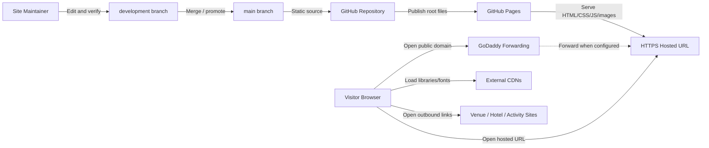

# Deployment Footprint

## Ordered Refresh - 2026-06-20

### Source Inputs
- Ordered systems refresh in `documentation/requirements/current-state-design.md`.
- Ordered behavioral refresh in `documentation/requirements/use-case-requirements.md`.
- Ordered requirements refresh in `documentation/requirements/requirements.md`.
- Current repository files: five root HTML pages, `css/style.css`, Bootstrap/jQuery CDN behavior, remaining unused legacy JS files, and image assets.
- Static scan result after removing the temporary Info/contact page: 5 HTML pages, 52 resolved local references, 0 missing references, 0 server-side runtime references, 0 PHP files, 11 external references.

### Footprint Type
Current-state hosted static wedding archive footprint with fallback planning.

### Architecture Goal
Serve the wedding archive publicly over HTTPS at the lowest practical cost, with no application server, database, visitor data collection, form backend, upload flow, or build pipeline.

### Cloud Necessity Decision
Hosted static website. Cloud compute is not needed. GitHub Pages is the current production fit; AWS Amplify/S3-style static hosting remains a fallback only if GitHub Pages or domain requirements become unsuitable.

### Cost and Complexity Class
Tiny / static-public. The site is plain HTML/CSS/JS/images with no build step, no persistent data store, and no runtime service to operate.

### Deployment Mode
Current: GitHub Pages serves static files from the repository, expected from `main` at the repository root. Development changes can occur on `development` before promotion.

Fallback: AWS static hosting only if GitHub Pages is blocked or the user chooses AWS for domain/account reasons.

### Current / As-Is Footprint Inputs
| Capability | Observation | Evidence |
|---|---|---|
| Runtime | Static HTML/CSS/JS/images. | Root files and static scan |
| Build | None. | No package/build config |
| Hosting | GitHub Pages is the current production-oriented host. | Existing deployment docs |
| Data storage | None beyond repository and static host. | Repo/content inspection |
| Backend | None; no PHP files or server runtime references in scan. | Static scan |
| Domain | GoDaddy forwarding/redirect is working. | User update |
| External resources | Bootstrap, jQuery, Google Fonts, venue/hotel/activity links. | HTML scan |
| Verification | Static scan exists and passes; browser/domain/link checks remain manual. | Prototype scripts |

### Target vs Current Gap Summary
| Current / As-Is Capability | Target Capability | Gap | Migration Implication |
|---|---|---|---|
| GitHub Pages hosted URL | Public visitors can reliably reach the site | Hosted URL path is acceptable; record final public domain and target | Document final URL/domain |
| GoDaddy forwarding | Forwarded domain reaches the hosted site | Working; exact domain should be recorded | Re-check after future publication changes |
| Internal static content | Polished wedding archive context | Some external links may be stale or misleading as live recommendations | Audit and patch/remove/convert links before wider sharing |
| Static scan | Repeatable release guard | Script remains in working/prototype area | Promote or document as release check if recurring |
| Source hygiene | Repo reflects current static/no-collection behavior | Public pages no longer load countdown scripts; unused countdown/validation files remain | Cleanup sprint can remove/archive remaining files |
| Static gallery | Share wedding photos without backend scope | Initial `gallery.html` implemented | Curate/expand selected photos and captions when ready |

### Mermaid Architecture Diagram

### Runtime Components
| Component | Responsibility | Technology Choice | Requirement Driver | Evidence |
|---|---|---|---|---|
| Static site | Public wedding archive, story, gallery, hotel, and Syracuse context pages. | HTML/CSS/JS/images | REQ-001 through REQ-013 | Observed |
| Static host | Public HTTPS hosting. | GitHub Pages | REQ-014, REQ-015 | Existing docs |
| Source control | Store site source and docs. | Git/GitHub | REQ-014, REQ-018 | Observed |
| Domain forwarding | Route public domain to hosted URL. | GoDaddy forwarding | REQ-017 | Working per user update |
| Verification | Static and smoke checks. | Prototype static scan plus manual browser checks | REQ-016 | Scan passes |
| External links | Provide offsite or historical context. | Third-party URLs/plain text | REQ-009 | Needs archive-polish audit |
| Static gallery | Share selected wedding photos. | Static HTML/images | REQ-021 | Initial page implemented |

### Deployment Footprint
| Layer | Resource / Service / Capability | Purpose | Current or Proposed | Notes |
|---|---|---|---|---|
| Source | GitHub repository | Store deployable static source. | Current | `development` for work, `main` for production source per docs. |
| Build | None | Deploy files as-is. | Current | Avoid build complexity. |
| Hosting | GitHub Pages | Serve HTTPS static site. | Current | Lowest cost/current fit. |
| Domain | GoDaddy forwarding | User-facing public URL. | Current / working | Needs exact domain and target recorded. |
| Backend | None | Keep no-collection static scope. | Current | Do not add PHP/serverless without new decision. |
| Storage | Repository/static host only | Store static assets. | Current | No visitor data. |
| Photo assets | Repository/static host only | Store selected gallery photos. | Current | Keep gallery static; optimize further if many more photos are added. |
| Observability | Static scan/manual checks | Release confidence. | Current / partial | External link audit remains. |
| Fallback host | AWS static hosting | Alternative if needed. | Deferred | No provisioning now. |

### Network and Security
- Public ingress is HTTPS to GitHub Pages or a GoDaddy-forwarded URL.
- Visitor browsers load external CDN assets and may navigate to third-party sites.
- The current site has no secrets, auth, admin surface, database, form receiver, or server-side code.
- Privacy posture: no visitor messages, RSVPs, email, address collection, uploads, comments, or private album accounts.
- External links should continue to use `rel="noopener"` where `target="_blank"` is used.

### Data Architecture
- Static content only: HTML, CSS, JavaScript, and images.
- No database, object upload flow, queue, cache, or visitor storage.
- Gallery work has started as static assets and pages; larger image volume can trigger image optimization or a later asset strategy.
- Future form work would require a new PRD/requirements/deployment refresh because it changes privacy and runtime scope.

### Observability
| Check | Purpose | Current State | Requirement |
|---|---|---|---|
| Static scan | Detect missing assets and backend/runtime refs. | Passing. | REQ-004, REQ-012, REQ-016 |
| Five-page browser smoke | Confirm visible page behavior across the remaining pages. | Manual check still useful. | REQ-001 through REQ-011 |
| Mobile navigation smoke | Confirm collapsed nav/dropdown. | Needed after JS cleanup. | REQ-005, REQ-016 |
| GoDaddy forwarding smoke | Confirm public domain reaches the hosted site. | Working per user update; re-check after future changes. | REQ-017 |
| External link audit | Confirm destinations are not misleading for an archive. | Pending. | REQ-009 |
| Static gallery smoke | Confirm gallery loads selected images without backend calls. | Static scan passes for `gallery.html`; browser smoke still useful. | REQ-021 |

### CI/CD and Environments
- No CI/CD service is required for the current no-build site.
- Recommended release sequence:
  1. Edit on `development`.
  2. Run static scan.
  3. Browser-smoke changed pages.
  4. Promote/merge to `main`.
  5. Verify GitHub Pages hosted URL.
  6. Re-check GoDaddy forwarding after publication.
- Rollback: revert or correct the production branch and allow GitHub Pages to republish.

### Deployment Maturity Path
| Stage | Architecture Shape | What To Build Now | Deferred Until | Exit Criteria |
|---|---|---|---|---|
| Current Static Host | GitHub Pages from repository | Keep scan passing and docs current. | Backend/build system. | Hosted URL serves all pages. |
| Public Domain Confidence | GoDaddy forwarding to hosted URL | Record exact working domain and target. | Full DNS/custom domain. | Forwarded domain reaches expected page. |
| Archive Polish | Same static host | Refresh stale links as historical context. | Redesign/dynamic features. | No known misleading recommendations remain. |
| Source Cleanup | Same static host | Remove/archive dead interaction assets. | New interaction features. | Reference search and scan pass. |
| Static Gallery | Same static host | Initial `gallery.html` with selected static photos. | Uploads, tagging, private sharing. | Gallery loads selected photos without backend calls. |
| Optional AWS Fallback | AWS static hosting | Nothing now. | GitHub Pages blocked or user preference changes. | Equivalent HTTPS static site exists. |

### Provider Mapping
| Capability | Provider-Neutral Need | AWS Option | GCP Option | Azure Option | Decision |
|---|---|---|---|---|---|
| Static hosting | Serve HTTPS static files | Amplify Hosting or S3/CloudFront | Firebase Hosting or Cloud Storage/CDN | Static Web Apps or Blob/CDN | Use GitHub Pages now; keep cloud options deferred. |
| Domain route | User-facing domain | Route 53 or external forwarding | Cloud DNS or external forwarding | Azure DNS or external forwarding | Use GoDaddy forwarding unless requirements change. |
| Runtime compute | None currently | Not needed | Not needed | Not needed | Do not add. |
| Data storage | None currently | Not needed | Not needed | Not needed | Do not add. |

### Requirement Trace
| Requirement / Use Case / Risk | Architecture Decision |
|---|---|
| REQ-014, REQ-015 | Use GitHub Pages for current static HTTPS hosting. |
| REQ-017 | Record and preserve working GoDaddy forwarding to the hosted URL. |
| REQ-012 | Keep no server runtime or PHP dependency. |
| REQ-009 | Treat external link polish as an archive-content task. |
| REQ-020 | Remove/archive unused legacy interaction assets as cleanup work. |
| REQ-021 | Keep photo gallery static unless later scope changes. |

### Sprint Planning Translation
| Architecture Decision | Implementation Workstream | Candidate Stories / Tasks | Dependencies | Risk / Priority |
|---|---|---|---|---|
| Record forwarded domain | Domain documentation | Record exact working domain and target URL; re-check after changes. | GoDaddy access if target changes. | High |
| Keep site static | Static release checks | Preserve scan and five-page smoke check. | Prototype script or equivalent. | Medium |
| Refresh external links | Archive polish | Audit and patch/remove/convert hotel/activity/venue links. | Owner preference/current web info. | High |
| Refine static gallery | Archive enhancement | Curate final photos/captions and image sizing. | Photo/caption selection. | Medium |
| Clean dead assets | Source hygiene | Remove/archive remaining countdown and validation files after search. | Confirmation that no countdown/form behavior is wanted. | Medium |
| Keep AWS as fallback | Deployment fallback | No action unless GitHub Pages blocked. | Future decision. | Low |

### Risks and Tradeoffs
- GoDaddy forwarding is simple, cheap, and currently working, but should be re-checked after future domain/hosting changes.
- GitHub Pages has minimal operations burden but should not be stretched into backend behavior.
- External links are the largest current visitor-facing archive-polish risk.
- Removing remaining legacy assets reduces confusion but makes future countdown/form revival a deliberate rebuild.
- The static gallery keeps costs and privacy simple; dynamic photo features would require a new deployment/privacy decision.

### Open Questions
- What exact GoDaddy domain and target URL should be recorded?
- Which stale external links should be replaced, removed, or converted to historical plain text?
- Should remaining dead countdown/validation assets be removed now?
- Should a warmer Weekend/Details page be added in a future sprint?
- Which additional photos or final captions should refine the first static gallery?

## Historical Archive

Older conflicting sections were moved to [historical-doc-conflicts-2026-06-20.md](archive/historical-doc-conflicts-2026-06-20.md). Treat this file as the current source of truth for Deployment Footprint; use the archive only for historical context.
