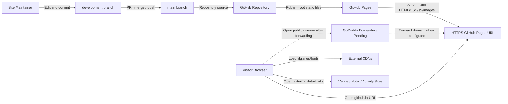

# Deployment Footprint

## Decision Update
Current deployment decision: GitHub Pages is the production host, and AWS is a fallback only.

The original deployment discussion started with AWS because the initial goal named AWS. The project goal was then clarified to the cheapest practical public hosting for a mostly static wedding information site with no RSVP, address collection, email form, or backend. GitHub Pages now satisfies that goal with fewer moving parts and no new cloud billing surface.

Current production URL:

```text
https://skeller01.github.io/wedding-website/
```

Verified June 19, 2026: GitHub Pages reports `built`, `public: true`, source `main` at `/`, and `https_enforced: true`; the live URL returns HTTP 200.

GoDaddy forwarding is partially verified: the user reports the GoDaddy link works on phone and the site looks responsive there, but the same link does not yet work from the user's home browser. The expected forwarding target is the GitHub Pages URL above unless the user later chooses a full custom-domain/DNS setup.

## Source Inputs
- User goal: make the website publicly reachable as cheaply as possible, then point a GoDaddy URL at it through GoDaddy forwarding.
- Current requirements: `documentation/requirements/requirements.md`.
- Current design and behavior docs: `documentation/requirements/current-state-design.md` and `documentation/requirements/use-case-requirements.md`.
- Sprint evidence: `documentation/planning/sprints/github-pages-publication.md`, `documentation/planning/sprints/aws-static-hosting-readiness.md`, and `documentation/planning/working/refactor-plan.md`.
- Prototype evidence: `documentation/planning/working/prototypes/static_site_scan.py` and `documentation/planning/working/prototype-lab.md`.
- Repository files: root HTML pages, `css/style.css`, `js/*`, and `images/*`.
- User update: GoDaddy forwarding works on phone but not yet from the user's home browser; several hotel/activity links may be stale or changed.

## Footprint Type
Current-state hosted static website footprint with near-term release follow-up planning.

## Architecture Goal
Serve the existing wedding website publicly over HTTPS with minimal code, no backend, no database, no paid cloud dependency, and a URL suitable for GoDaddy forwarding.

## Cloud Necessity Decision
Hosted static website. Public hosting is needed so external visitors can reach the site, but an application server, PHP runtime, serverless function, database, object-upload flow, or private network is not needed for the current product.

## Cost and Complexity Class
Tiny / static-public. GitHub Pages is expected to be free for this use case. The site has no build step, no runtime compute, no persistent data store, and modest expected traffic.

## Deployment Mode
GitHub Pages publishes static files from the GitHub repository. Production source is `main` at repository root. Development work occurs on `development` and is merged or pushed to `main` when ready.

AWS Amplify remains a fallback if GitHub Pages becomes blocked by account policy, repository constraints, custom-domain requirements, or a future preference to move into AWS.

## Current / As-Is Footprint Inputs
| Current Input | Observation | Evidence |
|---|---|---|
| Hosting | GitHub Pages is the active public host. | Live URL: `https://skeller01.github.io/wedding-website/`. |
| Pages source | Production serves from `main` at `/`. | Current GitHub Pages setup. |
| Runtime | Static HTML/CSS/JS/images. | Repository root files and assets. |
| Build process | No application build step. | No package manager, bundler config, or build artifact requirement. |
| Data | No database or persistent visitor storage. | Repo inspection and current product decision. |
| Forms/backend | No RSVP, address collection, email form, PHP endpoint, or server runtime. | Public behavior and static scan. |
| Static deploy scan | 5 HTML pages, 65 resolved local references, 0 missing references, 0 server-side runtime references, 0 PHP files. | `static_site_scan.py`. |
| Branch workflow | `development` is used for changes; `main` is production. | Current Git workflow. |
| Domain forwarding | GoDaddy forwarding works on phone but not yet from the user's home browser. | User update. |
| Content freshness | Some hotel/activity external links are stale or suspect. | User update and repository links. |

## Target vs Current Gap Summary
| Current Capability | Target Capability | Gap | Migration Implication |
|---|---|---|---|
| GitHub Pages URL works | Visitor can use GoDaddy-forwarded public URL | GoDaddy forwarding is partially verified; home-browser path still fails. | Check browser/cache/DNS/propagation and verify final domain from more than one network. |
| Internal pages render | Travel/local guidance is trustworthy enough for public use | Some external links may be stale, closed, or rebranded | Audit and update/remove stale links before domain promotion. |
| Static scan passes | Release confidence includes layout/mobile behavior | Browser/mobile visual pass is incomplete | Run a manual or working-browser smoke test. |
| No backend runtime | Future forms remain deliberate | Retired form requirements remain as conditional guardrails | Do not reintroduce forms without a new backend/form decision. |
| Legacy scripts/assets remain | Repository reflects current public behavior | Countdown/validation-era assets may be dead code | Remove or archive in a small cleanup sprint. |

## Mermaid Architecture Diagram



## Runtime Components
| Component | Responsibility | Technology Choice | Requirement Driver | Current State |
|---|---|---|---|---|
| Static website files | Public wedding, story, info, hotel, and Syracuse pages. | HTML, CSS, JavaScript, images | REQ-001 through REQ-011 | Implemented. |
| Static host | Public HTTPS hosting. | GitHub Pages | REQ-017, REQ-018 | Implemented. |
| Source control | Store deployable website source and branch history. | GitHub repository | REQ-017, REQ-021 | Implemented. |
| Domain forwarding | Route user-owned public URL to hosted site. | GoDaddy forwarding | REQ-019 | Partially verified on phone; home browser unresolved. |
| External resources | Fonts, Bootstrap/jQuery libraries, venue/hotel/activity detail sites. | External CDNs and linked websites | REQ-006, REQ-009, REQ-022 | CDNs acceptable; destination links need refresh. |
| Verification scan | Catch missing local assets and server-runtime dependencies. | Python/PowerShell prototype scripts | REQ-004, REQ-012, REQ-020 | Implemented and passing. |

## Deployment Footprint
| Layer | Resource / Service / Capability | Purpose | Current or Proposed | Notes |
|---|---|---|---|---|
| Source control | GitHub repository | Store website and documentation. | Current | `development` plus production `main`. |
| Build | None | Deploy files as-is. | Current | No generated site/build needed. |
| Hosting | GitHub Pages | Serve public HTTPS static site. | Current | Cheapest first-choice path. |
| Production URL | GitHub Pages URL | Immediate public access and GoDaddy forwarding target. | Current | `https://skeller01.github.io/wedding-website/`. |
| Domain forwarding | GoDaddy forwarding | User-facing domain redirects to hosted URL. | Partially verified | Works on phone; home browser still needs diagnosis. |
| Backend | None | Keep site static and cheap. | Current | Forms/RSVP/email collection are out of scope. |
| Storage | None beyond repo/static host | No visitor data persistence. | Current | Future photo gallery can remain static assets unless it grows. |
| Observability | Static scan plus manual/live checks | Basic release confidence. | Current / partial | Mobile visual check passed by user observation; home-browser GoDaddy check remains. |
| AWS fallback | AWS Amplify static hosting | Alternative if GitHub Pages becomes unsuitable. | Deferred | Do not set up unless needed. |

## Network and Security
- Public ingress: HTTPS requests to GitHub Pages.
- Domain forwarding: GoDaddy should forward the user-owned domain to the GitHub Pages URL after setup.
- External egress from the visitor browser: Bootstrap, jQuery, Google Fonts, and external venue/hotel/activity links.
- Backend exposure: none. There is no PHP endpoint, form receiver, database, or admin surface in the current public site.
- Secret handling: no application secrets are needed.
- Privacy posture: the public site does not collect addresses, RSVPs, messages, or emails.
- Link safety: outbound links should keep `target="_blank"` paired with `rel="noopener"` where new tabs are used.

## Data Architecture
- Current data: static website files and image assets only.
- Visitor-submitted data: none.
- Persistent stores: none.
- Future photo support: start with static images in the repository or a simple static asset folder; defer external storage/CDN decisions until image volume or privacy needs justify them.
- Future form support: requires a new explicit decision, such as a managed form service or serverless endpoint with spam/privacy controls.

## Observability and Verification
| Check | Purpose | Current State | Requirement |
|---|---|---|---|
| Static scan | Verify local references and no server-runtime dependency. | Passing. | REQ-004, REQ-012, REQ-020 |
| GitHub Pages smoke | Verify public HTTPS URL loads expected pages. | Passing as of June 19, 2026. | REQ-018, REQ-020 |
| GoDaddy forwarding smoke | Verify public domain reaches expected site. | Partially passing on phone; failing in user's home browser. | REQ-019, REQ-020 |
| Mobile visual check | Verify navigation and layout on small viewport. | Passing by user phone observation. | REQ-005, REQ-020 |
| External link audit | Verify or replace stale destinations. | Pending. | REQ-009, REQ-022 |

## CI/CD and Environments
- Current workflow:
  - Make changes on `development`.
  - Run static scan and source checks.
  - Review/merge/push to `main`.
  - GitHub Pages publishes from `main`.
  - Verify the live GitHub Pages URL.
  - Verify GoDaddy forwarding when the domain setup is available.
- No GitHub Actions workflow is required for the current site because there is no build step.
- Rollback path: revert the problematic commit or merge a corrective commit to `main`; GitHub Pages republishes static files from the updated branch.

## Deployment Maturity Path
| Stage | Architecture Shape | What To Do | Deferred Until | Exit Criteria |
|---|---|---|---|---|
| Current Live Static | GitHub Pages from `main` | Keep scan passing; maintain docs. | Custom domain polish, backend, build system. | GitHub Pages URL serves all pages. |
| Public Domain Promotion | GoDaddy forwarding to Pages URL | Finish home-browser/DNS verification and public content checks. | Full DNS custom-domain setup. | Public domain reaches expected site from phone and home browser. |
| Content Reliability Pass | Same static host | Refresh stale hotel/activity links. | Larger redesign. | No known stale external recommendations remain. |
| Cleanup Pass | Same static host | Remove or archive dead legacy assets. | New interaction features. | Repo assets match current public behavior. |
| Optional Future Gallery | Static image gallery | Add scrollable photos as static assets. | External image hosting/CDN. | Gallery loads acceptably without backend. |
| Optional AWS Fallback | AWS Amplify static hosting | Connect repo and publish static files. | GitHub Pages blocked or user preference changes. | Fallback HTTPS URL serves an equivalent static site. |

## Requirement Trace
| Requirement / Risk | Architecture Decision |
|---|---|
| REQ-017 Deploy From GitHub | Use GitHub Pages from the existing GitHub repository. |
| REQ-018 Provide HTTPS Hosted URL | Use the GitHub Pages HTTPS URL as the current production endpoint. |
| REQ-019 Support GoDaddy Forwarding | Forward the GoDaddy URL to the GitHub Pages URL. |
| REQ-020 Verify Before Public Release | Combine static scan, hosted URL smoke, user phone/mobile check, home-browser GoDaddy check, and external link audit. |
| REQ-012 Avoid Static PHP Dependency | Keep the site static; do not add PHP or server runtime for current scope. |
| REQ-022 Refresh External Destinations | Treat link freshness as a content reliability release task. |
| REQ-023 Remove Dead Legacy Assets | Schedule a small cleanup sprint after content/link decisions. |

## Sprint Planning Translation
| Workstream | Candidate Stories / Tasks | Dependencies | Risk / Priority |
|---|---|---|---|
| GoDaddy verification | Confirm the final domain, forwarding target, phone behavior, and home-browser behavior. | GoDaddy setup/propagation plus local browser/DNS cache behavior. | High |
| External link refresh | Audit hotel/activity links; replace stale destinations with official current pages or durable local/tourism resources. | Web verification and owner preference. | High |
| Mobile visual smoke | Record phone pass; optionally do a broader browser/device sweep. | User phone check already passed. | Low |
| Dead asset cleanup | Remove or archive unused countdown/form-validation files once confirmed unused. | Source search and static scan. | Medium |
| Optional docs cleanup | Replace historical AWS/PHP sections in older docs with either archived notes or current-only sections. | Owner preference. | Low |
| Optional AWS fallback | Create Amplify static deployment only if GitHub Pages is blocked later. | AWS login/account. | Low |

## Risks and Tradeoffs
- GoDaddy forwarding is simple and cheap, but less integrated than a GitHub Pages custom domain with DNS records.
- GitHub Pages is ideal for current static scope, but no backend features should be reintroduced casually.
- External destination freshness is now the largest visitor-facing risk because internal static hosting is working.
- A future photo gallery can stay static at first, but a large gallery may eventually push toward image optimization or external asset hosting.
- Historical documentation still contains AWS/PHP-era analysis in some files; the current authoritative sections should be used for planning until those docs are fully reconciled.

## Open Questions
- What exact GoDaddy domain should be recorded for forwarding verification?
- Should GoDaddy forwarding remain a redirect, or should a full GitHub Pages custom-domain DNS setup be considered later?
- Which hotel/activity links should be replaced with official current pages versus removed?
- Should the historical `contact.html` filename stay, or should the Info page be renamed in a future cleanup?
- Why does the GoDaddy-forwarded URL work on phone but not from the user's home browser: DNS cache, browser cache, local network resolver, or forwarding propagation?
- Should unused countdown and validation assets be removed before the GoDaddy-forwarded domain is advertised?
