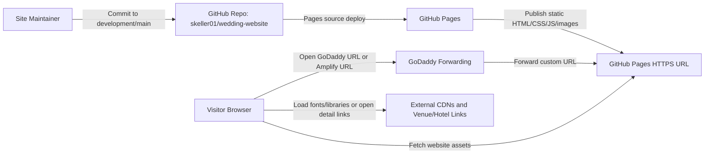

# Deployment Footprint

## Decision Update
Current recommendation: GitHub Pages first, AWS fallback.

The original footprint targeted AWS because the initial goal named AWS. The user later clarified that the real priority is cheapest possible hosting for a mostly static public wedding site with no RSVP, email form, or backend. A hosting comparison prototype selected GitHub Pages + cleaned HTTPS CDNs as the best first deployment path. Keep AWS Amplify as the fallback if GitHub Pages is blocked by repository visibility, account plan, or domain requirements.

Implementation update: the obsolete PHP contact form path has been removed from the site files. The remaining publication blocker is external to the code: the GitHub repository is currently private and GitHub Pages is not configured.

## Source Inputs
- User goal: host the website on AWS as cheaply as practical with minimal changes, then point a GoDaddy URL at the hosted link using GoDaddy forwarding.
- Repository files: static HTML/CSS/JS/images plus `bin/contact_me.php`.
- Design and requirements: `documentation/requirements/current-state-design.md`, `documentation/requirements/use-case-requirements.md`, `documentation/requirements/requirements.md`.
- Prototype evidence: `documentation/planning/working/prototypes/static_site_scan.ps1`.
- AWS references reviewed: AWS S3 static website hosting docs, S3 website endpoint docs, AWS Amplify pricing page.

## Footprint Type
Mixed: current-state repository analysis plus future-target hosted prototype / small public static deployment.

## Architecture Goal
Publish the existing wedding website with minimal code changes, very low operating cost, HTTPS access, and a URL that can be used as the GoDaddy forwarding target.

## Cloud Necessity Decision
Hosted prototype. Cloud is needed because external visitors need public access to the website. A server runtime, database, private networking, and managed backend are not needed for the first release if the contact path is made static-compatible.

## Cost and Complexity Class
Tiny / Prototype. The site is approximately 6.6 MB in repository size, has no application build step, no database, and modest expected traffic. A static hosting service should keep operating cost very low.

## Deployment Mode
Hosted static website. Recommended target: GitHub Pages connected to the existing GitHub repository.

Rationale:
- The site is already static-first.
- GitHub Pages can publish HTML, CSS, and JavaScript from a GitHub repository.
- GitHub Pages supports custom domains and HTTPS.
- The current repository is small enough for GitHub Pages limits.
- AWS Amplify remains viable, but it introduces an AWS billing surface and is no longer the cheapest first choice if GitHub Pages is available.

## Current / As-Is Footprint Inputs
| Current Input | Observation | Evidence |
|---|---|---|
| Hosting | No deployed cloud footprint observed in repo. | No IaC, deploy scripts, or hosting config found. |
| Runtime | Static HTML/CSS/JS/image assets with one PHP mail script. | Root HTML files, `js/*`, `bin/contact_me.php`. |
| Build process | No package manager or build step. | No `package.json`, bundler config, or generated build folder. |
| Data | No database or persistent storage. | Repo inspection. |
| Contact flow | Form posts to PHP mail endpoint and direct `mailto:` exists. | `contact.html`, `js/contact_me.js`, `bin/contact_me.php`. |
| Static deploy scan | 5 HTML pages, 75 resolved local references, 1 case mismatch, 1 PHP runtime dependency. | Prototype scan output. |

## Target vs Current Gap Summary
| Current / As-Is Capability | Target Capability | Gap | Migration Implication |
|---|---|---|---|
| Local static files | Public HTTPS hosted website | Need AWS hosting configuration | Connect GitHub repo to Amplify. |
| PHP contact endpoint | Static-compatible contact path | PHP will not execute on static hosting | Replace with `mailto:`/static fallback or later serverless backend. |
| `images/kayak.jpg` reference | Case-correct asset paths | File is `kayak.JPG` | Rename file or update HTML before deploy. |
| HTTP jQuery CDN | HTTPS-safe script loading | `http://ajax.googleapis.com/...` can be blocked | Change to HTTPS or vendor local script. |
| No release verification | Repeatable static/public checks | Need checklist | Use prototype scan plus manual hosted URL checks. |
| No domain forwarding | GoDaddy URL reaches site | Need forwarding setup | Configure forwarding after Amplify URL exists. |

## Mermaid Architecture Diagram

## Runtime Components
| Component | Responsibility | Technology Choice | Requirement Driver | Evidence |
|---|---|---|---|---|
| Static website files | Public content and interaction | HTML, CSS, JS, images | REQ-001 through REQ-010 | Observed |
| Contact channel | Let visitor contact couple | Direct email/static fallback for MVP | REQ-011 through REQ-016 | Observed/Proposed |
| GitHub repository | Source of deployable site | GitHub repo with branches | REQ-017, REQ-021 | Observed |
| Static host | Public HTTPS hosting | GitHub Pages recommended; AWS Amplify fallback | REQ-017, REQ-018 | Proposed |
| Domain forwarding | Public custom URL route | GoDaddy forwarding | REQ-019 | Proposed |
| Verification scan | Catch static deployment issues | PowerShell prototype scanner | REQ-004, REQ-020 | Prototype |

## Deployment Footprint
| Layer | Resource / Service / Capability | Purpose | Current or Proposed | Notes |
|---|---|---|---|---|
| Source control | GitHub repository | Store website files and branch history | Current | `main` plus `development`. |
| Build | No build command | Deploy files as-is | Proposed | Amplify can host static files without app build. |
| Hosting | GitHub Pages | Static HTTPS hosting | Proposed | Cheapest first-choice path. |
| Domain access | GitHub Pages URL | Immediate public URL | Proposed | Target for GoDaddy forwarding or custom domain setup. |
| Domain forwarding | GoDaddy forwarding | Custom URL redirects to Amplify URL | Proposed | Avoids DNS migration. |
| Contact backend | None for MVP | Keep site static and cheap | Proposed | Use direct email/static fallback first. |
| Observability | Manual verification / Amplify deploy status | Basic release confidence | Proposed | No formal monitoring needed initially. |

## Network and Security
- Public ingress: HTTPS requests to Amplify-hosted URL.
- Domain forwarding: GoDaddy forwards public domain traffic to the Amplify URL.
- External egress from visitor browser: Bootstrap CDN, Google Fonts, external venue/hotel/activity links.
- Current security concern: HTTP jQuery script reference should be upgraded before HTTPS hosting.
- Current privacy concern: contact form captures personal address information; avoid sending or storing it through an unmaintained PHP endpoint.
- IAM: only maintainer/AWS account permissions are needed for setup; no public admin surface is present.

## Data Architecture
- Current data: static files only.
- No database, object-store user uploads, queues, or durable application storage.
- Contact form data should not be stored in the static hosting layer.
- If real address collection remains needed later, use a deliberate backend decision: for example, a managed form service or AWS Lambda/API Gateway/SES pattern with spam controls.

## Observability
- MVP observability: Amplify deploy status, browser smoke checks, and static reference scan.
- No uptime SLO or alerting required for the initial low-cost public site.
- Optional later: simple synthetic check for home page and contact page if the public URL matters long-term.

## CI/CD and Environments
- Current branch context: user created `development` to avoid committing directly to `main`.
- Recommended:
  - Use `development` for first Amplify preview deployment.
  - Merge to `main` only after content/contact fixes are verified.
  - Either switch Amplify production to `main` later or keep an Amplify preview tied to `development`.
- Rollback: revert commit or repoint Amplify branch to last known good commit.

## Deployment Maturity Path
| Stage | Architecture Shape | What To Build Now | Deferred Until | Exit Criteria |
|---|---|---|---|---|
| Local Current State | Static files opened locally | Documentation and static scan | Public access | Docs capture current behavior. |
| Hosted Prototype | Amplify static deploy from GitHub branch | Fix static blockers; deploy `development` | Custom DNS polish, backend form | Amplify URL loads all pages. |
| Public Static Release | Amplify URL plus GoDaddy forwarding | Verify forwarded URL and contact fallback | Serverless form, monitoring | Custom URL reaches usable site. |
| Small Production Optional | Static host plus basic checks | Only if site remains actively used | Backend, analytics, alerts | Owner wants ongoing operations. |

## Requirement Trace
| Requirement / Use Case / Risk | Architecture Decision |
|---|---|
| REQ-017 Deploy From GitHub | Use GitHub Pages from the existing GitHub repository; keep AWS Amplify as fallback. |
| REQ-018 Provide HTTPS Hosted URL | Prefer Amplify over raw S3 website endpoint. |
| REQ-019 Support GoDaddy Forwarding | Use Amplify URL as forwarding target. |
| REQ-012 Avoid Static PHP Dependency | Remove/replace PHP form behavior for MVP. |
| REQ-004 Resolve Local Assets | Run static scan before deploy. |
| REQ-006 Use HTTPS Script Resources | Upgrade HTTP jQuery URL. |
| FMEA high risk: contact form fails | Make direct email/static fallback part of MVP. |

## Sprint Planning Translation
| Architecture Decision | Implementation Workstream | Candidate Stories / Tasks | Dependencies | Risk / Priority |
|---|---|---|---|---|
| Static hosting via Amplify | Hosting setup | Connect GitHub repo; deploy `development`; capture Amplify URL | AWS login | High |
| Static-compatible contact | Site cleanup | Replace PHP Ajax submission or make contact fallback explicit | Contact email decision | High |
| Static asset correctness | Site cleanup | Fix `kayak.JPG`/`kayak.jpg`; run scan | None | Medium |
| HTTPS-safe resources | Site cleanup | Change HTTP jQuery URL to HTTPS | None | Medium |
| Domain forwarding | Release setup | Configure GoDaddy forwarding to Amplify URL; verify | Amplify URL | High |

## Risks and Tradeoffs
- Amplify is slightly more managed than raw S3, but it reduces HTTPS/CDN setup and produces an easy forwarding target.
- Raw S3 static hosting may be cheapest at tiny traffic, but lacks HTTPS on website endpoints unless paired with CloudFront or another front door.
- Keeping a real form requires backend work and privacy/spam decisions; direct email is much cheaper and simpler.
- GoDaddy forwarding is simple but less elegant than full DNS integration; it matches the stated goal.

## Open Questions
- What exact email should be public on the contact page?
- Should the contact form be removed, converted to email, or replaced with a backend later?
- Should AWS production deploy from `main` after preview, or should `development` remain the hosted branch for now?
- Should stale 2017-era content be refreshed before public forwarding?
