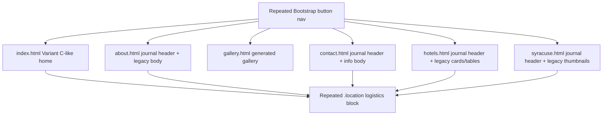
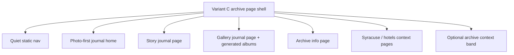

# Refactor Plan

## Source Inputs
- User direction from this session:
  - Variant C from `documentation/planning/working/prototypes/archive_visual_refresh_variants.html` is the preferred visual direction.
  - The desired site feel is a wedding archive photo album / historical wedding website.
  - The look should carry across the pages if possible.
  - Public site remains static; no backend or build-system migration unless deliberately selected later.
- Prototype source:
  - `documentation/planning/working/prototypes/archive_visual_refresh_variants.html`
  - Variant C CSS: `.variant-c`, `.journal-hero`, `.journal-photo img`, `.journal-text`, `.journal-list`
  - Variant C markup: one large photo, editorial text, two actions, and three chapter links.
- Product / requirements docs:
  - `documentation/planning/prd.md`
  - `documentation/requirements/requirements.md`
  - `documentation/requirements/current-state-design.md`
  - `documentation/planning/sprints/2026-06-20-archive-visual-refresh.md`
  - `documentation/planning/working/prototype-lab/2026-06-20-archive-visual-refresh.md`
- Public code reviewed:
  - `index.html`, `about.html`, `gallery.html`, `contact.html`, `hotels.html`, `syracuse.html`
  - `css/style.css`
  - `js/archive-home.js`, `js/gallery.js`, `js/gallery-data.js`
  - `data/gallery-data.json`
- Local tooling reviewed:
  - `tools/photo-pipeline.ps1`
  - `documentation/planning/working/prototypes/static_site_scan.ps1`
- Verification performed:
  - Static scan: 6 HTML pages, 76 local references resolved, 0 missing references, 0 server-side runtime references, 0 PHP files, 13 external references.
  - Browser automation attempted but unavailable in this environment due the Node/browser tool returning `codex/sandbox-state-meta: missing field sandboxPolicy`.

## Review Mode
Repository Audit.

This is a working static site with recently added gallery, photo-pipeline, and visual-refresh code. The review focuses on architecture and implementation seams that would let the accepted Variant C direction become coherent across the whole site without turning the project into a new framework rewrite.

## Architecture Vocabulary
- **Variant C visual contract**: the accepted prototype pattern: photo-first journal layout, restrained editorial copy, three chapter links, off-white/white paper feel, serif-led typography, and quiet outlined/primary actions.
- **Page shell**: the repeated public-page structure: head assets, nav, page header/hero, main content, shared event/context footer, and scripts.
- **Archive content**: static historical wedding/story/travel/gallery material intended for sharing.
- **Legacy logistics content**: original event-planning blocks, active-travel links, invitation/contact/form-era wording, and repeated Sangeet/Ceremony tables.
- **Visual system seam**: CSS/markup conventions that let each page adopt the same journal look without each page inventing its own layout.
- **Generated media seam**: the boundary between local photo tooling, generated public metadata/assets, and the public HTML/JS that consumes them.

## System / Change Context
The current code has moved toward Variant C on the home page, but the site still reads as two systems at once:

- The top of `index.html` now resembles Variant C.
- Immediately after the journal section, the older event logistics `.location` block appears.
- Other pages have a new `page-journal-header`, but their body content remains mostly Bootstrap-era cards, circles, buttons, tables, and repeated logistics footers.
- The navigation is still button-heavy and repeated manually across all six pages.
- The gallery is functionally static and generated, but visually it does not yet feel like the same wedding journal as Variant C.

The core refactor opportunity is to make Variant C a reusable page-level contract instead of a one-off home patch.

## Refactor Candidates
| Candidate | Architecture Value | Requirement / Mission Driver | Delivery Risk | Resource Constraints | Suggested PR Size | Test Surface | Recommendation |
|---|---|---|---|---|---|---|---|
| Variant C page shell and visual contract | High: turns an accepted prototype into a repeatable site pattern and removes the home/other-page split. | REQ-002, REQ-003, REQ-005, REQ-006, REQ-021, REQ-032; user wants Variant C across pages. | Medium: visible UI changes on every page require careful smoke/visual review. | Must stay static; no build system by default; browser automation currently unavailable. | Medium PR: `index.html`, five subpages, `css/style.css`, maybe small JS copy/behavior changes. | Static scan, source scan, manual desktop/mobile browser check, gallery smoke. | **Top recommendation** |
| Replace prototype copy with archive-ready production copy | Medium: removes throwaway wording that leaked from the prototype. | Archive should feel shareable and personal, not like an option in a design doc. | Low | Copy can be changed in HTML only. | Tiny PR or included in top candidate. | Source inspection and manual read-through. | Bundle with top candidate |
| Clarify home hero behavior versus exact Variant C image | Medium: resolves tension between session-stable random hero requirement and the user's desire for Variant C's exact look. | REQ-032; accepted Variant C uses `images/sonia_steve.jpg`; docs also say session-stable random hero. | Low/Medium: behavior decision affects `js/archive-home.js` and curation expectations. | Current placeholder hero set may crop differently from Variant C's source image. | Small PR. | Manual reload/session check; source inspection. | Grill before implementing |
| Separate placeholder adapter from photo generator | High: keeps temporary placeholder choices from becoming permanent pipeline logic. | REQ-022 through REQ-030; real wedding photos are not available yet. | Low/Medium: tooling-only refactor but must preserve generated output. | PowerShell/.NET pipeline; no Python/Pillow available in current environment. | Small/medium PR in `tools/` plus tests. | `tools/photo-pipeline.tests.ps1`, generated data parity checks. | Do after visual shell |
| Gallery visual alignment and renderer hardening | Medium/High: gallery is a primary archive page but still feels utilitarian and has small JS edge risks. | REQ-021, REQ-031; user said gallery looks terrible. | Medium: UI behavior and lightbox should not regress. | Static vanilla JS; no backend; no framework. | Medium PR: `gallery.html`, `css/style.css`, `js/gallery.js`. | Static scan, gallery data contract checks, manual lightbox smoke. | Follow top candidate or combine if scoped tightly |
| Repeated nav/footer/content block ownership | High long-term: reduces drift across all public pages. | Static maintenance and consistency across pages. | Medium/High if introducing generation; Low if adding only audit/checks. | Docs prefer no broad build-system migration. | First slice small: static consistency check; later slice larger: generator/includes. | Static scan, generated diff if generator chosen. | Defer build system; add consistency checks later |
| External link and legacy logistics cleanup | Medium: reduces stale historical/travel confusion. | Archive sharing should not point users at misleading current tasks. | Medium: link truth changes over time and needs web verification. | Requires browsing/current link checks. | Small content PR. | Link check, static scan, manual click smoke. | Separate archive-polish sprint |

## Top Recommendation
The best next engineering move is **Variant C page shell and visual contract**.

Why:
- It directly answers the user's latest direction: make the Variant C look carry across the pages.
- It fixes the largest visible inconsistency: a polished journal-like home followed by old event-site sections.
- It improves locality: once the shell and CSS contract are clear, gallery, travel, story, and info pages can all use the same visual vocabulary.
- It preserves the current plain static architecture. No Jekyll, React, backend, or public photo service is required.

Do not start by introducing a generator. The first PR should standardize the visible shell and CSS manually, then decide later whether repeated edits justify shared includes or a static generator.

## Candidate Details

### 1. Variant C Page Shell And Visual Contract
- Current friction:
  - `index.html` uses Variant C structure at lines 65-85, but the old `.location` logistics block starts at line 87.
  - `about.html`, `contact.html`, `hotels.html`, and `syracuse.html` have `page-journal-header` blocks, but the rest of each page remains Bootstrap-era layout and repeated event footer content.
  - `gallery.html` has generated gallery behavior but lacks the same journal header/chapter structure.
  - Navigation remains button-heavy through repeated `.navbar-btn` markup on every page.
- Evidence:
  - Variant C prototype uses three chapter links and a full-page `variant-c` section.
  - Current public pages repeat `.location` in five pages plus home.
  - Static scan passes, so this is a visual/coherence refactor rather than a broken-reference bug.
- Proposed direction:
  - Define a small set of journal page classes in `css/style.css`: archive shell, journal page intro, journal content grid, journal card/list, archive context band, and gallery journal grid.
  - Apply Variant C-derived page framing to `about.html`, `gallery.html`, `contact.html`, `hotels.html`, and `syracuse.html`.
  - Reframe the old `.location` block as an archive context section or remove it from pages where it duplicates chapter navigation.
  - Keep routes and filenames unchanged.
- Benefits:
  - The site feels like one archive instead of several eras of implementation.
  - Future copy/gallery edits become easier because page sections have clearer roles.
  - No hosting/deployment change.
- Risks:
  - Without browser screenshots, layout polish needs user/manual visual review.
  - Touching all pages in one PR can create a larger visual diff.
- Suggested diagrams:
  - The page-shell flowchart in this plan.

### 2. Replace Prototype Copy With Archive-Ready Production Copy
- Current friction:
  - `index.html` says: "This option makes the site feel like a small personal publication..." That belongs in a prototype readout, not a wedding archive.
- Evidence:
  - Same wording appears in Variant C prototype, where it described the option being evaluated.
- Proposed direction:
  - Preserve the Variant C layout but change copy to archive language, for example: "A quiet wedding archive for the story, photographs, and Syracuse weekend memories."
- Benefits:
  - The home page becomes shareable immediately.
- Risks:
  - Copy preference is personal; likely worth a small grilling pass.
- Suggested diagrams:
  - None.

### 3. Clarify Home Hero Behavior Versus Exact Variant C Image
- Current friction:
  - Variant C prototype uses `images/sonia_steve.jpg`.
  - Requirements currently say the hero should be session-stable random from explicit hero photos.
  - `js/archive-home.js` may replace the prototype image with generated hero derivatives from `js/gallery-data.js`.
  - The user's "stretching" concern is probably the `object-fit: cover` crop/fill behavior in a tall 76vh frame, not literal image distortion.
- Evidence:
  - `index.html` fallback now points at `images/sonia_steve.jpg`.
  - `archive-home.js` chooses from `data.heroPhotos` when available.
  - Generated placeholder hero photos include five images, not only the Variant C source image.
- Proposed direction:
  - Decide whether the home page should use:
    1. exact Variant C image until real curation,
    2. session-stable random hero only after real photos are available,
    3. session-stable random hero now but with stricter hero eligibility/focal point review.
- Benefits:
  - Makes REQ-032 and the accepted visual prototype agree.
- Risks:
  - Changing hero behavior could reduce the "random photo each visit" idea unless explicitly staged.
- Suggested diagrams:
  - Small sequence diagram if selected.

### 4. Separate Placeholder Adapter From Photo Generator
- Current friction:
  - `tools/photo-pipeline.ps1` hardcodes placeholder publish names, hero names, titles, and captions inside the production generation function.
  - `UseExistingAsPlaceholders` scans all checked-in images and then filters by hardcoded filename.
- Evidence:
  - Placeholder lists and captions live around `tools/photo-pipeline.ps1` lines 278-321.
  - Real photo source is not available yet, so this temporary adapter is doing real work.
- Proposed direction:
  - Move placeholder selection/captions into a small manifest, such as `tools/placeholders/gallery-placeholders.json`.
  - Keep the generator responsible for inventory, curation, resizing, metadata, and reports.
- Benefits:
  - The real pipeline stays cleaner when real photos arrive.
  - Placeholder choices become easy to inspect/change without editing generator code.
- Risks:
  - Need tests to prove generated public data remains equivalent.
- Suggested diagrams:
  - Generated media seam flowchart.

### 5. Gallery Visual Alignment And Renderer Hardening
- Current friction:
  - `gallery.html` intro is implementation-focused: "generated static gallery... no visitor file submission..."
  - Gallery cards and lightbox are functional but not yet a Variant C journal/gallery page.
  - `js/gallery.js` summary counts all albums in `data.albums`, even if some albums render no visible photos.
  - Lightbox controls are text buttons and no focus trap exists.
- Evidence:
  - `gallery.html` lines 45-58 contain the page intro and render root.
  - `js/gallery.js` lines 33-39 calculate summary and filter album photos separately.
- Proposed direction:
  - Give gallery a journal intro aligned with Variant C.
  - Use a quieter album layout and caption treatment.
  - Harden renderer count logic and lightbox affordances only where low risk.
- Benefits:
  - Fixes the user's "gallery looks terrible" concern in the same visual system.
- Risks:
  - Lightbox behavior is externally visible and should be smoke-tested manually.
- Suggested diagrams:
  - None unless JS refactor is selected.

### 6. Repeated Nav/Footer/Content Block Ownership
- Current friction:
  - Nav markup repeats across all six HTML pages.
  - Event footer/context markup repeats across most pages.
  - CSS now contains old selectors (`#weddingStyle`, `.saveDate`, `.carousel-*`) alongside new journal selectors.
- Evidence:
  - Source search finds `.navbar-btn` in all six pages and `.location` across all non-gallery pages plus home.
- Proposed direction:
  - For the next implementation, manually standardize rather than introduce a build step.
  - Later, consider either:
    - a static consistency check that verifies nav/chapter links and required page-shell classes, or
    - a tiny local generation step if repeated edits keep hurting.
- Benefits:
  - Keeps this project simple now while acknowledging the maintainability risk.
- Risks:
  - Manual edits can still drift until a later check/generator exists.
- Suggested diagrams:
  - Page-shell flowchart.

## Selected Candidate
Pending user selection.

Recommended candidate to grill next: **Variant C page shell and visual contract**.

## Grilling Decisions
No grilling decisions have been locked for this refactor yet.

Initial decision candidates:
- Should the home hero stay exactly on `images/sonia_steve.jpg` until real photos are curated, or should session-stable random hero remain active now?
- Should the old event logistics `.location` block become a single archive context section, move to `contact.html`, or be removed from most pages?
- Should the chapter set remain the exact Variant C three chapters, or should Info/Hotels remain first-class chapter links elsewhere?
- Should gallery visual work be included in the same PR as page shell alignment, or split into a second PR?

## Proposed Refactor Design
Pending selected-candidate grilling.

Likely shape if the top recommendation is selected:
- Proposed module / seam:
  - A CSS/HTML page-shell contract for static archive pages, centered on Variant C.
- Interface expectations:
  - Root URLs remain unchanged.
  - Pages remain plain HTML/CSS/vanilla JS.
  - Navigation and chapter links remain usable without backend services.
  - Gallery data remains generated static metadata.
- Implementation responsibilities:
  - HTML pages own content.
  - `css/style.css` owns the journal visual system.
  - `js/archive-home.js` owns only hero selection/application.
  - `js/gallery.js` owns only gallery rendering/lightbox behavior.
- Dependency and adapter strategy:
  - No new runtime dependency.
  - No new build step in the first slice.
- Behavior preserved:
  - Static site hosting.
  - Existing pages/routes.
  - Generated gallery metadata/lightbox.
- Behavior intentionally changed:
  - Production copy should stop sounding like a prototype.
  - Pages should visually read as one archive.
  - Legacy logistics blocks should be reframed or reduced.

## Diagrams
Current shape:

Target first slice:

## First Safe Slice
Pending final selection, but the recommended first safe slice is:

### Goal
Make Variant C the visible site-wide journal pattern while preserving static HTML/CSS/JS architecture.

### In Scope
- Replace prototype-sounding home copy with archive-ready copy.
- Decide and implement the first-pass hero rule:
  - exact Variant C image for now, or
  - session-stable generated hero with stricter curation/fallback.
- Convert `about.html`, `gallery.html`, `contact.html`, `hotels.html`, and `syracuse.html` to use consistent journal page sections.
- Reframe or reduce repeated `.location` logistics blocks so pages do not immediately fall back into old event-site mode.
- Quiet the Bootstrap button-heavy nav through CSS/markup that matches Variant C.
- Keep all routes and static hosting unchanged.

### Out of Scope
- New build system, Jekyll layouts, React, or backend.
- Real photo curation, because the real photo repository is not available yet.
- Broad external link modernization.
- Deep photo-pipeline refactor.
- Full lightbox rewrite.

### Required Characterization Tests
- Run static scan before edits.
- Source-scan current page roles:
  - `.variant-c`, `.page-journal-header`, `.location`, `.navbar-btn`, `.gallery-lightbox`.
- Capture manual screenshots or user browser review for home and gallery before accepting the PR.
- Verify `js/gallery-data.js` still loads before `js/archive-home.js` and `js/gallery.js`.

### Required Refactor Tests
- Static scan reports:
  - 0 missing/case-mismatched local references.
  - 0 server-side runtime references.
  - 0 PHP files.
- Source search confirms no prototype phrases remain in production HTML, especially "This option makes the site feel..."
- Manual desktop and mobile checks for:
  - home journal hero,
  - story page,
  - gallery page,
  - info page,
  - travel pages,
  - nav/dropdown behavior,
  - gallery lightbox open/next/previous/close.
- If browser automation remains unavailable, record manual/user visual review as required acceptance evidence.

### Follow-Up Slices
- Gallery-focused visual refinement and lightbox hardening.
- Placeholder adapter extraction from `tools/photo-pipeline.ps1`.
- Static consistency check for repeated nav/page-shell conventions.
- External link and legacy logistics audit.
- Optional shared-layout/static-generator evaluation only if manual duplication keeps causing drift.

## Prototype Recommendations
| Risk | Prototype Question | Suggested Method | Expected Decision Impact |
|---|---|---|---|
| Exact Variant C may not map cleanly to every page type. | What does Variant C look like on Story, Gallery, Info, and Travel pages without making all pages identical? | One throwaway HTML/CSS prototype with the five page templates stacked or tabbed. | Determines whether to implement one universal shell or two patterns: landing plus interior journal pages. |
| Hero randomization may weaken the accepted Variant C look. | Should random hero stay active before real photo curation? | Small local toggle/prototype comparing fixed `sonia_steve.jpg` against generated hero rotation. | Determines `archive-home.js` behavior in the next PR. |
| Gallery may need more than CSS polish. | Can the generated gallery feel like Variant C without rewriting lightbox behavior? | Prototype only the gallery card/album CSS against current generated data. | Determines whether gallery joins the page-shell PR or gets its own sprint. |

## Requirement Impacts
| Existing Requirement | Refactor Impact | New / Changed Requirement Candidate | Notes |
|---|---|---|---|
| REQ-002 Present Wedding Archive Summary | Strengthen | Public page copy shall be archive-ready and shall not include prototype-evaluation wording. | Current home copy still sounds like a prototype. |
| REQ-003 Provide Internal Navigation | Preserve / Strengthen | Chapter/navigation links shall use the accepted journal visual pattern while preserving existing routes. | Variant C three-chapter model may need a decision about Info/Hotels. |
| REQ-005 Support Mobile Navigation | Strengthen | Journal page shell shall be checked at mobile width before acceptance. | Browser automation unavailable; manual/user visual check required. |
| REQ-006 Preserve Readable Core Content | Strengthen | Hero/gallery images shall avoid awkward cropping through accepted image choice and focal-point behavior. | User observed stretched/awkward image presentation. |
| REQ-021 Support Static Photo Gallery | Strengthen | Gallery page shall visually align with the archive journal system while remaining static. | Functional behavior exists; visual polish remains. |
| REQ-031 Support Generated Album Lightbox | Preserve / Strengthen | Album counts and lightbox controls should remain correct after visual refactor. | Summary count and lightbox UX are follow-up hardening candidates. |
| REQ-032 Support Session-Stable Archive Hero | Clarify | Decide whether session-stable random hero applies now or after real photo curation. | Possible conflict with exact Variant C preference. |

## Sprint Planning Handoff
| Candidate | Suggested Sprint Slice | Branch / PR Scope | Required Tests | Prototype Needed |
|---|---|---|---|---|
| Variant C page shell and visual contract | `variant-c-sitewide-journal-shell` | Public HTML pages plus `css/style.css`; minimal JS if hero rule changes. | Static scan, source scan, manual desktop/mobile visual review, nav/gallery smoke. | Optional, only if page-type mapping is unclear. |
| Replace prototype copy | `archive-ready-copy-polish` | `index.html` and any page intro copy. | Source scan for prototype phrases; manual read-through. | No |
| Clarify hero behavior | `archive-hero-rule` | `index.html`, `js/archive-home.js`, generated data expectations if needed. | Session reload check, fallback check, source inspection. | Maybe |
| Placeholder adapter extraction | `photo-placeholder-manifest` | `tools/photo-pipeline.ps1`, placeholder manifest, tests. | Pipeline tests, generated JSON/JS parity, static scan after generation. | No |
| Gallery visual alignment | `variant-c-gallery-polish` | `gallery.html`, `css/style.css`, maybe `js/gallery.js`. | Static scan, generated data check, manual lightbox smoke. | Maybe |
| Repeated page shell ownership | `static-page-shell-check` | Add a scan/check script before any generator. | Check required nav/page-shell selectors across root pages. | No |
| External link and legacy logistics cleanup | `archive-link-logistics-polish` | Content and external links across pages. | Link check, static scan, manual review. | No, but browsing required |

## Assumptions
- Variant C is the accepted visual source of truth for the public-facing direction.
- The site should remain a plain static GitHub Pages site for now.
- The real wedding photo repository is not available yet, so placeholder/photo-pipeline work should not be allowed to dominate the visual refactor.
- The user's "stretching" concern is an accepted visual defect even if the CSS uses `object-fit: cover`; the implementation should optimize for perceived fit and crop quality.
- The current browser automation failure is environmental, not proof the page is visually correct.

## Gaps and Questions
- Do we want the home hero fixed to Variant C's `images/sonia_steve.jpg` until real photos are curated, or keep session-stable random hero now?
- Should the repeated Sangeet/Ceremony `.location` block remain on every page, move only to Info, or become a quieter archive context band?
- Should Gallery be included in the first site-wide Variant C PR, or should it get a dedicated follow-up because it needs lightbox/card-specific work?
- Should Hotels and Local Entertainment remain separate pages, or should they be treated together as the third Variant C "Syracuse Context" chapter?
