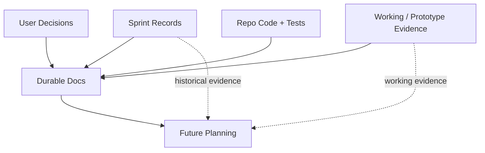
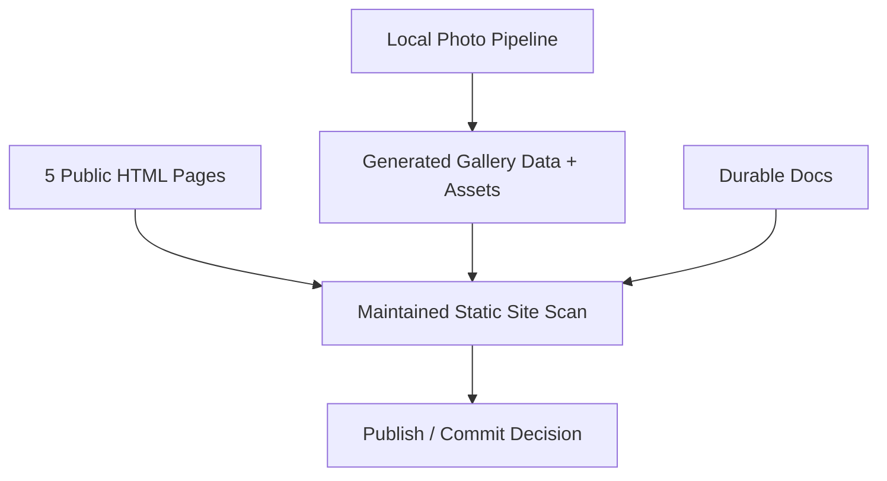
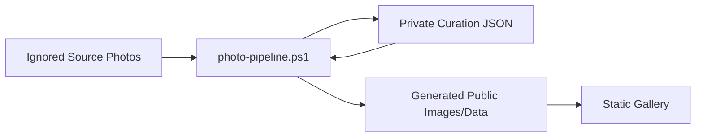
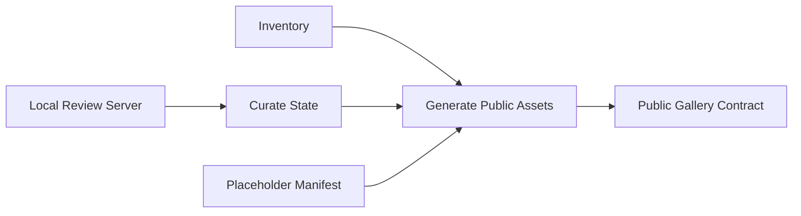

# Refactor Plan

## Source Inputs
- User request:
  - Full repository-level `refactor-planner` audit.
  - Review implementation approach and check `documentation/` for coherence and consistency.
- Durable product / architecture docs:
  - `documentation/planning/prd.md`
  - `documentation/planning/deployment-footprint.md`
  - `documentation/requirements/requirements.md`
  - `documentation/requirements/use-case-requirements.md`
  - `documentation/requirements/current-state-design.md`
  - `documentation/README.md`
- Sprint and working evidence:
  - `documentation/planning/sprints/README.md`
  - all files under `documentation/planning/sprints/`
  - `documentation/planning/working/prototype-lab/README.md`
  - `documentation/planning/working/prototype-lab/*.md`
  - `documentation/planning/working/prototypes/*.html`
  - previous `documentation/planning/working/refactor-plan.md`
- Public site code:
  - `index.html`, `about.html`, `gallery.html`, `hotels.html`, `syracuse.html`
  - `css/style.css`
  - `js/archive-home.js`, `js/gallery.js`, `js/gallery-data.js`
  - `data/gallery-data.json`
- Local tooling:
  - `tools/photo-pipeline.ps1`
  - `tools/photo-pipeline.tests.ps1`
  - `tools/README.md`
  - `.gitignore`
- Legacy / cleanup candidates:
  - `js/app.js`
  - `js/jquery.countdown.js`
  - `js/jqBootstrapValidation.js`
  - `js/ReactiveRaven-jqBootstrapValidation-1.3.6-0-gd66d033*`
  - `css/jquery.countdown.js`
  - legacy CSS selectors in `css/style.css`
- Checks run for this audit:
  - `powershell -NoProfile -ExecutionPolicy Bypass -File documentation/planning/working/prototypes/static_site_scan.ps1`
    - Result: 5 HTML pages, 52 local references resolved, 0 missing references, 0 server-side runtime references, 0 PHP files, 11 external references.
  - `powershell -NoProfile -ExecutionPolicy Bypass -File tools/photo-pipeline.tests.ps1`
    - Result: generated 2 public photos across 2 albums; metadata/report produced; tests passed.

## Review Mode
Repository Audit.

This is a working static site with code, tests, durable requirements, sprint plans, prototype evidence, and a local photo pipeline. The audit treats durable docs as current truth, sprint/prototype docs as historical or working evidence unless explicitly promoted, and code/tests as the strongest observed source.

## Coherence Cleanup Status
Updated 2026-06-20 after the documentation coherence pass:

- `documentation/planning/sprints/README.md` now rolls implemented sprints up as implemented, superseded, historical, or fallback instead of leaving all recent work as `Planned`.
- `documentation/planning/prd.md` now treats the PowerShell/.NET photo pipeline as the implemented baseline; Python/Pillow is only a possible future portability option.
- Durable requirements and current-state docs now describe the generated gallery, local photo pipeline, and session-stable hero as implemented current behavior, with real source-photo curation still pending.
- Historical sprint/prototype bodies still preserve old `contact.html` and six-page assumptions as evidence, but the current index and durable docs identify the active five-page site and deferred Info/contact route.

## Architecture Vocabulary
- **Public site shell**: the repeated HTML/CSS structure used by Home, Story, Gallery, Hotels, and Syracuse.
- **Variant C contract**: the accepted journal-style visual direction: photo-first home, restrained copy, interior archive pages, and no active event logistics.
- **Release contract**: the checks and invariants that must pass before publishing: static refs, no backend/form/PHP, current route set, gallery data/assets, and manual browser smoke.
- **Durable docs**: current PRD, deployment footprint, requirements, use-case requirements, and current-state design.
- **Working evidence**: prototypes, sprint records, and analysis notes that explain how decisions were reached but may describe older states.
- **Generated media seam**: the boundary between ignored original photos, private curation state, generated public images/data, and the public gallery/lightbox.
- **Deep module**: a module that hides meaningful behavior behind a small interface. Current best examples are `tools/photo-pipeline.ps1 generate` and the static scan script.
- **Shallow module**: a file or section whose caller must understand too much implementation detail. Current examples include repeated nav markup and the mixed legacy/current CSS file.

## System / Change Context
The repository is now much healthier than earlier in the project:

- The public site is static and deployable.
- The public page set is now 5 root pages: `index.html`, `about.html`, `gallery.html`, `hotels.html`, `syracuse.html`.
- The temporary `contact.html` / Info page has been removed from production and from durable active docs.
- The gallery and local photo pipeline are real, testable functionality, not just plans.
- Static scan and photo-pipeline tests pass.

The main problem is no longer "make it work." The highest-risk documentation drift found by this audit has now been addressed in the current docs and indexes. Remaining risks are cleanup and release-hardening items:

- Sprint records and prototype docs intentionally preserve older states, but the sprint index now labels implemented/superseded/historical status.
- Earlier working notes may still reference `contact.html`, six pages, old logistics blocks, and pre-implementation layout issues as historical evidence.
- Durable docs now agree that the implemented photo pipeline is PowerShell/.NET, with Python/Pillow only a possible future portability option.
- `css/style.css` still carries old carousel/countdown/page-journal selectors that are no longer used by production pages.
- Legacy countdown/form-validation assets remain in the repository even though the product has retired that behavior.
- `tools/photo-pipeline.ps1` is valuable but large; placeholder data, generation, review-server behavior, and HTTP handling live in one file.

## Source Claim Classification
| Claim | Classification | Evidence | Notes |
|---|---|---|---|
| Public site is static GitHub Pages-oriented HTML/CSS/JS. | Observed / Accepted | Static scan; deployment footprint; PRD | Strong and coherent. |
| Active root page count is 5. | Observed / Accepted | Static scan; production files | Durable docs now agree. |
| `contact.html` is removed for now. | Observed / Accepted | File absent; requirements updated | Sprint/prototype history still references it, correctly as history. |
| No public RSVP/address/message/upload/account/contact flow exists. | Observed / Accepted | Source scans; requirements | Strong. |
| Local photo review/generation tool exists. | Observed | `tools/photo-pipeline.ps1`; test passes | Implemented in PowerShell/.NET. |
| Photo pipeline current implementation is PowerShell/.NET. | Observed / Accepted | `tools/photo-pipeline.ps1`; requirements; PRD | Python/Pillow is now documented only as a possible future portability option. |
| Variant C is the visual direction. | Accepted | Prototype records, sprint docs, production classes | Public pages mostly follow it now. |
| Sprint plans 1-5 are implemented or superseded. | Accepted | `documentation/planning/sprints/README.md`; sprint implementation evidence | Index now rolls status up correctly. |
| Old countdown/form-validation assets are current behavior. | Stale | Source search: not referenced by public pages | Good cleanup candidate. |
| Browser automation is available. | Conflicting / Environment-dependent | Prior attempts failed with sandbox metadata error | Manual browser smoke remains required. |

## Documentation Coherency Verdict
Overall after cleanup: **coherent at the durable-doc and index level; historical working/sprint bodies still intentionally preserve older states.**

| Area | Coherency | Evidence | Risk |
|---|---|---|---|
| Durable requirements | Good | Requirements reflect 5 pages, deferred Info/contact route, no backend, implemented photo pipeline. | Low |
| Use cases | Good | UC-003 is deferred; gallery/photo pipeline flows active. | Low |
| Current-state design | Good | Current page set, implemented photo tooling, generated gallery, and scan result are current. | Low/Medium: diagrams are broad and may need pruning after code cleanup. |
| PRD | Good | Product scope and implementation baseline now agree. | Low |
| Deployment footprint | Good | Static/no-backend/GitHub Pages direction is clear. | Low |
| Sprint index | Good | Implemented sprints are labeled as implemented/superseded/historical/fallback. | Low |
| Sprint records | Mixed by design | Older sprint evidence still names `contact.html` and 6-page scan results. | Low: acceptable because the index and durable docs now identify current truth. |
| Prototype records | Historical/working | Variant C prototype still includes Info/contact. | Low: should not be edited unless promoted again. |
| Previous refactor plan | Stale | Replaced by this audit. | Resolved by this update. |

## Refactor Candidates
| Candidate | Architecture Value | Requirement / Mission Driver | Delivery Risk | Resource Constraints | Suggested PR Size | Test Surface | Recommendation |
|---|---|---|---|---|---|---|---|
| Documentation status and release-contract cleanup | High: makes future work trust the right docs and checks. | REQ-016, REQ-019; user explicitly asked for documentation coherence. | Low | No runtime change; mostly Markdown plus maybe moving scan script. | Small PR | Static scan, source scan, doc scan for stale active claims. | **Completed for docs; optional follow-up: promote static scan** |
| Promote static scan into maintained release tooling | High: deepens a useful module currently buried under prototypes. | REQ-004, REQ-012, REQ-016 | Low/Medium | Script already exists; avoid overbuilding CI. | Small PR | Run promoted command; compare output with current scan. | Pair with top recommendation or immediate follow-up |
| Legacy asset and CSS dead-code cleanup | Medium/High: reduces confusion and source noise. | REQ-020, REQ-018 | Medium | Need careful reference scan; browser smoke still manual. | Small/medium PR | Static scan, `rg` references, manual page smoke. | Do after release-contract cleanup |
| Photo pipeline module split and placeholder manifest | High: improves locality before real photo import. | REQ-022 through REQ-030; upcoming real photo work. | Medium | PowerShell only; keep command interface stable. | Medium PR | `tools/photo-pipeline.tests.ps1`, fixture generation, data parity. | Best next code refactor before adding real photos |
| Gallery/lightbox hardening | Medium: improves public UX and robustness. | REQ-021, REQ-031 | Medium | Browser automation unavailable; manual smoke required. | Small/medium PR | Static scan, gallery data check, manual lightbox smoke. | Useful, but not first unless visual bugs are visible |
| Repeated public nav/page-shell ownership | Medium: reduces manual drift across pages. | REQ-003, REQ-018 | Medium/High if generator introduced | No build step currently desired. | First slice small: consistency check. Later slice larger: generator/includes. | Static consistency check; static scan. | Defer generator; add checks first |
| External link archive-polish audit | Medium: improves visitor trust. | REQ-009 | Medium | Requires current web verification. | Small content PR | Link audit; manual review; static scan. | Separate content sprint |

## Top Recommendation
The original top recommendation was **Documentation status and release-contract cleanup**. That documentation cleanup has now been completed for the durable docs and status indexes. The best remaining tiny follow-up is promoting the static scan into maintained tooling if the user wants a code-adjacent release check improvement.

Why this first:

- The current code passes its checks, so there is no emergency code refactor.
- The next few user-visible changes will likely involve real photos; those changes will rely heavily on docs and checks.
- The sprint index now reflects implemented/superseded/historical state.
- The PRD now identifies the actual PowerShell/.NET tool as the current baseline.
- The static scan is important release infrastructure but still lives under `documentation/planning/working/prototypes/`, which makes it look disposable.

This is not the most glamorous refactor, but it is the one that lowers the most future mistake risk per line changed.

## Candidate Details

### 1. Documentation Status And Release-Contract Cleanup
- Current friction:
  - Resolved for active docs and status indexes.
  - Working/prototype docs intentionally contain old states as historical evidence.
- Evidence:
  - Sprint files contain implementation evidence tables for local photo pipeline, generated gallery, visual refresh, hardening, and remove-contact work.
  - `documentation/README.md` correctly says durable docs win over working/sprint conflicts.
  - Static scan passes with 5 pages.
- Proposed direction:
  - Keep sprint index statuses aligned after future implementation.
  - Keep implementation deviations reflected in the PRD or durable design docs.
  - Optionally add a fuller "Release Contract" section to `documentation/README.md` or deployment footprint that names the current commands and expected outputs.
  - Leave prototype files untouched as working evidence.
- Benefits:
  - Future sprint planning starts from true state.
  - Reduces accidental resurrection of `contact.html`, form behavior, or Python/Pillow assumptions.
  - Keeps docs useful without another full systems rewrite.
- Risks:
  - Low; mostly documentation.

### 2. Promote Static Scan Into Maintained Release Tooling
- Current friction:
  - The static scan is a real release guard but lives under `documentation/planning/working/prototypes/static_site_scan.ps1`.
  - That path implies throwaway prototype, while sprint plans depend on it as a gate.
- Evidence:
  - The scan catches local reference, runtime, and PHP issues.
  - Recent implementation evidence repeatedly cites it.
- Proposed direction:
  - Move or copy the script to `tools/static-site-scan.ps1`.
  - Keep a thin compatibility note or update docs to reference the new command.
  - Optionally add a single release-check wrapper later.
- Benefits:
  - Turns a prototype into a maintained deep module with a small interface: one command, clear output.
  - Makes future release verification less dependent on remembering a working-doc path.
- Risks:
  - Need to update sprint/docs references only where current commands are listed.

### 3. Legacy Asset And CSS Dead-Code Cleanup
- Current friction:
  - Legacy files remain: `js/app.js`, `js/jquery.countdown.js`, `js/jqBootstrapValidation.js`, ReactiveRaven zip/extracted files, and `css/jquery.countdown.js`.
  - `css/style.css` still contains unused old selectors: `#weddingStyle`, `.saveDate`, `.carousel-*`, `.location`, `.page-journal-header`, `.thumbnail`, `.img-circle`.
- Evidence:
  - Source search found these selectors only in CSS/docs, not active production HTML.
  - Requirements already mark REQ-020 as Active / Partial and list these cleanup candidates.
- Proposed direction:
  - First characterization: run `rg` reference checks for every candidate file/selector.
  - Delete unused legacy JS/vendor/countdown files.
  - Prune unused CSS blocks in a small, reviewable pass.
  - Keep `reset.css`/`normalize.css` only if intentionally retained as archive/vendor assets; otherwise mark them for deletion too.
- Benefits:
  - Reduces confusion for future maintainers.
  - Makes the current site easier to understand.
- Risks:
  - Visual regressions if a selector is still used indirectly by Bootstrap markup or future pages; requires manual browser smoke.

### 4. Photo Pipeline Module Split And Placeholder Manifest
- Current friction:
  - `tools/photo-pipeline.ps1` is about 29 KB and owns several responsibilities:
    - command routing,
    - JSON read/write,
    - inventory,
    - curation schema defaults,
    - image resizing,
    - placeholder manifest,
    - generation report,
    - local review HTML,
    - raw TCP HTTP server.
  - Placeholder photo titles/captions/hero selection are hardcoded inside `Invoke-Generate`.
- Evidence:
  - `tools/photo-pipeline.tests.ps1` passes and gives a good regression seam.
  - Real photos are not added yet, so now is a good time to improve seams before source scale increases.
- Proposed direction:
  - Preserve the command interface:
    - `.\tools\photo-pipeline.ps1 init`
    - `.\tools\photo-pipeline.ps1 serve`
    - `.\tools\photo-pipeline.ps1 generate`
  - Extract placeholder choices into a JSON manifest, such as `tools/photo-placeholders.json`.
  - Split functions by responsibility in the same file first, or only later split into dot-sourced `.ps1` modules if PowerShell ergonomics justify it.
  - Add tests for placeholder generation parity and source-folder album preservation.
- Benefits:
  - Keeps the public metadata contract stable.
  - Makes real-photo import less scary.
  - Makes placeholder behavior obviously temporary.
- Risks:
  - PowerShell module splitting can create path/load complexity; first slice should avoid changing runtime command behavior.

### 5. Gallery / Lightbox Hardening
- Current friction:
  - Gallery rendering is compact and functional, but browser behavior has not been manually verified in this environment.
  - Summary count uses all albums in metadata, not only rendered albums if an album has zero visible photos.
  - Lightbox has keyboard support but no focus management.
  - `noscript` copy is outside the main content band, so it may be visually awkward when JS is disabled.
- Evidence:
  - `js/gallery.js` is only 5.4 KB and has a clear public seam.
  - Static gallery data checks pass.
- Proposed direction:
  - Characterize current behavior with a manual browser smoke.
  - Fix visible album count logic.
  - Improve lightbox focus/close affordance only if it stays small.
  - Keep no backend and no original downloads.
- Benefits:
  - Improves the page most likely to grow when real photos arrive.
- Risks:
  - Browser/manual QA required.

### 6. Repeated Public Nav / Page-Shell Ownership
- Current friction:
  - Nav markup repeats across all five HTML pages.
  - Page heads repeat CDN and font links.
  - Manual edits already caused route drift in earlier steps.
- Evidence:
  - Source search finds the nav block repeated in all five production pages.
  - No build system is desired right now.
- Proposed direction:
  - Do not introduce a static generator yet.
  - Add a small consistency check that asserts:
    - five public pages exist,
    - no `contact.html` production links exist,
    - nav target set is consistent,
    - required Variant C shell classes exist,
    - `gallery.html` includes `js/gallery-data.js` before `js/gallery.js`.
  - Revisit includes/generation only if manual drift continues.
- Benefits:
  - Gains most of the safety of a shared shell without changing deployment shape.
- Risks:
  - Check scripts can become brittle if over-specified.

### 7. External Link Archive-Polish Audit
- Current friction:
  - External links are old wedding-era hotel/activity URLs.
  - Durable docs correctly mark external link freshness as pending.
- Evidence:
  - Static scan lists 11 external references.
- Proposed direction:
  - Web-assisted link/currentness review in a dedicated sprint.
  - Replace, remove, or convert stale links to plain historical notes.
- Benefits:
  - Improves visitor trust before broad sharing.
- Risks:
  - Requires browsing/current information; can sprawl if not bounded.

## Selected Candidate
No candidate has been selected for grilling yet.

Recommended candidate to grill next: **Documentation status and release-contract cleanup**.

## Grilling Decisions
No grilling decisions have been locked in this audit.

Suggested first grilling question:

> Should sprint records be treated as immutable history after implementation, with only the sprint index updated for current status?

Recommended answer: **Yes.** Keep sprint files as implementation history, update the index/status layer and durable docs for current truth. This keeps auditability without making every old sprint rewrite itself when the site evolves.

## Proposed Refactor Design
Pending selected-candidate grilling. If the top recommendation is selected, the proposed design is:

- Proposed module / seam:
  - A **release contract** documented in one place and backed by maintained commands.
- Interface expectations:
  - One current release-check command or short command list.
  - One sprint index that clearly distinguishes current, implemented, superseded, historical, and fallback records.
  - Durable docs remain the source of product truth.
  - Prototype/sprint files remain evidence, not active requirements.
- Implementation responsibilities:
  - `documentation/README.md`: how to decide what is current.
  - `documentation/planning/sprints/README.md`: sprint status ledger.
  - `documentation/planning/deployment-footprint.md`: release verification expectations.
  - `tools/static-site-scan.ps1`: maintained release guard, if promoted.
- Dependency and adapter strategy:
  - Keep current static site tooling.
  - No CI/build system required.
- Behavior preserved:
  - Public site files and routes.
  - Photo pipeline commands.
  - Static hosting model.
- Behavior intentionally changed:
  - Documentation no longer implies unimplemented/planned status for implemented work.
  - PRD no longer states Python/Pillow as the preferred current implementation.

## Diagrams
Current documentation flow:

Recommended release-contract shape:

Photo pipeline current responsibility bundle:

Future photo pipeline seam:

## First Safe Slice
Status: documentation portion completed in the 2026-06-20 coherence pass. Optional tooling promotion remains available as a follow-up.

### Goal
Make repository planning state and release verification unambiguous without changing public site behavior.

### In Scope
- Completed: update `documentation/planning/sprints/README.md` statuses to reflect actual state:
  - implemented,
  - implemented with manual browser smoke pending,
  - superseded by later sprint,
  - historical/fallback.
- Completed: update the PRD line that still preferred Python/Pillow so it matches the implemented PowerShell/.NET pipeline.
- Completed: add concise truth-reconciliation guidance to `documentation/README.md`.
- Optionally promote `documentation/planning/working/prototypes/static_site_scan.ps1` to `tools/static-site-scan.ps1` and update current docs to reference it.

### Out of Scope
- Editing historical archive docs.
- Rewriting prototype files.
- Changing public HTML/CSS/JS behavior.
- Splitting the photo pipeline.
- Deleting legacy assets.
- Adding CI/build tooling.

### Required Characterization Tests
- Current static scan result:
  - 5 HTML pages,
  - 52 local refs resolved,
  - 0 missing refs,
  - 0 runtime refs,
  - 0 PHP files.
- Current photo pipeline test:
  - `tools/photo-pipeline.tests.ps1` passes.
- Source scan for active durable-doc conflicts:
  - `contact.html`,
  - old six-page scan claims,
  - `Python/Pillow`,
  - sprint status terms.
  Current result: remaining current-doc `contact.html` hits describe the deferred/removed route; `Python/Pillow` appears only as a future option or implementation note, not as the preferred baseline.

### Required Refactor Tests
- Run static scan from its maintained location if promoted.
- Run `tools/photo-pipeline.tests.ps1`.
- Source-scan durable docs to confirm no active Python/Pillow preference remains.
- Review sprint index manually to confirm status labels are clear.

### Follow-Up Slices
1. Legacy asset and CSS dead-code cleanup.
2. Photo pipeline placeholder manifest and function-locality refactor.
3. Static page-shell consistency check.
4. Gallery/lightbox hardening after manual browser smoke.
5. External link archive-polish sprint.

## Prototype Recommendations
| Risk | Prototype Question | Suggested Method | Expected Decision Impact |
|---|---|---|---|
| Static generator/includes may be overkill. | Would a consistency check catch the drift that a generator would prevent? | Prototype a small PowerShell source scanner before introducing templates. | If it catches route/nav/page-shell drift, avoid a build system. |
| Photo pipeline split could make PowerShell harder to run. | Is dot-sourced module splitting worth it? | Prototype extracting only placeholder manifest first, without splitting files. | Determines whether to split modules or keep one command file. |
| Browser smoke remains manual. | Can lightweight local browser verification be added without a large dependency? | Prototype only if a browser runner becomes reliably available. | Determines whether release checks can be automated beyond source scans. |

## Requirement Impacts
| Existing Requirement | Refactor Impact | New / Changed Requirement Candidate | Notes |
|---|---|---|---|
| REQ-016 Verify Public Release | Strengthen | Release checks should live in maintained tooling/docs, not only prototype folders. | Static scan is already relied on as a gate. |
| REQ-018 Support Static Maintenance | Strengthen | Sprint index and docs should make current state easy to identify. | Reduces maintenance confusion. |
| REQ-019 Update Docs On Behavior Change | Strengthen | Sprint status index should be updated when implementation closes. | Current index lags actual implementation. |
| REQ-020 Remove Or Archive Dead Legacy Assets | Prepare | Cleanup should delete unused countdown/form validation assets after reference checks. | Good second slice. |
| REQ-022 through REQ-030 Photo Pipeline | Strengthen | Placeholder behavior should be separate from permanent generator behavior before real photos arrive. | Good code refactor before real source import. |
| REQ-031 Generated Album Lightbox | Preserve / Strengthen | Gallery hardening should keep static/no-backend behavior. | Browser smoke required. |

## Sprint Planning Handoff
| Candidate | Suggested Sprint Slice | Branch / PR Scope | Required Tests | Prototype Needed |
|---|---|---|---|---|
| Documentation status and release-contract cleanup | `documentation-release-contract-cleanup` | Sprint index, PRD implementation note, documentation guide/deployment release checks; optional scan promotion. | Static scan, photo-pipeline tests, doc source scans. | No |
| Promote static scan into maintained tooling | `promote-static-site-scan` | Move/copy scan to `tools/`, update docs and sprint templates. | Old/new scan output parity, static scan. | No |
| Legacy asset and CSS dead-code cleanup | `legacy-asset-css-cleanup` | Delete unused countdown/form validation assets; prune unused CSS selectors. | `rg` reference checks, static scan, manual browser smoke. | No |
| Photo pipeline module split and placeholder manifest | `photo-pipeline-placeholder-manifest` | Add placeholder manifest; keep command interface stable; refactor generator locality. | `tools/photo-pipeline.tests.ps1`, generated metadata/assets checks, static scan after generation. | Maybe, only if module split is considered |
| Gallery/lightbox hardening | `gallery-lightbox-hardening` | `js/gallery.js`, `gallery.html`, `css/style.css` small UX/focus/count fixes. | Static scan, gallery data check, manual lightbox smoke. | No |
| Public page-shell consistency check | `static-page-shell-check` | Add scan/check script for nav/page-shell/gallery script ordering. | New check plus static scan. | Yes, small check prototype if desired |
| External link archive-polish audit | `external-link-archive-polish` | Hotels/Syracuse link text and destinations. | Web-assisted link verification, static scan, manual review. | No |

## Assumptions
- The public site should remain plain static HTML/CSS/JS for now.
- Durable docs are intended to be current truth; sprint/prototype docs can remain historical evidence.
- The user may add real wedding photos soon, so photo pipeline stability matters.
- Browser automation may remain unavailable in this environment; manual browser smoke should stay in release criteria.
- It is acceptable for historical/prototype docs to mention removed pages as long as current indexes/docs label them as historical or superseded.

## Gaps and Questions
- Should sprint files be left immutable after implementation, with only the sprint index and durable docs updated for current truth?
- Should the static scan be promoted to `tools/static-site-scan.ps1`, or is the current prototype path acceptable for now?
- Should legacy countdown/form-validation files be deleted next, or archived under `documentation/planning/archive/` for provenance?
- Before real photos arrive, should the photo pipeline first get a placeholder manifest refactor?
- Do you want a small page-shell consistency checker before more manual HTML edits?
