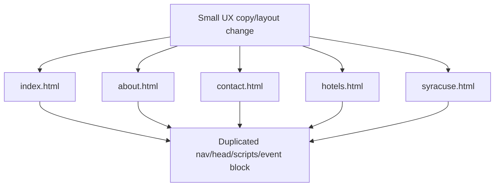

# Refactor Plan

## Source Inputs
- User request: look for small UX improvements to the published wedding site.
- Current deployment goal: cheapest possible static public site on GitHub Pages, with GoDaddy forwarding.
- Product docs: `documentation/planning/prd.md`
- Deployment docs: `documentation/planning/deployment-footprint.md`
- Sprint docs: `documentation/planning/sprints/github-pages-publication.md`
- Static scan: `documentation/planning/working/prototypes/static_site_scan.ps1`
- Repository files reviewed: `index.html`, `about.html`, `contact.html`, `hotels.html`, `syracuse.html`, `css/style.css`, `js/app.js`, `js/jquery.countdown.js`, `js/jqBootstrapValidation.js`, image assets.
- Live status from prior verification: GitHub Pages is built at `https://skeller01.github.io/wedding-website/`.

## Review Mode
Repository Audit.

The site has working production code, but this review is scoped to small UX refactor candidates rather than the prior publication/deployment slice.

## Architecture Vocabulary
- **Static page**: one root `.html` file served directly by GitHub Pages.
- **Shared page chrome**: repeated navigation, scripts, footer/event summary, and shared head assets.
- **Visitor-facing content**: text, images, buttons, links, titles, and page structure that a guest sees directly.
- **UX polish slice**: a small PR that improves visitor clarity, mobile behavior, accessibility, or trust without changing hosting or adding a backend.
- **Dead interaction code**: JavaScript, CSS, or vendor assets for behavior no longer present in public markup.

## System / Change Context
The site is now static and published through GitHub Pages. The next useful work is not a framework rewrite; it is a small visitor-facing cleanup that makes the existing pages clearer, more mobile-friendly, and easier to maintain.

The key tension is that some content still reflects the original pre-wedding invitation workflow, while the current product goal is a simple public information site with no RSVP, address collection, or form behavior.

## Refactor Candidates
| Candidate | Architecture Value | Requirement / Mission Driver | Delivery Risk | Resource Constraints | Suggested PR Size | Test Surface | Recommendation |
|---|---|---|---|---|---|---|---|
| Visitor-facing UX polish pass | Medium: concentrates current public-site intent in the visible copy and page metadata without changing architecture. | Cheap static public information site; no RSVP/address collection; mobile visitors should be able to read it comfortably. | Low | Plain HTML/CSS only; no build step. | Small: 5 HTML files plus small CSS edits. | Static scan, five-page live smoke, mobile-width visual/manual check. | **Do first** |
| Remove dead interaction assets | Medium: reduces confusing legacy code paths and future maintenance risk. | No forms, no RSVP, no countdown workflow. | Low | Must avoid breaking Bootstrap/jQuery behavior still used by nav/tooltips. | Small: remove unused scripts/assets and script tags after checking references. | Static scan, `rg` for removed files, live nav/dropdown smoke. | Do second or bundle only if very small |
| Shared page chrome source of truth | High: improves locality for nav/footer/event updates and prevents page drift. | Future patches should be easy and consistent. | Medium | A true partial system needs Jekyll/build tooling or deliberate static generation; current goal favors no build step. | Medium: either introduce Jekyll/static generation or a documented copy/update pattern. | Generated output diff, static scan, all-page smoke. | Defer until repeated edits justify it |
| External link and trust cleanup | Medium: improves visitor confidence and avoids stale/offsite surprises. | Public travel/local information should be useful and trustworthy. | Medium | Link freshness changes over time; requires current web verification. | Small/medium: update link URLs, add `rel="noopener"`, improve link labels. | External link checker or manual verification, static scan. | Plan as a follow-up polish sprint |
| Future photo gallery preparation | Medium: creates a clean place for future photos without redesigning the site now. | User mentioned possible scrollable pictures later. | Medium | Needs content decisions and image optimization. | Medium: gallery page/section, thumbnails, image sizing. | Visual checks, performance check, mobile smoke. | Defer until photos exist |

## Top Recommendation
The best next engineering move is **Visitor-facing UX polish pass**.

Why: it has the highest immediate visitor value for the least risk. It fixes the most visible mismatch between current intent and current content, especially the home CTA asking for invitation addresses even though the contact page says the site is no longer collecting addresses, RSVPs, or messages.

## Candidate Details

### Candidate 1: Visitor-facing UX polish pass
- Current friction:
  - `index.html:71-74` still says "Save the Date", `5.26.2017`, and "Let us know your address for invitations".
  - `contact.html:69-70` says the site is not collecting addresses, RSVPs, or messages, creating a direct mismatch with the home CTA.
  - All pages have the same generic title at line 7 and no `meta name="viewport"`, which weakens mobile behavior for a Bootstrap site.
  - `syracuse.html:70`, `75`, `80`, and `85` use `alt="logo"` for non-logo activity images.
  - `hotels.html:111` contains a stray closing `
`.
  - Hotel costs still say `TBD` in `hotels.html:79`, `99`, and `122`.
- Evidence:
  - Static scan passes, so these are not deployment blockers.
  - The content mismatch is observed in the root HTML.
  - The no-viewport issue is observed across all five pages.
- Proposed direction:
  - Update home hero CTA to point to useful static content, such as hotel/local information, instead of address collection.
  - Add viewport metadata to all pages.
  - Give each page a specific title.
  - Replace generic image alt text with descriptive alt text.
  - Fix the stray closing paragraph and either remove or reword `TBD` cost values.
  - Tune only the CSS needed to preserve readability on narrow screens.
- Benefits:
  - Visitors get a coherent site immediately.
  - Mobile rendering improves without adopting new tooling.
  - Accessibility improves slightly through page titles and image alt text.
- Risks:
  - Copy choices may need owner preference.
  - Mobile CSS changes should be checked visually.
- Suggested diagrams:
  - No diagram needed for implementation; the flow is simple.

### Candidate 2: Remove dead interaction assets
- Current friction:
  - `js/app.js` initializes `#countdown`, but no active page contains that element.
  - `js/jquery.countdown.js` is loaded on every page.
  - Countdown CSS remains in `css/style.css`.
  - `js/jqBootstrapValidation.js` and the ReactiveRaven archive/folder remain in the repo even though public pages no longer reference the old contact form.
- Evidence:
  - `js/app.js:3`, `18`, and `36` reference `#note`/`#countdown`.
  - `css/style.css:143-190` contains countdown styles.
  - `index.html`, `about.html`, `contact.html`, `hotels.html`, and `syracuse.html` still load `js/jquery.countdown.js`.
  - `js/jqBootstrapValidation.js` and the extracted ReactiveRaven files are present in the repository.
- Proposed direction:
  - Remove countdown initialization and script loads if the countdown is no longer desired.
  - Remove unused countdown CSS.
  - Remove unused validation vendor files after confirming there are no references outside documentation.
- Benefits:
  - Less JavaScript downloaded and fewer historical code paths to understand.
  - Future maintainers are less likely to revive broken form/countdown behavior accidentally.
- Risks:
  - If the owner wants a future commemorative countdown/count-up, removing it now means rebuilding it later.
- Suggested diagrams:
  - No diagram needed.

### Candidate 3: Shared page chrome source of truth
- Current friction:
  - The navigation block is duplicated in all five pages.
  - The `location` event summary block is duplicated in all five pages.
  - Shared scripts and head assets are duplicated in all five pages.
  - Any copy, link, or class change must be repeated manually.
- Evidence:
  - `Sonia and Steve's Wedding`, `Hotel Information`, and `class="location"` appear in every root page.
- Proposed direction:
  - Defer full Jekyll/static-generation until repeated UX edits make duplication painful.
  - For the next small PR, keep manual edits synchronized and document the duplicate blocks.
  - If future gallery/content work expands, convert to Jekyll layouts/includes or a tiny static-generation script.
- Benefits:
  - A true shared layout would make nav/footer updates safer.
  - Reduces drift between pages.
- Risks:
  - Adding Jekyll or generation now increases deployment/change complexity beyond the current cheap-static goal.
- Suggested diagrams:
  - A small before/after flowchart if this candidate is selected.

### Candidate 4: External link and trust cleanup
- Current friction:
  - Several external links still use `http://`.
  - New-tab links do not consistently use `rel="noopener"`.
  - Some hotel/local destination URLs are likely old and should be verified before public forwarding.
- Evidence:
  - Static scan lists 8 `http://` external destination links.
- Proposed direction:
  - Verify current destination URLs.
  - Upgrade to HTTPS URLs where supported.
  - Add `rel="noopener"` to `target="_blank"` links.
  - Improve link labels so visitors know when they are leaving the site.
- Benefits:
  - Better visitor trust and security posture.
  - Fewer broken travel/local recommendations.
- Risks:
  - Current link verification requires web checks because third-party pages may have moved.
- Suggested diagrams:
  - No diagram needed.

### Candidate 5: Future photo gallery preparation
- Current friction:
  - Future photos are a known possibility, but there is no gallery structure yet.
- Evidence:
  - User mentioned possible future pictures that can be scrolled through.
- Proposed direction:
  - Defer until photos are available.
  - When ready, add a static gallery section/page with optimized images and captions.
- Benefits:
  - Adds the most emotional value when the content exists.
- Risks:
  - Gallery work can balloon into image optimization/layout work.
- Suggested diagrams:
  - Optional page-flow sketch when selected.

## Selected Candidate
**Visitor-facing UX polish pass**.

The user approved implementing the small UX improvements on `development` and publishing them to `main` so the GitHub Pages site can show the changes.

## Grilling Decisions
| Decision | Selected Answer | Rationale |
|---|---|---|
| Home hero framing | Archival/public wedding information site | The site no longer collects addresses, RSVPs, or messages, so the home CTA should send visitors to useful static information instead of invitation collection. |
| Contact navigation label | Use `Info` while preserving `contact.html` URL | The page is now informational, but preserving the existing URL avoids routing churn. |
| Travel navigation label | Use `Travel` | Shorter label works better in the fixed Bootstrap navbar and still covers hotels/local entertainment. |
| Hotel cost values | Replace `TBD` with `See hotel site` | Current pricing changes over time and should not be implied as known static data. |
| Shared layout refactor | Defer | Current goal favors minimal static-file edits over introducing Jekyll or a build step. |

## Proposed Refactor Design
Pending user selection.

- Proposed module / seam: visitor-facing page copy and metadata across the five root HTML pages.
- Interface expectations: URLs remain unchanged; visual style remains recognizable; no new backend or build step.
- Implementation responsibilities: HTML copy/metadata, image alt text, safer new-tab link attributes, tiny CSS mobile/readability fixes.
- Dependency and adapter strategy: none; stay on existing Bootstrap/static files.
- Behavior preserved: five public pages, GitHub Pages hosting, current navigation destinations.
- Behavior intentionally changed: remove address-collection language and any remaining active invitation workflow language; relabel `Contact` as `Info` and `Hotel Information` as `Travel`.

## Diagrams
Current maintenance shape:

Recommended first slice keeps this shape for now, because avoiding a new build system is more valuable than perfect reuse for a small polish pass.

## First Safe Slice
- Goal: improve visible UX clarity and mobile basics without changing URLs, hosting, or introducing a build step.
- In Scope:
  - Add viewport metadata to all five root pages.
  - Replace the home address-collection CTA.
  - Make page titles specific.
  - Improve obvious image alt text.
  - Fix the stray `
` in `hotels.html`.
  - Reword or remove `TBD` hotel cost cells if the owner agrees.
  - Add small CSS adjustments only where needed for mobile readability.
- Out of Scope:
  - Jekyll/FastHTML/build-system conversion.
  - Photo gallery.
  - Full redesign.
  - RSVP/contact form/backend.
  - Broad external link rewrite unless selected separately.
- Required Characterization Tests:
  - Run the static site scan before edits.
  - Capture current live/page smoke baseline for all five root pages.
  - Confirm no active contact form or PHP references are reintroduced.
- Required Refactor Tests:
  - Static scan reports zero missing local references and zero server-side runtime references.
  - Source search finds no address-collection CTA or active form references.
  - All five pages return `200` on GitHub Pages after merge.
  - Manual or automated mobile-width smoke check confirms nav and hero text remain readable.
- Follow-Up Slices:
  - Remove dead countdown/form-era assets.
  - Verify and update external links.
  - Consider shared layout/Jekyll only after another content-growth sprint.

## Prototype Recommendations
| Risk | Prototype Question | Suggested Method | Expected Decision Impact |
|---|---|---|---|
| Mobile hero readability is uncertain without visual tooling. | Does the revised hero fit on common phone widths? | Browser screenshot/manual viewport check after a tiny CSS prototype. | Determines whether CSS changes are limited to text sizing/spacing or need a larger hero layout pass. |
| External links may be stale. | Which hotel/activity links still resolve to useful pages? | Lightweight link-check script plus manual review of changed destinations. | Determines whether link cleanup belongs in the first UX PR or a separate polish PR. |
| Shared layout might become worth it later. | Will two or more upcoming changes require coordinated edits across every page? | Count repeated blocks and estimate edit churn after the first UX pass. | Determines whether Jekyll/static generation is justified later. |

## Requirement Impacts
| Existing Requirement | Refactor Impact | New / Changed Requirement Candidate | Notes |
|---|---|---|---|
| REQ-003 Provide Internal Navigation | Preserve | None | Keep all current page URLs and nav links. |
| REQ-005 Support Mobile Navigation | Strengthen | Each page shall include viewport metadata for responsive rendering. | Current pages omit viewport metadata. |
| REQ-011 Present Contact Channel | Clarify | Public copy shall not invite address, RSVP, or message collection when no collection path exists. | Align home CTA with contact page. |
| REQ-020 Verify Before Public Release | Strengthen | UX polish changes shall pass static scan plus five-page smoke test. | Same release seam as publication sprint. |

## Sprint Planning Handoff
| Candidate | Suggested Sprint Slice | Branch / PR Scope | Required Tests | Prototype Needed |
|---|---|---|---|---|
| Visitor-facing UX polish pass | `ux-polish-static-site` | Five HTML files plus small CSS fixes. | Static scan, source search, five-page smoke, mobile-width visual/manual check. | Maybe: mobile hero screenshot only. |
| Remove dead interaction assets | `remove-dead-js-assets` | Remove countdown/form-era unused assets and script tags. | Static scan, `rg` reference check, nav/dropdown smoke. | No |
| Shared page chrome source of truth | `shared-layout-evaluation` | Decide Jekyll/static generation or defer. | Generated output diff if implemented. | Yes, only if selected |
| External link and trust cleanup | `external-link-polish` | Verify external URLs, HTTPS upgrades, `rel="noopener"`. | Link check, static scan, manual click checks. | Maybe |
| Future photo gallery preparation | `static-photo-gallery` | Add gallery page/section with optimized images. | Visual/mobile checks, image size check. | Yes, when photos exist |

## Assumptions
- The site should remain static and extremely cheap.
- The current visual identity should be preserved for now.
- The wedding date may remain as historical context, but should not be presented as an active "Save the Date" task unless the owner wants the site to remain intentionally nostalgic.
- No form, RSVP, email submission, or backend workflow should be reintroduced.

## Gaps and Questions
- Should the home hero be framed as archival/historical, or as evergreen guest information?
- Should the Contact nav item stay, become "Info", or be removed entirely?
- Should old hotel cost `TBD` rows be removed, replaced with "See hotel site", or updated with current pricing guidance?
- Can we use a visual browser/mobile check after implementation, or should the owner do a quick manual phone check?
