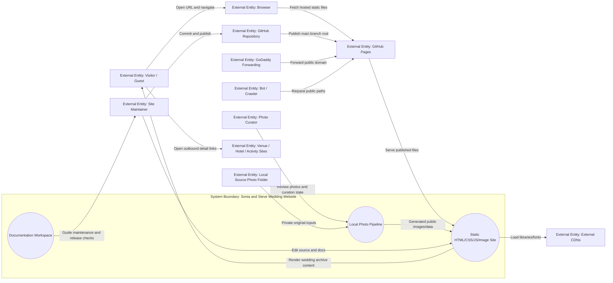
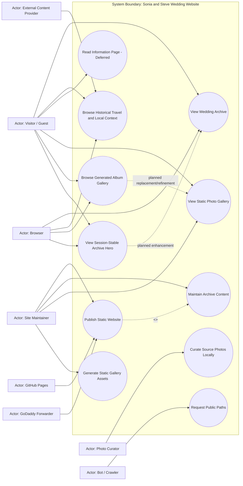
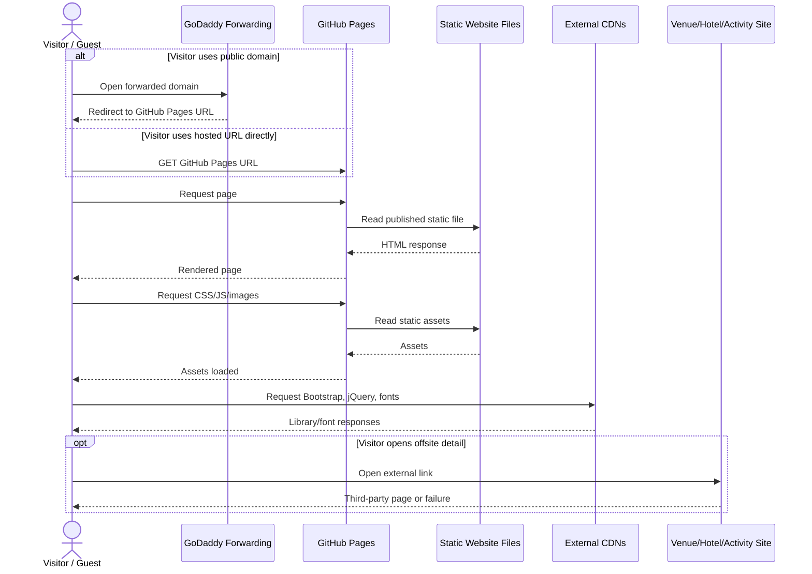
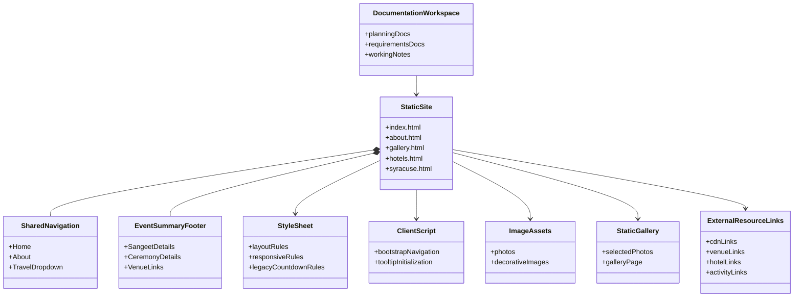

# Current State Design

## Ordered Systems Refresh - 2026-06-20

This refresh was produced in the requested systems order: documentation setup, context model, use case model, use case behavior, requirements consolidation, FFBD, IDEF0, sequence diagram, class diagram, Functional FMEA, deployment footprint, then PRD. It supersedes older AWS/PHP/contact-form-era analysis that remains later in this file for history.

Documentation workspace status: `documentation/planning/`, `documentation/planning/working/`, and `documentation/requirements/` already exist and are the active documentation paths.

Source inputs reviewed:
- Root static pages: `index.html`, `about.html`, `gallery.html`, `hotels.html`, `syracuse.html`.
- Shared assets: `css/style.css`, Bootstrap/jQuery CDN behavior, remaining unused legacy validation/countdown files, `images/*`.
- Current durable docs: `documentation/requirements/current-state-design.md`, `documentation/requirements/use-case-requirements.md`, `documentation/requirements/requirements.md`, `documentation/planning/deployment-footprint.md`, `documentation/planning/prd.md`.
- Planning evidence: sprint docs, refactor plan, prototype lab, and static scan scripts under `documentation/planning/`.
- Current static scan after removing the temporary Info/contact page: 5 HTML pages, 52 local references resolved, 0 missing references, 0 server-side runtime references, 0 PHP files, 11 external references.

## Context Diagram and Matrix

### Source Inputs
- Current repository files and assets listed in the ordered refresh source inputs.
- Current deployment and planning docs.
- Static scan result from `documentation/planning/working/prototypes/static_site_scan.ps1`.
- Photo/gallery/visual-refresh sprint implementation evidence from `documentation/planning/sprints/`.

### System Boundary
The Sonia and Steve Wedding Website is a static public wedding archive / memory site made of HTML, CSS, JavaScript, and image assets. It includes visitor-facing archive pages, generated static gallery/lightbox behavior, shared navigation, local media, client-side Bootstrap behavior, local-only photo review/generation tooling, and documentation used to maintain and publish the site. The system excludes GoDaddy account configuration, GitHub hosting infrastructure, third-party linked websites, CDN infrastructure, public photo upload services, and any RSVP/contact-form backend.

### Inside the System
| Internal Element | Description | Evidence |
|---|---|---|
| Static pages | Home, story, gallery, hotels, and Syracuse historical context pages. | Root `*.html` files |
| Shared presentation | Bootstrap classes plus custom styling. | HTML includes and `css/style.css` |
| Client behavior | Bootstrap navigation/tooltips; public pages no longer load obsolete countdown initialization. | Root script tags and source search |
| Static assets | Local photos and decorative images. | `images/*`; scan resolves references |
| Generated gallery assets | Public web-sized thumbnails, large images, hero images for explicit hero photos, and gallery metadata generated from private source photos or placeholder checked-in images. | `images/gallery/generated/`, `data/gallery-data.json`, `js/gallery-data.js` |
| Local photo tooling | Local-only review/generation workflow for ignored original photos and private curation state. | `tools/photo-pipeline.ps1` |
| Documentation workspace | Durable planning, requirements, and working analysis. | `documentation/*` |

### Outside the System
| External Entity | Type | Description | Evidence |
|---|---|---|---|
| Visitor / Guest | Person | Reads wedding memories, event context, and historical travel/local pages. | Site content |
| Couple / Family | Person | Shares the archive and may curate wedding photos. | User update/prototype absorption |
| Photo Curator | Person | Reviews source photos locally and records publish/exclude/hero/album decisions. | Sprint research |
| Site Maintainer | Person | Edits content, verifies static behavior, and publishes changes. | Git/docs workflow |
| Browser | Runtime | Requests, renders, and navigates static pages/assets. | HTML/CSS/JS site |
| GitHub Repository | External service | Stores source and production branch. | Current deployment docs |
| GitHub Pages | External host | Serves the static site over HTTPS. | Deployment footprint |
| GoDaddy Forwarding | External service | Redirects a public domain to the hosted URL. | User update: redirect is working |
| External CDNs | External services | Serve Bootstrap, jQuery, and Google Fonts. | HTML links/scripts |
| Venue / Hotel / Activity Sites | External websites | Provide offsite or historical context details. | External links in HTML |
| Local Source Photo Folder | Local/private data source | Stores original wedding photos outside public committed outputs. | Implemented `.gitignore` convention |
| Bot / Crawler | Unintended actor | Requests public pages or stale paths. | Public static website risk |

### Mermaid Context Diagram



### Context Matrix
| External Entity | Interaction | Direction | Category | System Input | System Output | Frequency / Volume | Assumptions | Constraints |
|---|---|---|---|---|---|---|---|---|
| Visitor / Guest | View wedding archive | In/Out | Query/response | Page request | Static wedding memory and event context | Occasional | Public wedding archive is the current product. | Must remain readable without backend services. |
| Visitor / Guest | Browse historical travel/local context | In/Out | Query/response | Navigation/link click | Hotel and Syracuse pages | Occasional | Internal content is useful as historical context even if third-party links drift. | External destinations should not be misleading. |
| Visitor / Guest | Encounter no public contact flow | In/Out | Query/response | Page navigation/source request | No Info/contact page or submission workflow exposed | Occasional | No RSVP/address/message collection is intended. | `contact.html` removed for now. |
| Browser | Load local assets | In/Out | Startup/query | CSS/JS/image requests | Static assets | Per page load | Paths must be deploy-safe. | Static scan currently passes. |
| Browser | Load CDN assets | Out/In | Startup/query | CDN requests | Libraries/fonts | Per page load | CDN use remains acceptable. | CDN outages degrade styling/interactions. |
| Site Maintainer | Update content | In | Maintenance | File edits and docs changes | Repository changes | Infrequent | Changes occur before production publication. | Duplicated nav/footer markup creates maintenance risk. |
| Photo Curator | Curate local photos | In/Out | Maintenance | Review decisions | Private curation state | Project setup / occasional | Original photos stay local/ignored. | Private state must not be public site output. |
| Local Source Photo Folder | Provide original photo inputs | In | Local data | Original JPEG files | Source metadata/images for generation | Hundreds of photos expected | Folder structure should be preserved as albums. | Originals should not be committed. |
| GitHub Pages | Publish site | Out | Runtime | Repository source | HTTPS site | Continuous | GitHub Pages is current production host. | No server runtime. |
| GoDaddy Forwarding | Route public domain | In/Out | Network | Domain request | Redirected hosted site | Per visitor | Forwarding targets GitHub Pages URL. | Working per user update. |
| Venue / Hotel / Activity Sites | Provide linked or historical details | Out/In | Query/response | Outbound click | Third-party page or historical note | User-driven | Links may be stale. | Must be audited manually or with web checks. |

### High-Value Use Case Candidates
| Priority | Use Case ID | Use Case | Primary Actor | Trigger | System Response | Source Interaction | Notes |
|---|---|---|---|---|---|---|---|
| High | UC-001 | View Wedding Archive | Visitor / Guest | Visitor opens site URL. | Render home/story/event memory content. | Page request | Core site value. |
| High | UC-002 | Browse Historical Travel and Local Context | Visitor / Guest | Visitor selects Travel/Hotels/Syracuse. | Render historical context pages and safe outbound/plain-text references. | Navigation/link click | Stale external links remain the main content risk. |
| Low | UC-003 | Read Information Page | Visitor / Guest | Deferred; no public Info/contact route exists. | Preserve no-collection posture by omitting submission paths. | Removed page/source scan | Future Weekend/Details page should be planned separately. |
| High | UC-004 | Publish Static Website | Site Maintainer | Maintainer wants public updates. | Publish verified static content through GitHub Pages. | Git/GitHub Pages flow | Current production path. |
| Medium | UC-005 | Maintain Archive Content | Site Maintainer | Content, link, gallery, or asset cleanup needed. | Update static files/docs and rerun checks. | Maintenance workflow | Next likely implementation slice. |
| Medium | UC-006 | View Static Photo Gallery | Visitor / Guest | Visitor opens `gallery.html`. | Render selected wedding photos from static assets. | Page request | Initial static slice implemented. |
| High | UC-008 | Curate Source Photos Locally | Photo Curator | Source photo repository is available locally. | Review and record include/highlight/hero/exclude metadata. | Local review workflow | Implemented local tool; first-pass real source curation complete. |
| High | UC-009 | Generate Static Gallery Assets | Site Maintainer | Curation state changes. | Generate optimized public JPEGs, metadata, and report. | Local generation command | Real 185-photo gallery generated from source images. |
| High | UC-010 | Browse Generated Album Gallery | Visitor / Guest | Visitor opens generated gallery. | Render albums, counts, thumbnails, lightbox, and deep links. | Gallery page request | Implemented scalable static gallery. |
| Medium | UC-011 | View Session-Stable Archive Hero | Visitor / Guest | Visitor opens home page. | Render photo-first hero and chapter links. | Home page request | Implemented with generated hero list and fallback. |

### Secondary / Unintended Use Cases
| Priority | Use Case | Actor | Risk or Concern | Expected System Response |
|---|---|---|---|---|
| Medium | Open stale external link | Visitor / Guest | Closed/rebranded third-party destination. | Keep internal content useful and replace/remove/convert known stale links. |
| Medium | Request legacy form/backend paths | Bot / Crawler | Old links or probes may request removed PHP/form paths. | Return static host response without executing server code. |
| Low | CDN resource unavailable | Browser | Styling or dropdown behavior may degrade. | Core text remains readable. |

### Assumptions
- GitHub Pages remains the production static host.
- AWS is a fallback only, not the active deployment path.
- No backend, RSVP, message, address collection, uploads, or dynamic albums are in current scope.
- External link polish should be corrected before broadly sharing the archive.
- The photo gallery remains static; scaling uses local/private generation plus committed public web assets rather than public upload/backend behavior.

### Gaps and Questions
- Record the exact working GoDaddy domain and final forwarding target.
- Decide which external hotel/activity links to replace, remove, or keep as historical plain text.
- Owner-review the 185-photo real gallery selection before broad sharing.
- Decide optional album-cover, caption, and album-grouping refinements after local review.
- Decide whether to remove remaining unused countdown and validation assets.
- Decide whether a future warm Weekend/Details page should be added.

### Follow-On Artifacts
- Use case diagram and behavioral matrices for UC-001 through UC-006 base behavior and UC-008 through UC-011 implemented photo/gallery/visual-refresh behavior.
- Final requirements mapping in `documentation/requirements/requirements.md`.
- FFBD/IDEF0/sequence/class/FMEA sections below.
- Deployment footprint and PRD refresh in `documentation/planning/`.

## Use Case Diagram

### Source Inputs
- Context model above.
- Current root HTML pages and static scan.
- Current deployment, requirements, and planning docs.
- Sprint implementation evidence from `documentation/planning/sprints/2026-06-20-local-photo-curation-pipeline.md`, `2026-06-20-generated-gallery-lightbox.md`, `2026-06-20-archive-visual-refresh.md`, `2026-06-20-variant-c-publishable-site-hardening.md`, and `2026-06-20-remove-contact-page-links.md`.

### System Boundary
System boundary: Sonia and Steve Wedding Website. Actors and hosting/domain services are outside the boundary; static archive content, navigation, local assets, generated static gallery assets, local-only photo curation/generation tooling, and maintenance documentation are inside. Public visitor uploads, accounts, dynamic/private albums, and backend services remain outside the boundary.

### Actors
| Actor ID | Actor | Type | Description | Source |
|---|---|---|---|---|
| A-001 | Visitor / Guest | Person | Reads wedding archive content and follows links. | Site content |
| A-002 | Site Maintainer | Person | Edits, verifies, and publishes the site. | Repo/docs workflow |
| A-009 | Photo Curator | Person | Reviews local source photos, chooses inclusion/hero metadata, and generates public-safe gallery assets. | Sprint research |
| A-003 | Browser | Runtime | Loads and renders static resources. | Site architecture |
| A-004 | GitHub Pages | External service | Hosts production static files. | Deployment docs |
| A-005 | GoDaddy Forwarder | External service | Forwards public domain to hosted URL. | User update |
| A-008 | Couple / Family | Person | Shares the archive and may curate gallery photos. | User update |
| A-006 | External Content Provider | External system | Provides CDN assets or linked third-party pages. | HTML refs |
| A-007 | Bot / Crawler | Unintended actor | Requests public or stale paths. | Public site risk |

### Use Cases
| Use Case ID | Use Case | Goal | Primary Actor | Priority | Source Interaction |
|---|---|---|---|---|---|
| UC-001 | View Wedding Archive | Read home, story, and event memory details. | Visitor / Guest | High | Page request |
| UC-002 | Browse Historical Travel and Local Context | Read hotel/Syracuse historical context and optional safe external resources. | Visitor / Guest | High | Navigation/link click |
| UC-003 | Read Information Page | Deferred; no public Info/contact page exists for now. | Visitor / Guest | Low | Removed route/source scan |
| UC-004 | Publish Static Website | Make verified content publicly reachable. | Site Maintainer | High | GitHub Pages publication |
| UC-005 | Maintain Archive Content | Keep archive content, links, assets, and docs aligned with current intent. | Site Maintainer | Medium | Maintenance change |
| UC-006 | View Static Photo Gallery | Browse selected wedding photos without backend services. | Visitor / Guest | Medium | Gallery page request |
| UC-007 | Request Public Paths | Crawl or request public paths without privileged access. | Bot / Crawler | Low | Public GET request |
| UC-008 | Curate Source Photos Locally | Review ignored original photos and mark publish/hero/exclude decisions. | Photo Curator | High | Local review session |
| UC-009 | Generate Static Gallery Assets | Produce optimized public web images, gallery metadata, and generation report from local curation state. | Site Maintainer | High | Local generation command |
| UC-010 | Browse Generated Album Gallery | Browse folder-preserving album sections, thumbnails, and lightbox views from generated static assets. | Visitor / Guest | High | Generated gallery page request |
| UC-011 | View Session-Stable Archive Hero | See a photo-first archive landing with a session-stable hero selected from explicit hero photos. | Visitor / Guest | Medium | Home page request |

### Mermaid Use Case Diagram



### Relationships
| Source | Relationship | Target | Meaning |
|---|---|---|---|
| Publish Static Website | include | Maintain Archive Content | Publication depends on maintained static source and checks. |
| Generate Static Gallery Assets | dependency | Curate Source Photos Locally | Generation uses local review decisions and source-photo folders, but curation is not performed during public browsing. |
| Browse Generated Album Gallery | implemented refinement | View Static Photo Gallery | The generated album/lightbox gallery is the scalable evolution of the implemented simple static gallery. |
| View Session-Stable Archive Hero | implemented enhancement | View Wedding Archive | The refreshed home hero is a presentation enhancement using generated hero metadata or fallback. |

### Scope Notes
- The site does not include a backend, database, auth, RSVP flow, contact submission flow, photo uploads, or dynamic/private albums.
- Current gallery scope is a generated static checked-in gallery page with a private local curation/generation workflow and generated public assets.
- Original wedding source photos and raw curation state are local/private inputs, not public site assets.
- External websites are linked destinations, not owned system behavior.
- GoDaddy and GitHub Pages are external services that support access and publication.

### Secondary / Unintended Use Cases
| Use Case | Actor | Reason Included | Priority |
|---|---|---|---|
| Request Public Paths | Bot / Crawler | Public static sites receive automated requests and stale path probes. | Low |
| Open Stale External Link | Visitor / Guest | Misleading links affect archive polish and trust. | Medium |

### Assumptions
- Static archive reading/sharing is the primary user goal.
- Maintenance and publication are lightweight manual workflows.
- Future photo scaling should preserve the static hosting/no-backend boundary.

### Gaps and Questions
- Confirm final public domain and whether forwarding remains the desired domain model.
- Decide stale external link remediation strategy.
- Owner-review the 185-photo real gallery selection before broad sharing.
- Decide final owner adjustments, album-cover, caption, and exclude choices during or after local review.

### Follow-On Behavioral Models
- UC-001 through UC-006 describe base production behavior. UC-008 through UC-011 now describe implemented local photo pipeline, generated gallery/lightbox, and archive visual refresh behavior; first-pass real source-photo curation produced a 185-photo generated gallery.

## Functional Flow Block Diagram

### Source Inputs
- Context/use-case refresh above.
- Current requirements and static scan evidence.

### Functional Flow Summary
The site flow is static: a visitor reaches the hosted URL or working forwarded domain, the browser loads static pages/assets, the visitor reads archive content, and may optionally follow outbound links. Maintainers update files, verify static references, publish through GitHub Pages, and check public access.

### Top-Level FFBD

```text
[F.1 Ref: Visitor URL Request]
          |
          v
+-----------------------------+
| Function 1                  |
| Serve Static Website        |
+-----------------------------+
          |
          v
+-----------------------------+
| Function 2                  |
| Present Wedding Archive     |
+-----------------------------+
          |
          v
+-----------------------------+
| Function 3                  |
| Support Navigation          |
+-----------------------------+
          |
          v
        [OR]
       /    \
      v      v
+-----------------------------+      +-----------------------------+
| Function 4                  |      | Function 5                  |
| Present Historical Travel   |      | Open External Resource      |
| Context                     |      | or Context Link             |
+-----------------------------+      +-----------------------------+
      |                                      |
      v                                      v
[F.2 Ref: Internal Content Viewed]   [F.3 Ref: Third-Party Site Opened]
```

### Decomposed FFBDs

#### Function 6 Publishing Decomposition

```text
[F.4 Ref: Maintainer Change]
          |
          v
+-----------------------------+
| Function 6.1                |
| Edit Static Source          |
+-----------------------------+
          |
          v
+-----------------------------+
| Function 6.2                |
| Verify Static References    |
+-----------------------------+
          |
          v
+-----------------------------+
| Function 6.3                |
| Publish Production Branch   |
+-----------------------------+
          |
          v
+-----------------------------+
| Function 6.4                |
| Verify Hosted and Forwarded |
| URLs                        |
+-----------------------------+
```

### Function Dictionary
| Function | Function Name | Purpose | Inputs | Outputs | Preconditions | Failure Modes | Evidence |
|---|---|---|---|---|---|---|---|
| 1 | Serve Static Website | Return HTML/CSS/JS/images through static hosting. | URL request | Static response | GitHub Pages enabled | Host unavailable, wrong branch | Observed |
| 2 | Present Wedding Archive | Show wedding/story/event memory content. | Static files | Readable content | Assets resolve | Broken asset, unreadable layout | Observed |
| 3 | Support Navigation | Move among pages and dropdowns. | Link/menu action | Target page | Bootstrap/jQuery load | Mobile/dropdown failure | Observed |
| 4 | Present Historical Travel Context | Show hotel and Syracuse context as archive content. | Page request | Internal details | Pages exist | Stale or misleading copy | Observed |
| 5 | Open External Resource or Context Link | Navigate to third-party sites or present historical plain text. | Outbound click | Third-party page or historical note | Link/context exists | Stale/dead destination | Observed |
| 6 | Maintain and Publish Site | Update, verify, and publish files. | Maintainer changes | Public site update | Repo access | missed duplicated markup, forwarding failure | Observed/Inferred |
| 7 | Present Static Photo Gallery | Show selected wedding photos without backend services. | Gallery page request | Static photo gallery | Photos selected and deploy-safe | Oversized images, missing assets | Observed/Tested |

### Gate Logic Notes
- Function 3 branches with OR: visitors may stay in internal content or open third-party resources.
- Publishing verification should include both GitHub Pages and GoDaddy forwarding when the public domain is active.

### Reliability Notes
- Core success depends on static hosting, local asset integrity, and internal navigation.
- External resource links improve usefulness but must not be required for core event information.
- GoDaddy forwarding is a working public discoverability layer, not the only access path.

### Assumptions
- GitHub Pages remains the production publication path.
- No form/backend flow is part of the active functional flow.
- Gallery flow remains static; scaling uses local generation and public web-sized assets.

### Gaps and Questions
- Record final GoDaddy domain/target.
- Complete external-link archive-polish review.
- Use the implemented local photo pipeline and 185-photo curation baseline before expanding the gallery further.

### Change Recommendations
- Remove remaining unused countdown and validation assets after confirming no future interactive feature needs them.
- Consider consolidating duplicated navigation/footer markup if maintenance continues.

## IDEF0 ICOM Model

### Source Inputs
- Context, use cases, FFBD, requirements, deployment docs, and repository files.

### IDEF0 Node Tree

```text
A0: Provide Static Wedding Website
|-- A1: Present Wedding Content
|-- A2: Support Visitor Navigation
|-- A3: Present Travel Context
|-- A4: Route Visitors to External Resources
`-- A5: Maintain and Publish Website
```

### A0 Context Table
| Function | Inputs | Outputs | Controls | Mechanisms |
|---|---|---|---|---|
| A0: Provide Static Wedding Archive | Visitor URL requests; maintainer changes; static source files | Rendered archive pages; outbound/context link exits; published HTTPS site; documentation record | No-backend product scope; static hosting constraints; browser behavior; archive-polish decisions | HTML/CSS/JS/images; browser; GitHub repository; GitHub Pages; GoDaddy forwarding; maintainer |

### Decomposition Table
| Parent | Function | Inputs | Outputs | Controls | Mechanisms |
|---|---|---|---|---|---|
| A0 | A1: Present Wedding Content | Page requests; home/about files | Wedding summary and story content | Browser standards; asset paths | HTML pages; CSS; images |
| A0 | A2: Support Visitor Navigation | Link/menu selections | Page transitions and dropdown access | Bootstrap behavior; internal URLs | Navbar markup; Bootstrap; jQuery |
| A0 | A3: Present Travel Context | Hotels/Syracuse requests | Historical travel context | Current product scope; content decisions | Static pages; images |
| A0 | A4: Route Visitors to External Resources | Outbound clicks | Third-party site navigation or historical context | Link polish; `rel="noopener"` convention | Anchor links; browser |
| A0 | A5: Maintain and Publish Website | Maintainer edits; static scan results | Updated repository and public hosted site | Branch workflow; no-backend requirement; release checks | Git; GitHub; GitHub Pages; docs |

### ICOM Dictionary
| ICOM | Role | First Produced By | Reused By | Notes |
|---|---|---|---|---|
| Visitor URL requests | Input | Visitor/browser | A1, A2, A3 | Public read traffic. |
| Static source files | Input/Mechanism | Repository | A1-A5 | HTML/CSS/JS/images. |
| No-backend product scope | Control | User direction/docs | A3, A5 | Prevents accidental form/backend reintroduction. |
| Rendered archive pages | Output | A1/A3 | Visitor | Primary product output. |
| Outbound/context link exits | Output | A4 | Visitor/external sites | Subject to link polish risk. |
| Static scan results | Input/Control | Prototype/check script | A5 | Release confidence evidence. |
| Published HTTPS site | Output | A5 | Visitor/browser | Current production endpoint. |

### Tunnel Notes
- GitHub Pages and GoDaddy remain external mechanisms, not internal functions.
- CDN availability is treated as an external mechanism/control for rendering.

### Assumptions
- Maintainer-driven manual publication remains adequate.
- No analytics, database, or background work is needed.

### Gaps and Questions
- Whether to promote the static scan into a first-class release script.
- Whether stale link checks should become a recurring release task.

## Mermaid Sequence Diagram

### Source Inputs
- Use-case and FFBD refresh.
- HTML links, script references, deployment docs.

### Flow Summary
The highest-value runtime flow is visitor page access through GitHub Pages, with working GoDaddy forwarding and optional outbound third-party navigation.

### Diagram Confidence
Mixed: static page/resource behavior is observed from code and scan output; GoDaddy forwarding is working per user update.

### Mermaid Sequence Diagram



### Participants
- Visitor / Guest: person reading public site content. Evidence: observed site audience.
- GoDaddy Forwarding: external domain forwarding service. Evidence: deployment docs/user report.
- GitHub Pages: static host serving production site. Evidence: deployment docs.
- Static Website Files: HTML/CSS/JS/images in repository. Evidence: repo files and scan.
- External CDNs: Bootstrap, jQuery, Google Fonts. Evidence: HTML includes.
- Venue/Hotel/Activity Site: third-party outbound links. Evidence: HTML external references.

### Key Messages
- `GET` page and asset requests are the core behavior.
- Domain forwarding is optional because the GitHub Pages URL remains direct access.
- External links are user-driven exits from the system boundary.

### Alternatives and Errors
- GoDaddy forwarding is working but should be re-checked after future changes.
- CDN failure can degrade styling/interactions but should not erase core text.
- Third-party links may be stale or unavailable and should not mislead archive visitors.

### Assumptions
- GitHub Pages URL is the production target for forwarding.
- External link opening does not need in-site error recovery.

### Gaps and Questions
- Exact final GoDaddy domain and target URL.
- Which external links should be updated, removed, or converted to historical plain text.
- Owner review of the 185-photo generated gallery selection.

### Change Recommendations
- Keep external links auditable.
- Avoid reintroducing client code that expects a server endpoint.

## Mermaid Class Diagram

### Source Inputs
- Repository structure and static files.
- Current requirements, use cases, and deployment docs.

### System Summary
This repository is a plain static wedding archive, so the useful structural model is a content/module diagram rather than a conventional object-oriented class map.

### Diagram Confidence
Observed from repository structure, with inferred responsibilities.

### Mermaid Class Diagram



### Key Classes
- StaticSite: owns the five root HTML pages. Evidence: observed.
- SharedNavigation: repeated markup that links pages and exposes the Travel dropdown. Evidence: observed.
- EventSummaryFooter: repeated Sangeet/Ceremony summary block. Evidence: observed.
- StyleSheet: custom site presentation and responsive behavior. Evidence: observed.
- ClientScript: public pages rely on Bootstrap/jQuery for navigation and Syracuse tooltips; obsolete countdown script loads were removed from public pages. Evidence: observed.
- ImageAssets: local media referenced by pages. Evidence: scan.
- StaticGallery: initial static photo gallery using checked-in images/pages. Evidence: `gallery.html` and static scan.
- ExternalResourceLinks: CDNs and outbound venue/hotel/activity links. Evidence: scan.
- DocumentationWorkspace: planning and requirements artifacts. Evidence: observed.

### Architectural Notes
- There is no build step, template engine, component system, backend, upload service, or database.
- Repeated navigation/footer markup is the main maintainability tradeoff.
- Remaining legacy countdown and validation files are cleanup candidates.

### Assumptions
- A static structure remains intentionally simple for the current site.
- Gallery should remain static public content, with local/private tooling only for source-photo review and asset generation.

### Gaps and Questions
- Whether to remove dead local scripts now.
- Which owner adjustments, album covers, album groupings, and optional captions should be chosen after local review.
- Whether to introduce templates only if content maintenance grows.

### Change Recommendations
- Remove unused interaction assets in a small follow-up.
- Consider shared includes/static generator only after repeated manual edits become painful.

## Functional FMEA

### Source Inputs
- Context, use cases, FFBD, IDEF0, sequence/class diagrams, requirements, and scan evidence.

### Functional FMEA Purpose
Analyze functional failures that could prevent visitors from reading the archive, using navigation, trusting historical context, viewing future static photos, or reaching the public URL.

### Subsystem Function List
| Subsystem | Function ID | Function Name | Function Purpose | Source |
|---|---|---|---|---|
| Static Hosting | F1 | Serve Static Website | Return pages and assets. | FFBD Function 1 |
| Content Presentation | F2 | Present Wedding Archive | Show wedding and info content. | FFBD Function 2 |
| Navigation | F3 | Support Navigation | Move visitors across pages. | FFBD Function 3 |
| External Links | F4 | Open External Resource or Context Link | Send visitors to offsite resources or historical notes. | FFBD Function 5 |
| Static Gallery | F7 | Present Static Photo Gallery | Show selected wedding photos without backend services. | UC-006 |
| Publication | F5 | Maintain and Publish Site | Update, verify, publish, and forward. | FFBD Function 6 |
| Repository Hygiene | F6 | Maintain Current Source | Keep code/assets aligned with current behavior. | Class diagram |

### Functional FMEA Table
| Subsystem | Item / Function | Failure Mode | Potential Impact | Possible Cause | Corrective Action | Severity | Likelihood | Risk Score | Priority |
|---|---|---|---|---|---|---:|---:|---:|---|
| Publication | F5 Maintain and Publish Site | GoDaddy forwarding regresses after future changes | Visitors cannot use the intended public domain reliably | Domain/hosting target changes or cache behavior | Record current working domain/target and re-check after publication changes | 4 | 2 | 8 | Medium |
| External Links | F4 Open External Resource or Context Link | Known stale, closed, or rebranded external links remain clickable as recommendations | Visitors lose trust or receive misleading archive context | Old wedding-era outbound URLs | Audit and replace/remove/convert stale hotel/activity links | 3 | 4 | 12 | Medium |
| Static Gallery | F7 Present Static Photo Gallery | Gallery images are too large or missing | Visitors cannot comfortably view wedding photos | Unoptimized files or broken paths | Keep gallery in static scan/smoke test and use the planned generator before adding many photos | 3 | 2 | 6 | Low |
| Repository Hygiene | F6 Maintain Current Source | Remaining dead countdown/validation assets confuse future work | Maintainer may revive obsolete behavior or carry unnecessary JS | Legacy files retained after public script loads were removed | Remove or explicitly archive unused assets after reference check | 2 | 3 | 6 | Low |
| Navigation | F3 Support Navigation | Mobile dropdown fails | Visitors cannot reach secondary pages easily | CDN/script failure or Bootstrap dependency issue | Smoke test mobile navigation and keep HTTPS script refs | 3 | 2 | 6 | Low |
| Static Hosting | F1 Serve Static Website | Local asset reference breaks after edit | Broken images or styling | Manual HTML edits, case mismatch | Keep static scan as release check | 3 | 2 | 6 | Low |
| Content Presentation | F2 Present Public Information | Historical wording or links reintroduce a contact/Info path | Visitors misunderstand what action is expected | Old invitation workflow copy returns | Inspect pages for RSVP/address/form/contact promises | 3 | 2 | 6 | Low |

### Highest-Risk Items
- Stale external links are the highest current archive-polish risk.
- Gallery asset quality is lower risk after the initial static slice, but the planned generator should be used before many photos are added.
- Dead legacy assets are medium risk because they affect maintainability more than visitor safety.

### Corrective Action Plan
| Priority | Action | Owner / Role | Target Evidence | Related Function |
|---|---|---|---|---|
| Medium | Record the exact working GoDaddy domain and target URL. | Site Maintainer | Passing public-domain smoke check. | F5 |
| Medium | Audit hotels and Syracuse links, then replace, remove, or convert stale destinations. | Site Maintainer | Updated links and manual check notes. | F4 |
| Low | Implement local photo curation/generation before large gallery expansion. | Site Maintainer / Couple | Generated public assets, metadata, and report from fixture photos. | F7 |
| Low | Remove or archive remaining unused countdown/validation assets after source search. | Site Maintainer | Static scan and reference search still pass. | F6 |
| Low | Keep static scan in release checklist. | Site Maintainer | 0 missing local refs and 0 server runtime refs. | F1 |

### Assumptions
- Archive polish matters more than preserving every old outbound link as clickable.
- The current traffic profile does not require monitoring or automated uptime checks.

### Gaps and Questions
- Exact domain and target URL for working GoDaddy forwarding.
- Owner preference for stale link replacement/removal/plain-text targets.
- Owner review of the 185-photo curation baseline, plus optional album covers, exclusions, and captions.
- Whether dead assets should be deleted now or left until a cleanup sprint.

### Test Implications
- Static scan before publishing.
- Browser smoke for all five pages and mobile nav.
- Public-domain smoke after future publication changes.
- Manual external-link audit.
- Gallery image-path and visual smoke test; generated gallery/lightbox smoke after the planned gallery sprint.

## Historical Archive

Older conflicting sections were moved to [historical-doc-conflicts-2026-06-20.md](../planning/archive/historical-doc-conflicts-2026-06-20.md). Treat this file as the current source of truth for Current State Design; use the archive only for historical context.
