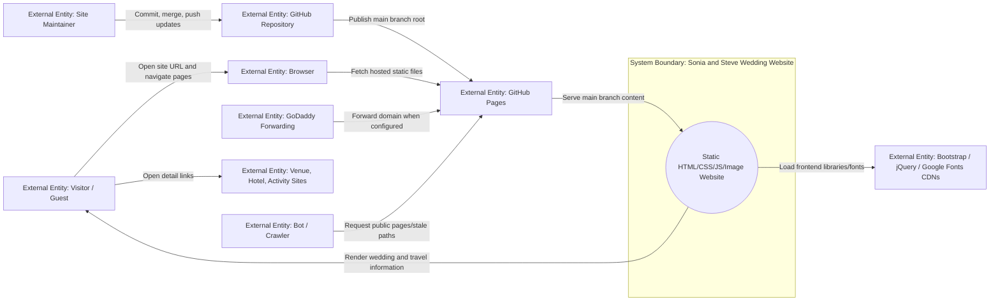
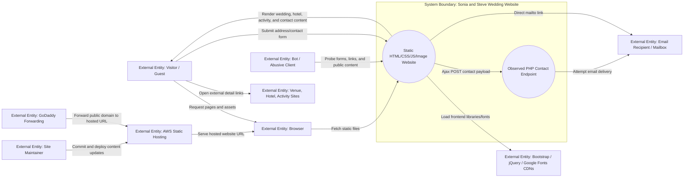
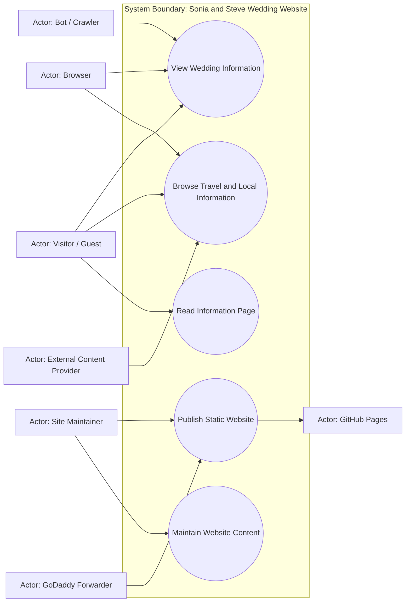
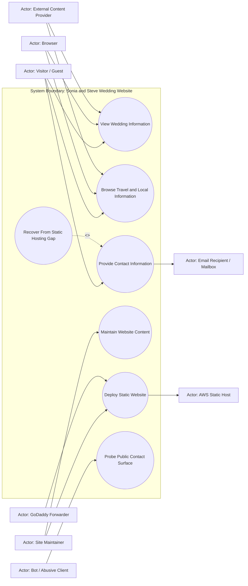
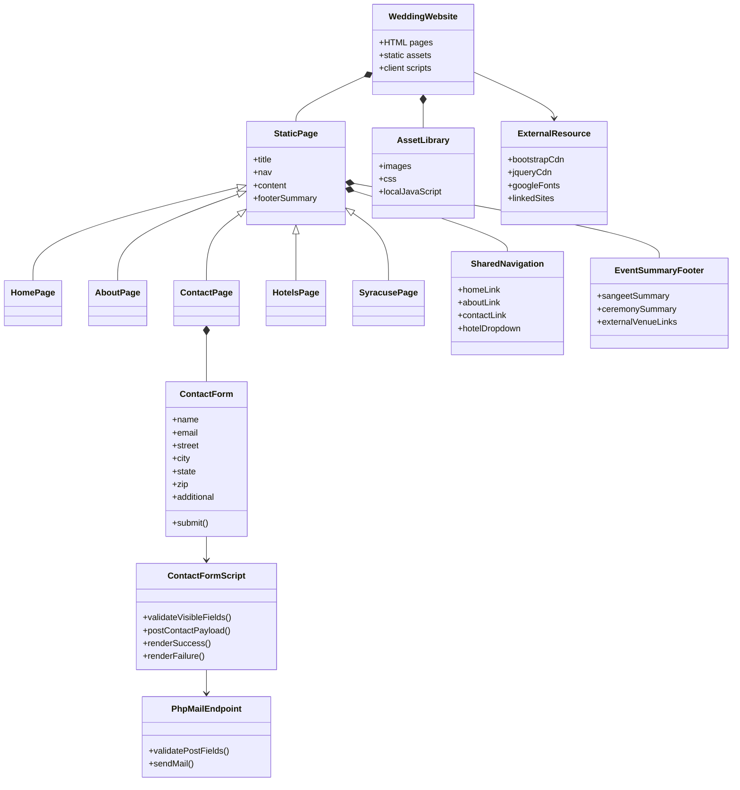
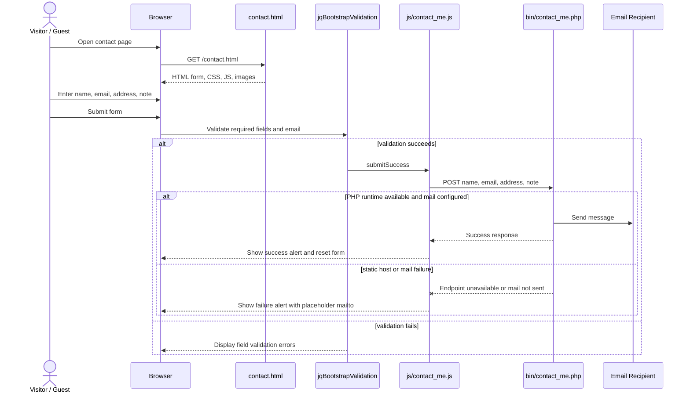

# Current State Design

## Implementation Update
Current authoritative state as of the latest refresh: the website is a static GitHub Pages site published from `main` at `https://skeller01.github.io/wedding-website/`. `development` and `main` both point at commit `82487fd`.

The GitHub Pages publication sprint removed the obsolete PHP contact path from the public site. `contact.html` is now a static informational page, root HTML pages no longer load `js/contact_me.js` or `js/jqBootstrapValidation.js`, and `bin/contact_me.php` / `js/contact_me.js` were deleted.

The UX polish sprint changed the public site from an invitation/address collection workflow to an archival/static wedding information site. Current live behavior includes the `Info` and `Travel` navigation labels, a home CTA to hotel/Syracuse details, mobile viewport metadata, improved page titles and alt text, and hotel cost wording of `See hotel site`.

Remaining known work: GoDaddy forwarding is partially verified because it works on the user's phone but not yet from the user's home browser, several external hotel/activity links are stale or suspect, and unused countdown/validation assets remain in the repository. Mobile responsiveness has been observed on the user's phone. Older sections below may still describe AWS/PHP/form-era risks; treat the refresh notes at the top of each rerun section as authoritative for current planning.

## Context Diagram and Matrix

### Current Authoritative Snapshot

This rerun updates the context model from "AWS static hosting with a PHP/contact-form conflict" to "GitHub Pages static publication with stale external-link and domain-forwarding follow-up work."

#### Source Inputs
- Current repository state: root HTML/CSS/JS/image files on `development` and `main` at `82487fd`.
- Current live deployment: GitHub Pages from `main`, path `/`, HTTPS enforced.
- Static scan: 5 HTML pages, 65 local references resolved, 0 missing references, 0 server-side runtime references, 0 PHP files.
- User updates: GoDaddy forwarding works on phone but not yet from the user's home browser; mobile presentation looks responsive on phone; some travel/local links are stale, including Jefferson Clinton rebranding and the kayak business likely being closed.
- Planning artifacts: `documentation/planning/working/refactor-plan.md`, `documentation/planning/sprints/github-pages-publication.md`, `documentation/planning/working/prototype-lab.md`.

#### System Boundary
The system is the "Sonia and Steve Wedding Website": static HTML, CSS, JavaScript, and images served through GitHub Pages. The system includes public pages, local assets, client-side navigation/tooltip behavior, and the static no-collection information page. It excludes GoDaddy forwarding setup, third-party hotel/activity websites, and any RSVP/contact-form backend.

#### Inside the System
| Internal Element | Description | Evidence |
|---|---|---|
| Static HTML pages | Home, story, info, hotels, and Syracuse guide pages. | Root `*.html` files. |
| Styling and layout | Bootstrap CDN plus `css/style.css`. | HTML links and CSS file. |
| Client-side behavior | Bootstrap navigation/tooltips plus remaining legacy countdown code. | Script tags and `js/*`. |
| Image assets | Local image files used by pages. | `images/*`; static scan passes. |
| Static verification scripts | PowerShell/Python prototype scanners. | `documentation/planning/working/prototypes/*`. |
| Documentation workspace | Requirements, design, sprint, prototype, and refactor docs. | `documentation/*`. |

#### Outside the System
| External Entity | Type | Current Role |
|---|---|---|
| Visitor / Guest | Person | Reads public wedding, hotel, and Syracuse information. |
| Site Maintainer | Person | Edits content, verifies checks, and publishes through Git/GitHub. |
| Browser | Runtime | Requests and renders pages/assets. |
| GitHub Repository | External service | Stores source and branch history. |
| GitHub Pages | External host | Publishes the static site from `main`. |
| GoDaddy Forwarding | External service | Partially verified public-domain forwarding to GitHub Pages. |
| External CDNs | External services | Serve Bootstrap, jQuery, and Google Fonts. |
| Venue / Hotel / Activity Sites | External websites | Linked destinations; some are stale/suspect. |
| Bot / Crawler | Unintended actor | May request public pages or removed legacy paths. |

#### Mermaid Context Diagram



#### Context Matrix
| External Entity | Interaction | Direction | Category | Current Status / Constraint |
|---|---|---|---|---|
| Visitor / Guest | View wedding information | In/Out | Query/response | Implemented and live on GitHub Pages. |
| Visitor / Guest | Browse travel/local information | In/Out | Query/response | Implemented, but external destination freshness is pending. |
| Visitor / Guest | Read static info page | In/Out | Query/response | Implemented; no address, RSVP, or message collection. |
| Browser | Load local assets | In/Out | Startup/query | Static scan passes. |
| Browser | Load external CDN assets | Out/In | Startup/query | Required script URLs are HTTPS. |
| Site Maintainer | Update and publish content | In | Maintenance | `development` -> `main` workflow works; Pages publishes from `main`. |
| GitHub Pages | Serve public HTTPS site | Out | Runtime | Implemented; Pages API reports built/public/HTTPS-enforced. |
| GoDaddy Forwarding | Route public domain | In/Out | Network | Partially verified on phone; home browser still failing. |
| Venue / Hotel / Activity Sites | Provide offsite detail pages | Out/In | Query/response | Known risk: stale/rebranded/closed destinations. |

#### High-Value Use Case Candidates
| Priority | Use Case ID | Use Case | Primary Actor | Current Planning Note |
|---|---|---|---|---|
| High | UC-001 | View Wedding Information | Visitor / Guest | Implemented/live. |
| High | UC-002 | Browse Travel and Local Information | Visitor / Guest | Implemented, but link freshness needs a sprint. |
| Medium | UC-003 | Read Information Page | Visitor / Guest | Replaces old contact/address form use case. |
| High | UC-004 | Publish Static Website | Site Maintainer | Implemented for GitHub Pages; GoDaddy forwarding partially verified on phone. |
| Medium | UC-005 | Maintain Website Content | Site Maintainer | Next work: external links, dead assets, doc reconciliation. |

#### Current Gaps and Questions
- What exact GoDaddy domain should be recorded, and why does it work on phone but not home browser?
- Which stale external links should be replaced with durable Visit Syracuse/current hotel links versus removed?
- Should the `Info` page stay in navigation if there is no contact channel?
- Should unused countdown and validation assets be deleted in the next sprint?

### Source Inputs
- User goal: host the wedding website cheaply on AWS, then point a GoDaddy URL to the hosted link.
- Repository files: `index.html`, `about.html`, `contact.html`, `hotels.html`, `syracuse.html`.
- Supporting assets: `css/style.css`, `js/app.js`, `js/contact_me.js`, `js/jqBootstrapValidation.js`, `js/jquery.countdown.js`, `bin/contact_me.php`, `images/*`.
- Prototype evidence: `documentation/planning/working/prototypes/static_site_scan.ps1` found 5 HTML pages, 75 resolved local references, 1 case-sensitive asset issue, 1 PHP runtime dependency, and 15 external references.

### System Boundary
The system is the "Sonia and Steve Wedding Website": a small public website made of static HTML, CSS, JavaScript, and image assets, plus an observed PHP mail endpoint for the contact form. For the current AWS goal, the deployable system boundary should be treated as static web content unless a replacement contact-form backend is intentionally added.

### Inside the System
| Internal Element | Description | Evidence |
|---|---|---|
| Static HTML pages | Public pages for home, story, contact/address request, hotels, and Syracuse activities. | Observed in root `*.html` files. |
| Shared navigation/footer markup | Repeated Bootstrap navbar and event summary footer across pages. | Observed in all five HTML pages. |
| Styling layer | Custom CSS plus Bootstrap CDN styling and Google Fonts. | Observed in `css/style.css` and page `<link>` tags. |
| Image assets | Photos and decorative images used by the pages. | Observed in `images/*`; prototype found one case mismatch. |
| Client-side scripts | Bootstrap interactions, countdown code, validation plugin, contact form Ajax. | Observed in `js/*` and script tags. |
| Contact form UI | Address/contact form on `contact.html`. | Observed in `contact.html`. |
| PHP mail endpoint | Server-side endpoint for attempted email submission. | Observed in `bin/contact_me.php` and `js/contact_me.js`. |

### Outside the System
| External Entity | Type | Description | Evidence |
|---|---|---|---|
| Visitor / Guest | Person | Reads event, hotel, activity, story, and contact information. | Primary user implied by site content. |
| Site Maintainer | Person | Updates files, deploys site, and corrects broken links/content. | Repository ownership and GitHub workflow. |
| Browser | Runtime | Fetches HTML, CSS, JS, images, and external resources. | Static website architecture. |
| External CDNs | External service | Serve Bootstrap, jQuery, and Google Fonts. | External references in HTML scan. |
| Venue / hotel / activity sites | External websites | Destination links for event, hotel, and local activity details. | External references in HTML scan. |
| Email recipient / mailbox | External system | Receives direct mailto messages or PHP-generated contact messages. | `mailto:` link and PHP mail script. |
| AWS static host | External service | Proposed public hosting target for static assets. | User goal. |
| GoDaddy forwarding | External service | Proposed domain redirection to AWS URL. | User goal. |
| Bot / abusive client | Unintended actor | Could scrape contact address, submit spam, or probe endpoint paths. | Public website risk. |

### Mermaid Context Diagram



### Context Matrix
| External Entity | Interaction | Direction | Category | System Input | System Output | Frequency / Volume | Assumptions | Constraints |
|---|---|---|---|---|---|---|---|---|
| Visitor / Guest | View home page | In/Out | Query/response | Page request | Home content, hero image, event summary | Occasional public traffic | Wedding guests or invitees are primary users. | Must work on common browsers. |
| Visitor / Guest | Navigate pages | In/Out | Query/response | Link click | About, contact, hotel, local activity pages | Occasional | Navigation should remain simple. | Current nav markup is duplicated per page. |
| Visitor / Guest | Submit contact/address information | In | Command/input | Name, email, address, note | Success/failure UI; attempted email | Low volume | Current form intent is address collection. | Static hosting will not execute PHP. |
| Visitor / Guest | Use direct email link | Out | Response/command | Mailto click | Opens mail client | Low volume | Direct email can replace broken PHP in minimal static deployment. | Depends on visitor mail client. |
| Browser | Load local assets | In/Out | Startup/query | Asset requests | CSS, JS, images | Per page view | Assets should be path- and case-correct. | `images/kayak.jpg` mismatches `images/kayak.JPG`. |
| Browser | Load external CDN assets | Out/In | Startup/storage | CDN requests | Bootstrap, jQuery, fonts | Per page view | External CDNs stay available. | Mixed `http://` jQuery can fail or warn under HTTPS. |
| Venue / hotel / activity sites | Provide linked detail content | Out/In | Query/response | Link click | External pages | User-driven | External links may be stale. | Outside repository control. |
| Site Maintainer | Update and deploy content | In | Maintenance | Git changes | Published website update | Infrequent | Changes happen on `development` before main. | Deployment process not yet automated. |
| AWS static host | Serve site publicly | Out | Runtime | Deployed assets | Public HTTPS URL | Continuous | AWS Amplify is proposed minimal path. | Static host cannot run PHP. |
| GoDaddy forwarding | Route custom URL | In/Out | Network | User domain request | Redirect to AWS URL | Per visitor | User wants GoDaddy forwarding instead of DNS migration. | Forwarding behavior controlled in GoDaddy. |
| Bot / abusive client | Spam/probe public contact paths | In | Unintended use/security | Form posts, path probes | Errors, possible spam | Unknown | Public form attracts unwanted traffic if backend exists. | No auth or anti-spam controls currently exist. |

### High-Value Use Case Candidates
| Priority | Use Case ID | Use Case | Primary Actor | Trigger | System Response | Source Interaction | Notes |
|---|---|---|---|---|---|---|---|
| High | UC-001 | View Wedding Information | Visitor / Guest | Visitor opens site URL | Render home page and event summary | Page request | Core public value. |
| High | UC-002 | Browse Travel and Local Information | Visitor / Guest | Visitor selects hotel/local pages | Render hotel/activity details and external links | Navigation/link click | Important for guests planning travel. |
| High | UC-003 | Provide Contact Information | Visitor / Guest | Visitor opens contact page or submits form | Render contact form; currently attempts PHP mail POST | Contact form interaction | Needs decision before static deploy. |
| Medium | UC-004 | Maintain Website Content | Site Maintainer | Maintainer edits files | Updated content can be committed and deployed | Git/deploy workflow | Needed for future cleanup and hosting. |
| Medium | UC-005 | Deploy Static Website | Site Maintainer | Maintainer publishes from GitHub | AWS host serves public URL | AWS hosting goal | Captured in deployment footprint. |

### Secondary / Unintended Use Cases
| Priority | Use Case | Actor | Risk or Concern | Expected System Response |
|---|---|---|---|---|
| Medium | Probe Contact Endpoint | Bot / Abusive Client | Spam or endpoint discovery | Static deployment should avoid executable PHP endpoint. |
| Medium | Load Site Over HTTPS | Browser | Mixed `http://` jQuery can be blocked or downgraded | Use HTTPS CDN URLs or local vendor assets. |
| Low | Visit Stale External Link | Visitor / Guest | Linked third-party sites may change or disappear | Prefer current links where practical; failures are outside system control. |

### Assumptions
- The near-term deployment target is a public static website hosted cheaply on AWS.
- GoDaddy will forward the public URL rather than delegating DNS to AWS Route 53.
- The legacy PHP contact flow is not required for the first static hosting slice unless the user confirms otherwise.
- Existing wedding content is intentionally preserved unless a cleanup request changes it.

### Gaps and Questions
- Should the contact form be removed, converted to `mailto:`, or replaced with a backend later?
- Should outdated 2017 wedding-specific copy be preserved as archival content or refreshed?
- Should external `http://` links be upgraded where HTTPS equivalents exist?
- Should the repo keep vendored Bootstrap validation zip/source files?

### Follow-On Artifacts
- Use case diagram entries: UC-001 through UC-005.
- Behavioral matrices: UC-001, UC-002, UC-003, UC-005.
- Functional requirements: static page rendering, navigation, asset integrity, contact fallback, HTTPS-safe resources, deployment.
- FFBD and IDEF0: public browsing and static deployment flows.
- FMEA: contact failure, mixed content, broken image paths, stale links, deployment drift.

## Use Case Diagram

### Current Authoritative Snapshot

#### Source Inputs
- Refreshed Context Diagram and Matrix snapshot above.
- Current root HTML pages and navigation labels.
- GitHub Pages deployment state.
- User statement that GoDaddy forwarding works on phone but not home browser, mobile layout looks responsive, and travel/local links are stale.

#### System Boundary
System boundary: Sonia and Steve Wedding Website. The boundary includes static public content and client-side behavior served through GitHub Pages. It excludes third-party linked websites, GoDaddy account configuration, and any RSVP/contact backend.

#### Actors
| Actor ID | Actor | Type | Description | Source |
|---|---|---|---|---|
| A-001 | Visitor / Guest | Person | Reads public wedding, hotel, and Syracuse information. | Site content. |
| A-002 | Site Maintainer | Person | Updates content and publishes through Git/GitHub. | Current workflow. |
| A-003 | Browser | Runtime | Requests and renders pages/assets. | Static website behavior. |
| A-004 | External Content Provider | External system | CDN or linked venue/hotel/activity site. | External references. |
| A-005 | GitHub Pages | External service | Publishes `main` branch static content. | Current deployment. |
| A-006 | GoDaddy Forwarder | External service | Redirect from public domain to GitHub Pages; currently works on phone but not home browser. | User update. |
| A-007 | Bot / Crawler | Unintended actor | Requests public pages or removed legacy paths. | Public website risk. |

#### Use Cases
| Use Case ID | Use Case | Goal | Primary Actor | Priority | Source Interaction |
|---|---|---|---|---|---|
| UC-001 | View Wedding Information | Read names, date framing, story, and event summary. | Visitor / Guest | High | Page request/navigation. |
| UC-002 | Browse Travel and Local Information | Find hotel and Syracuse activity guidance. | Visitor / Guest | High | Travel navigation and external links. |
| UC-003 | Read Information Page | Understand the site is informational and not collecting addresses, RSVPs, or messages. | Visitor / Guest | Medium | `Info` page request. |
| UC-004 | Publish Static Website | Serve verified content through GitHub Pages. | Site Maintainer | High | Merge/push to `main`, Pages build. |
| UC-005 | Maintain Website Content | Refresh stale links, remove dead assets, and keep docs/checks current. | Site Maintainer | Medium | Git workflow. |

#### Mermaid Use Case Diagram



#### Relationship Notes
| Source | Relationship | Target | Meaning |
|---|---|---|---|
| UC-002 | Dependency note | External Content Provider | Travel/local pages can link outward, but external sites are outside system control. |
| UC-004 | Dependency note | GoDaddy Forwarder | GoDaddy verification is partially complete on phone; home-browser behavior still needs diagnosis. |
| UC-005 | Dependency note | UC-002 | Content maintenance should refresh stale hotel/activity links. |

#### Follow-On Behavioral Models
Highest-value behavioral matrices: UC-002 Browse Travel and Local Information, UC-004 Publish Static Website, and UC-005 Maintain Website Content. UC-001 and UC-003 are stable and simple.

### Source Inputs
- Context Diagram and Matrix section above.
- Repository files listed in Context Source Inputs.
- Prototype scan evidence from `documentation/planning/working/prototypes/static_site_scan.ps1`.

### System Boundary
System boundary: Sonia and Steve Wedding Website. The boundary includes public static content, client-side behavior, and the observed contact form UI. The PHP endpoint is documented as current repository content, but not considered compatible with the proposed static AWS deployment without additional runtime support.

### Actors
| Actor ID | Actor | Type | Description | Source |
|---|---|---|---|---|
| A-001 | Visitor / Guest | Person | Reads wedding information and may provide contact/address details. | Site content. |
| A-002 | Site Maintainer | Person | Updates content, fixes assets, and deploys the site. | GitHub/development workflow. |
| A-003 | Browser | Runtime | Requests and renders files. | Static website behavior. |
| A-004 | External Content Provider | External system | CDN or linked venue/hotel/activity site. | External references. |
| A-005 | Email Recipient / Mailbox | External system | Receives direct or submitted messages. | `mailto:` and PHP script. |
| A-006 | AWS Static Host | External service | Serves the deployed site. | User goal. |
| A-007 | GoDaddy Forwarder | External service | Redirects public domain traffic to the AWS URL. | User goal. |
| A-008 | Bot / Abusive Client | Unintended actor | Attempts spam, scraping, or endpoint probing. | Public website risk. |

### Use Cases
| Use Case ID | Use Case | Goal | Primary Actor | Priority | Source Interaction |
|---|---|---|---|---|---|
| UC-001 | View Wedding Information | Read event details, names, date, location, and story. | Visitor / Guest | High | Page request and navigation. |
| UC-002 | Browse Travel and Local Information | Find hotels, venue details, and Syracuse activity links. | Visitor / Guest | High | Hotel/local page navigation. |
| UC-003 | Provide Contact Information | Send address/contact information or contact the couple directly. | Visitor / Guest | High | Contact page form and `mailto:` link. |
| UC-004 | Maintain Website Content | Update site files and correct content/assets. | Site Maintainer | Medium | Git changes. |
| UC-005 | Deploy Static Website | Publish the website to a cheap public AWS URL. | Site Maintainer | High | AWS hosting goal. |
| UC-006 | Recover From Static Hosting Gap | Preserve user contact path when PHP is unavailable. | Site Maintainer | High | Static deployment constraint. |

### Mermaid Use Case Diagram



### Relationships
| Source | Relationship | Target | Meaning |
|---|---|---|---|
| UC-006 Recover From Static Hosting Gap | `<<extend>>` | UC-003 Provide Contact Information | Static hosting creates a conditional contact-form fallback or replacement need. |
| UC-005 Deploy Static Website | Association | AWS Static Host | Deployment publishes static assets to public hosting. |
| UC-005 Deploy Static Website | Association | GoDaddy Forwarder | Public domain forwards users to hosted URL. |

### Scope Notes
- Inside scope: public content, client-side rendering, static assets, contact page user experience, deployment documentation.
- Outside scope for minimal deployment: executable PHP mail hosting, database storage, authentication, custom DNS migration to Route 53.

### Secondary / Unintended Use Cases
| Use Case | Actor | Reason Included | Priority |
|---|---|---|---|
| Probe Public Contact Surface | Bot / Abusive Client | Public forms and mail endpoints can attract spam. | Medium |
| Experience Mixed Content Blocking | Browser | HTTP CDN scripts may be blocked on HTTPS hosting. | Medium |
| Encounter Broken Media | Visitor / Guest | Case-sensitive static hosts can fail on `kayak.jpg` vs `kayak.JPG`. | Medium |

### Assumptions
- AWS Amplify Hosting or equivalent static hosting is the preferred near-term mode.
- Visitors do not need accounts, personalization, or persistent state.
- A direct email fallback is acceptable unless the user asks for a real form backend.

### Gaps and Questions
- Confirm whether the address collection form still matters for the current audience.
- Confirm whether the public site should remain wedding-era content or become an archival page.

### Follow-On Behavioral Models
- Expand UC-001, UC-002, UC-003, and UC-005 into use case behavioral matrices.

## Mermaid Class Diagram

### Source Inputs
- Root HTML pages, `css/style.css`, `js/app.js`, `js/contact_me.js`, `bin/contact_me.php`.
- Current-state context and use case sections.

### System Summary
The repository is not an object-oriented application. Its structure is best represented as a set of static page artifacts, shared page regions, client-side scripts, external resources, image assets, and one observed server-side mail endpoint.

### Diagram Confidence
Mixed: page/module relationships are observed from code; class-like abstractions are inferred to explain the static architecture.

### Mermaid Class Diagram



### Key Classes
- `WeddingWebsite`: Top-level artifact collection. Evidence: inferred from repository structure.
- `StaticPage`: Shared shape for all root HTML pages. Evidence: observed repeated page structure.
- `SharedNavigation`: Repeated navbar across pages. Evidence: observed in all HTML files.
- `EventSummaryFooter`: Repeated lower event summary block. Evidence: observed in all HTML files.
- `AssetLibrary`: Local CSS, JS, and image files. Evidence: observed folders and scan.
- `ExternalResource`: CDN and third-party links. Evidence: observed external references.
- `ContactForm`: Contact/address form in `contact.html`. Evidence: observed.
- `ContactFormScript`: jQuery validation and Ajax behavior. Evidence: observed in `js/contact_me.js`.
- `PhpMailEndpoint`: Legacy server-side mail script. Evidence: observed in `bin/contact_me.php`.

### Architectural Notes
- The site is static-first, with no build step and no package manager.
- Page markup is duplicated, so nav/footer changes must be repeated across pages unless later refactored.
- Contact behavior crosses from static frontend into PHP runtime, which conflicts with static AWS hosting.
- External HTTP scripts and links are operational dependencies for HTTPS hosting and browser trust.

### Assumptions
- Refactoring to templates is deferred until after cheap hosting is proven.
- Existing page content is treated as source of truth for current-state documentation.

### Gaps and Questions
- Should `bin/contact_me.php` be removed, replaced, or kept for historical reference?
- Should repeated page regions be templated later with a static site generator?

### Change Recommendations
- Fix `syracuse.html` image path case or rename `images/kayak.JPG`.
- Replace `http://ajax.googleapis.com/...` with an HTTPS URL or local jQuery file.
- Replace or disable the PHP contact submission before static deployment.
- Consider later extracting shared nav/footer only if repeated edits become painful.

## Mermaid Sequence Diagram

### Source Inputs
- `contact.html`, `js/contact_me.js`, `bin/contact_me.php`, root HTML pages.
- Prototype static-site scan.

### Flow Summary
The most deployment-sensitive runtime flow is contact/address submission. In current code, a visitor submits the form, client-side validation runs, and JavaScript attempts an Ajax POST to `./bin/contact_me.php`. This flow requires a PHP runtime and therefore does not work on static-only hosting without modification.

### Diagram Confidence
Observed from code.

### Mermaid Sequence Diagram



### Participants
- Visitor / Guest: provides address/contact information. Evidence: contact page copy.
- Browser: renders the page and executes scripts. Evidence: static web runtime.
- `contact.html`: contains the form and email address. Evidence: observed.
- `jqBootstrapValidation`: validates required inputs. Evidence: script use.
- `js/contact_me.js`: gathers form data and sends Ajax POST. Evidence: observed.
- `bin/contact_me.php`: validates POST fields and calls PHP `mail()`. Evidence: observed.
- Email Recipient: destination for direct or submitted messages. Evidence: `mailto:` and PHP script.

### Key Messages
- `GET /contact.html`: loads static contact page.
- `submitSuccess`: validation plugin passes control to custom script.
- `POST ./bin/contact_me.php`: key static-hosting conflict.
- `mail(...)`: endpoint attempts server-side mail delivery.

### Alternatives and Errors
- Validation failure keeps the user on the form.
- Static hosting returns missing/unsupported endpoint behavior for PHP.
- PHP script uses `$to = '#'`, so successful PHP execution may still not send useful mail.
- Failure message points to `me@example.com`, which is placeholder content.

### Assumptions
- On AWS Amplify/S3 static hosting, `bin/contact_me.php` is served as a file or unavailable, not executed.
- Direct `mailto: rani@steveandsonia.com` is a viable minimal fallback if preserved.

### Gaps and Questions
- Decide desired contact behavior for the hosted version.
- Decide whether form-submitted address collection is still needed.

### Change Recommendations
- For minimal AWS static hosting, replace the Ajax submit path with a visible direct email fallback or `mailto:` behavior.
- If a real form is needed later, design a small serverless backend with spam controls rather than hosting PHP.

## Functional Flow Block Diagram

### Current Authoritative Snapshot

#### Source Inputs
- Refreshed Context Diagram and Matrix.
- Refreshed Use Case Diagram.
- Current GitHub Pages deployment and static scan results.
- User update: GoDaddy forwarding works on phone but not home browser; mobile presentation looks responsive; some hotel/activity links are stale.

#### Functional Flow Summary
The current system flow is a static browsing and publishing flow. Visitors request the GitHub Pages URL or GoDaddy-forwarded domain, the browser loads static pages and assets, visitors read internal content, and optional external links take them to third-party resources outside the system. Maintainers update content on `development`, verify it, merge/push to `main`, and GitHub Pages publishes it. Remaining flow risk is concentrated in stale external links and the split GoDaddy result: works on phone, not yet in the user's home browser.

#### Top-Level FFBD

```text
[F.1 Ref: Visitor URL Request]
          |
          v
+-----------------------------+
| Function 1                  |
| Serve Static Site           |
+-----------------------------+
          |
          v
+-----------------------------+
| Function 2                  |
| Present Wedding Information |
+-----------------------------+
          |
          v
+-----------------------------+
| Function 3                  |
| Support Visitor Navigation  |
+-----------------------------+
          |
          v
        [OR]
       /    \
      v      v
+-----------------------------+      +-----------------------------+
| Function 4                  |      | Function 5                  |
| Present Internal Travel     |      | Open External Resource      |
| and Info Content            |      | Link                        |
+-----------------------------+      +-----------------------------+
      |                                      |
      v                                      v
[F.2 Ref: Internal Content Viewed]   [F.3 Ref: Third-Party Site Opened]
```

#### Publishing FFBD

```text
[F.4 Ref: Maintainer Change]
          |
          v
+-----------------------------+
| Function 6                  |
| Edit Static Content         |
+-----------------------------+
          |
          v
+-----------------------------+
| Function 7                  |
| Verify Static Site          |
+-----------------------------+
          |
          v
        [AND]
       /     \
      v       v
+-----------------------------+      +-----------------------------+
| Function 8                  |      | Function 9                  |
| Merge and Push Main         |      | Verify GitHub Pages         |
+-----------------------------+      +-----------------------------+
          \                         /
           \                       /
            v                     v
        [F.5 Ref: Published HTTPS Site]
                    |
                    v
+-----------------------------+
| Function 10                 |
| Verify GoDaddy Forwarding   |
+-----------------------------+
                    |
                    v
[F.6 Ref: Public Domain Verified or Pending]
```

#### Function Dictionary
| Function | Name | Purpose | Inputs | Outputs | Preconditions | Failure Modes | Evidence |
|---|---|---|---|---|---|---|---|
| 1 | Serve Static Site | Return HTML/CSS/JS/images from GitHub Pages. | URL request | Static response | Pages enabled from `main`. | Pages disabled, wrong branch, CDN propagation delay. | Observed |
| 2 | Present Wedding Information | Show home/story/event information. | HTML/assets | Readable wedding content | Static assets resolve. | Broken images, unreadable mobile layout. | Observed |
| 3 | Support Visitor Navigation | Provide internal links among pages. | Link click | Requested page | Bootstrap/HTML links present. | Wider browser sweep still useful. | Observed/User verified on phone |
| 4 | Present Internal Travel and Info Content | Show hotel, Syracuse, and no-collection info pages. | Page request | Internal content | Pages exist. | Stale internal copy. | Observed |
| 5 | Open External Resource Link | Send visitor to third-party site. | Link click | External navigation | Link exists. | Destination moved, closed, or rebranded. | Observed/Pending refresh |
| 6 | Edit Static Content | Update HTML/CSS/docs. | Maintainer changes | Git worktree diff | Repo access. | Duplicated markup causes missed edits. | Observed |
| 7 | Verify Static Site | Run static scan/source/live checks. | Changed files | Pass/fail evidence | Scripts and network available. | Visual browser tooling unavailable. | Observed |
| 8 | Merge and Push Main | Publish verified content source. | Development commit | Updated `main` | Clean branch/remote. | Merge conflict or wrong branch. | Observed |
| 9 | Verify GitHub Pages | Confirm live URL and content. | Pages URL | Live evidence | Pages build complete. | Temporary edge/cache 404 during publish. | Observed |
| 10 | Verify GoDaddy Forwarding | Confirm public domain reaches site. | Domain URL | Forwarding pass/fail | GoDaddy setup complete. | Home-browser DNS/cache/propagation issue. | Partial |

#### Gate Logic Notes
- Function 3 branches with an OR: visitors can stay on internal pages or open third-party resources.
- Functions 8 and 9 are AND for release confidence: code should be pushed and the live GitHub Pages site should be verified.
- Function 10 is downstream of GitHub Pages publication and is partially complete because the GoDaddy link works on phone.

#### Reliability Notes
- Total public-site success currently depends on GitHub Pages serving the five internal pages and local assets.
- Core information does not depend on external hotel/activity sites, but travel usefulness does.
- GoDaddy forwarding is a release/discoverability function, not a blocker for the `github.io` URL.
- Mobile responsiveness has been observed on the user's phone; home-browser forwarding behavior remains the check gap.

#### Assumptions
- GitHub Pages remains the production hosting path.
- GoDaddy forwarding will target the GitHub Pages URL.
- No RSVP/contact backend will be reintroduced.

#### Gaps and Questions
- Which external destinations should replace stale hotel/activity links?
- Should stale business-specific links be replaced with durable Visit Syracuse hub pages?
- Should dead countdown/form-era assets be removed before the domain is advertised?

### Source Inputs
- Current-state context and use case sections.
- Repository files and prototype scan.

### Functional Flow Summary
The system enables visitors to load public wedding content, navigate supporting pages, optionally attempt contact/address submission, and follow external detail links. A maintainer can update and deploy static assets to a public host.

### Top-Level FFBD

```text
[F.1 Ref: Visitor Page Request]
          |
          v
+----------------------+
| Function 1           |
| Serve Public Content |
+----------------------+
          |
          v
+----------------------+
| Function 2           |
| Support Navigation   |
+----------------------+
          |
          v
      [OR]
       / \
      v   v
+----------------------+     +----------------------+
| Function 3           |     | Function 4           |
| Provide Contact Path |     | Open External Detail |
+----------------------+     +----------------------+
       \                    /
        \                  /
         v                v
+----------------------+
| Function 5           |
| Maintain and Deploy  |
+----------------------+
          |
          v
[F.5 Ref: Public Hosted Website]
```

### Decomposed FFBDs

#### Function 1 Decomposition

```text
+----------------------+
| Function 1.1         |
| Receive Page Request |
+----------------------+
          |
          v
+----------------------+
| Function 1.2         |
| Load Static Assets   |
+----------------------+
          |
          v
+----------------------+
| Function 1.3         |
| Render Page Content  |
+----------------------+
```

#### Function 3 Decomposition

```text
+--------------------------+
| Function 3.1             |
| Capture Contact Fields   |
+--------------------------+
          |
          v
+--------------------------+
| Function 3.2             |
| Validate Contact Fields  |
+--------------------------+
          |
          v
      [OR]
       / \
      v   v
+--------------------------+   +--------------------------+
| Function 3.3             |   | Function 3.4             |
| Submit To Mail Endpoint  |   | Provide Direct Email     |
+--------------------------+   +--------------------------+
```

#### Function 5 Decomposition

```text
+--------------------------+
| Function 5.1             |
| Commit Website Changes   |
+--------------------------+
          |
          v
+--------------------------+
| Function 5.2             |
| Publish Static Assets    |
+--------------------------+
          |
          v
+--------------------------+
| Function 5.3             |
| Forward Public Domain    |
+--------------------------+
```

### Function Dictionary
| Function | Purpose | Inputs | Outputs | Preconditions | Failure Modes | Evidence |
|---|---|---|---|---|---|---|
| 1 Serve Public Content | Display website pages. | Page requests | Rendered pages | Assets deployed | Missing page, blocked CDN, broken image | Observed |
| 2 Support Navigation | Let visitors move among pages. | Link clicks | Target page requests | Links valid | Broken internal link | Observed |
| 3 Provide Contact Path | Let visitors send contact/address information. | Form fields or mailto click | Submitted data or email draft | Contact path configured | PHP unavailable, placeholder recipient | Observed |
| 4 Open External Detail | Send visitors to venue/hotel/activity details. | External link click | External site opened | External site exists | Stale or insecure link | Observed |
| 5 Maintain and Deploy | Publish updated site. | Git changes, AWS config, GoDaddy config | Hosted public website | Repo and hosting configured | Wrong branch, stale deploy, bad redirect | Proposed/Observed |

### Gate Logic Notes
- Function 3 uses an OR gate because either a working backend submission or a direct email path can satisfy minimal contact capability.
- Function 4 is optional for the main page-view flow.

### Reliability Notes
- Functions 1 and 2 are required for total visitor success.
- Function 3 is required only if address/contact collection remains in scope.
- Function 5 is required to meet the AWS hosting goal.

### Assumptions
- Static deployment is the first release target.
- Contact backend replacement can be deferred if direct email remains visible.

### Gaps and Questions
- Confirm whether the contact form should remain active.
- Confirm branch-to-environment strategy in AWS Amplify.

### Change Recommendations
- Add a repeatable static scan to future deployment checks.
- Fix the image path and contact behavior before public hosting.

## IDEF0 ICOM Model

### Source Inputs
- Current-state context, use cases, FFBD, repository files, prototype scan.

### IDEF0 Node Tree

```text
A0: Provide Wedding Website
|-- A1: Present Wedding Content
|-- A2: Support Guest Navigation
|-- A3: Provide Contact Channel
|-- A4: Link External Information
`-- A5: Publish Website
```

### A0 Context Table
| Function | Inputs | Outputs | Controls | Mechanisms |
|---|---|---|---|---|
| A0: Provide Wedding Website | Visitor requests; maintainer changes; contact information | Rendered pages; external link exits; contact messages; hosted public site | User goal; static hosting constraint; browser behavior; repository content | HTML/CSS/JS files; image assets; browser; GitHub; AWS host; GoDaddy forwarding |

### Decomposition Table
| Parent | Function | Inputs | Outputs | Controls | Mechanisms |
|---|---|---|---|---|---|
| A0 | A1: Present Wedding Content | Visitor page requests; repository content | Home, about, event, hotel, and local pages | Browser standards; asset paths | HTML pages; CSS; images; external fonts |
| A0 | A2: Support Guest Navigation | Visitor link selections | Page transitions; menu interactions | Bootstrap behavior; internal link targets | Navbar markup; Bootstrap JS/CSS; browser |
| A0 | A3: Provide Contact Channel | Contact fields; email clicks | Contact submission attempt; email draft | Validation rules; static hosting constraint; recipient configuration | Contact form; validation plugin; contact JS; PHP endpoint or mail client |
| A0 | A4: Link External Information | Venue/hotel/activity link clicks | External website navigation | Third-party URL availability | Anchor links; browser |
| A0 | A5: Publish Website | Maintainer changes; GitHub repository | Public AWS URL; GoDaddy-forwarded URL | Branch policy; AWS hosting configuration; cost goal | Git; GitHub; AWS Amplify/static host; GoDaddy forwarding |

### ICOM Dictionary
| ICOM | Role | First Produced By | Reused By | Notes |
|---|---|---|---|---|
| Visitor requests | Input | External visitor | A1, A2, A3, A4 | Browser-initiated requests. |
| Repository content | Input/Control | Maintainer | A1, A5 | Current source of truth. |
| Rendered pages | Output | A1 | Visitor | Primary product output. |
| Contact information | Input | Visitor | A3 | Potentially sensitive enough to avoid casual public storage. |
| Static hosting constraint | Control | User goal/deployment decision | A3, A5 | Drives PHP replacement decision. |
| Public AWS URL | Output | A5 | GoDaddy forwarding, visitors | Target for domain forwarding. |
| GoDaddy-forwarded URL | Output | A5 | Visitors | Desired public access path. |

### Tunnel Notes
- External CDN availability is modeled as a mechanism/control for page presentation but not decomposed as an internal function.
- Bot/spam behavior is modeled in FMEA rather than as an intended IDEF0 function.

### Assumptions
- AWS static hosting is chosen for cost and simplicity.
- GoDaddy forwarding remains outside the deployed website itself.

### Gaps and Questions
- Contact channel decision remains the main ICOM uncertainty.

## Functional FMEA

### Source Inputs
- FFBD and IDEF0 sections.
- Repository scan and code review.
- Deployment goal for AWS static hosting.

### Functional FMEA Purpose
Analyze functional failures that could prevent guests from viewing the website, using the contact path, or reaching the hosted public URL after a minimal AWS deployment.

### Subsystem Function List
| Subsystem | Function ID | Function Name | Function Purpose | Source |
|---|---|---|---|---|
| Static Content | F1 | Serve Public Content | Render HTML, CSS, JS, and images. | FFBD Function 1 |
| Navigation | F2 | Support Navigation | Move visitors across pages and dropdowns. | FFBD Function 2 |
| Contact | F3 | Provide Contact Path | Capture or route guest contact/address information. | FFBD Function 3 |
| External Links | F4 | Open External Detail | Send visitors to hotel, venue, and activity sites. | FFBD Function 4 |
| Deployment | F5 | Maintain and Deploy | Publish site to AWS and route GoDaddy URL. | FFBD Function 5 |

### Functional FMEA Table
| Subsystem | Item / Function | Failure Mode | Potential Impact | Possible Cause | Corrective Action | Severity | Likelihood | Risk Score | Priority |
|---|---|---|---|---|---|---:|---:|---:|---|
| Contact | F3 Provide Contact Path | Contact form cannot submit on static host | Visitors think address/contact info was not received; poor trust | PHP endpoint not executable on Amplify/S3 static hosting | Replace form submit with `mailto:` or serverless form backend | 4 | 4 | 16 | High |
| Static Content | F1 Serve Public Content | Image fails on AWS/Linux/CDN path handling | Syracuse activity tile image broken | `images/kayak.jpg` references `images/kayak.JPG` with case mismatch | Rename file or update HTML path | 3 | 4 | 12 | Medium |
| Static Content | F1 Serve Public Content | Browser blocks jQuery under HTTPS | Bootstrap interactions/contact validation may fail | `http://ajax.googleapis.com/...` script on HTTPS page | Use `https://ajax.googleapis.com/...` or local jQuery | 4 | 3 | 12 | Medium |
| Contact | F3 Provide Contact Path | Failure message points to wrong email | Visitor sends message to placeholder address | `me@example.com` in `js/contact_me.js` | Replace with real email or remove failure branch | 3 | 3 | 9 | Medium |
| Contact | F3 Provide Contact Path | PHP sends to invalid recipient | Submitted form data is lost | `$to = '#'` in `bin/contact_me.php` | Configure real backend or remove PHP path | 4 | 3 | 12 | Medium |
| External Links | F4 Open External Detail | Third-party link is stale or unavailable | Visitor cannot access additional info | Old wedding-era external URLs | Review and update high-value external links | 2 | 3 | 6 | Low |
| Deployment | F5 Maintain and Deploy | Wrong branch is deployed | Published site omits intended fixes | Amplify branch misconfiguration | Document and verify branch mapping | 3 | 2 | 6 | Low |
| Deployment | F5 Maintain and Deploy | GoDaddy forwarding points at wrong URL | Public domain does not show site | Manual forwarding mistake | Verify final forwarded URL after setup | 4 | 2 | 8 | Medium |
| Navigation | F2 Support Navigation | Mobile menu/dropdown stops working | Visitors cannot reach secondary pages easily | Bootstrap JS or jQuery load failure | Fix HTTPS resource loading and verify mobile nav | 3 | 3 | 9 | Medium |

### Highest-Risk Items
- Contact form cannot submit on static host: risk score 16.
- Case-sensitive image path and mixed-content jQuery issues: risk score 12 each.
- Invalid PHP recipient and placeholder failure email: risk score 12 and 9.

### Corrective Action Plan
| Priority | Action | Owner / Role | Target Evidence | Related Function |
|---|---|---|---|---|
| High | Decide and implement minimal contact path for static hosting. | Site Maintainer | Contact page works without PHP. | F3 |
| Medium | Fix `images/kayak.jpg` case mismatch. | Site Maintainer | Static scan reports zero missing local references. | F1 |
| Medium | Upgrade HTTP CDN script to HTTPS. | Site Maintainer | HTTPS-hosted page loads scripts without mixed-content warning. | F1/F2 |
| Medium | Verify Amplify branch and GoDaddy forwarding. | Site Maintainer | Public URL and forwarded domain both load site. | F5 |

### Assumptions
- Contact submission is less critical than public content for the first hosting slice.
- Guest traffic is modest, so CDN scale is not a limiting factor.

### Gaps and Questions
- Whether to retain a form or simplify to direct email.
- Whether to modernize stale content before first public deploy.

### Test Implications
- Add or keep a static reference scan before deployment.
- Manually verify page load, mobile navigation, contact page behavior, and GoDaddy forwarding after AWS setup.
