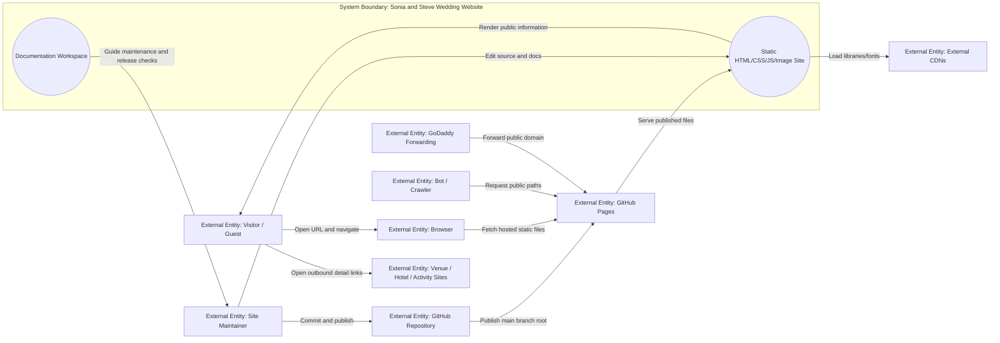
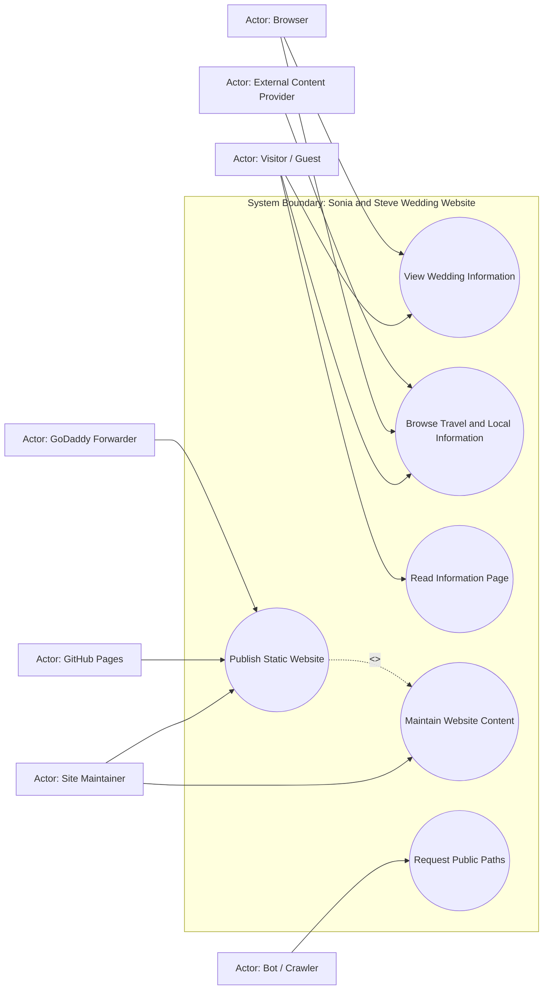
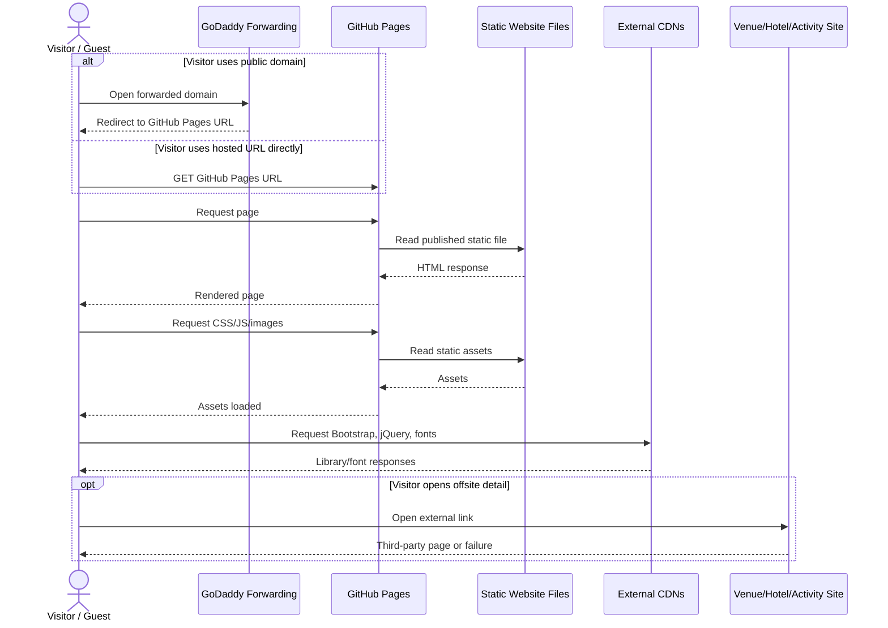
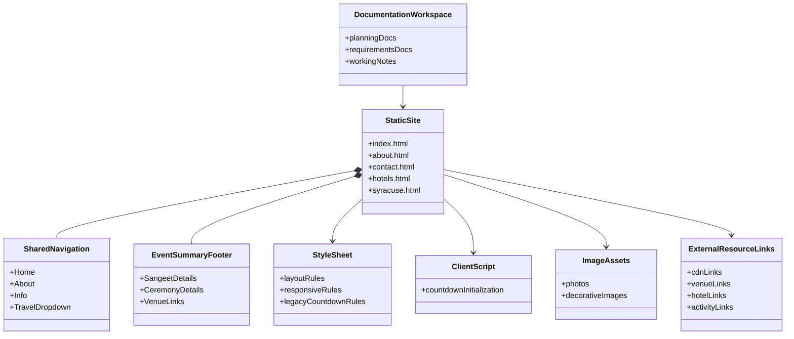

# Current State Design

## Ordered Systems Refresh - 2026-06-20

This refresh was produced in the requested systems order: documentation setup, context model, use case model, use case behavior, requirements consolidation, FFBD, IDEF0, sequence diagram, class diagram, Functional FMEA, deployment footprint, then PRD. It supersedes older AWS/PHP/contact-form-era analysis that remains later in this file for history.

Documentation workspace status: `documentation/planning/`, `documentation/planning/working/`, and `documentation/requirements/` already exist and are the active documentation paths.

Source inputs reviewed:
- Root static pages: `index.html`, `about.html`, `contact.html`, `hotels.html`, `syracuse.html`.
- Shared assets: `css/style.css`, `js/app.js`, `js/jquery.countdown.js`, `js/jqBootstrapValidation.js`, `images/*`.
- Current durable docs: `documentation/requirements/current-state-design.md`, `documentation/requirements/use-case-requirements.md`, `documentation/requirements/requirements.md`, `documentation/planning/deployment-footprint.md`, `documentation/planning/prd.md`.
- Planning evidence: sprint docs, refactor plan, prototype lab, and static scan scripts under `documentation/planning/`.
- Current static scan: 5 HTML pages, 65 local references resolved, 0 missing references, 0 server-side runtime references, 0 PHP files, 13 external references.

## Context Diagram and Matrix

### Source Inputs
- Current repository files and assets listed in the ordered refresh source inputs.
- Current deployment and planning docs.
- Static scan result from `documentation/planning/working/prototypes/static_site_scan.ps1`.

### System Boundary
The Sonia and Steve Wedding Website is a static public information website made of HTML, CSS, JavaScript, and image assets. It includes visitor-facing pages, shared navigation, local media, client-side Bootstrap behavior, and documentation used to maintain and publish the site. It excludes GoDaddy account configuration, GitHub hosting infrastructure, third-party linked websites, CDN infrastructure, and any RSVP/contact-form backend.

### Inside the System
| Internal Element | Description | Evidence |
|---|---|---|
| Static pages | Home, story, information, hotels, and Syracuse guide pages. | Root `*.html` files |
| Shared presentation | Bootstrap classes plus custom styling. | HTML includes and `css/style.css` |
| Client behavior | Bootstrap navigation/tooltips plus unused legacy countdown initialization. | Root script tags and `js/app.js` |
| Static assets | Local photos and decorative images. | `images/*`; scan resolves references |
| Documentation workspace | Durable planning, requirements, and working analysis. | `documentation/*` |

### Outside the System
| External Entity | Type | Description | Evidence |
|---|---|---|---|
| Visitor / Guest | Person | Reads wedding, event, travel, and local information. | Site content |
| Site Maintainer | Person | Edits content, verifies static behavior, and publishes changes. | Git/docs workflow |
| Browser | Runtime | Requests, renders, and navigates static pages/assets. | HTML/CSS/JS site |
| GitHub Repository | External service | Stores source and production branch. | Current deployment docs |
| GitHub Pages | External host | Serves the static site over HTTPS. | Deployment footprint |
| GoDaddy Forwarding | External service | Redirects a public domain to the hosted URL when configured. | Requirements/deployment docs |
| External CDNs | External services | Serve Bootstrap, jQuery, and Google Fonts. | HTML links/scripts |
| Venue / Hotel / Activity Sites | External websites | Provide offsite details. | External links in HTML |
| Bot / Crawler | Unintended actor | Requests public pages or stale paths. | Public static website risk |

### Mermaid Context Diagram



### Context Matrix
| External Entity | Interaction | Direction | Category | System Input | System Output | Frequency / Volume | Assumptions | Constraints |
|---|---|---|---|---|---|---|---|---|
| Visitor / Guest | View wedding information | In/Out | Query/response | Page request | Static wedding and event content | Occasional | Public archival information is the current product. | Must remain readable without backend services. |
| Visitor / Guest | Browse travel/local information | In/Out | Query/response | Navigation/link click | Hotel and Syracuse pages | Occasional | Internal content is useful even if third-party links drift. | External destination freshness is outside direct control. |
| Visitor / Guest | Read information page | In/Out | Query/response | `contact.html` request | No-collection information page | Occasional | No RSVP/address/message collection is intended. | Filename remains historical. |
| Browser | Load local assets | In/Out | Startup/query | CSS/JS/image requests | Static assets | Per page load | Paths must be deploy-safe. | Static scan currently passes. |
| Browser | Load CDN assets | Out/In | Startup/query | CDN requests | Libraries/fonts | Per page load | CDN use remains acceptable. | CDN outages degrade styling/interactions. |
| Site Maintainer | Update content | In | Maintenance | File edits and docs changes | Repository changes | Infrequent | Changes occur before production publication. | Duplicated nav/footer markup creates maintenance risk. |
| GitHub Pages | Publish site | Out | Runtime | Repository source | HTTPS site | Continuous | GitHub Pages is current production host. | No server runtime. |
| GoDaddy Forwarding | Route public domain | In/Out | Network | Domain request | Redirected hosted site | Per visitor | Forwarding targets GitHub Pages URL. | Verification is partially complete. |
| Venue / Hotel / Activity Sites | Provide linked details | Out/In | Query/response | Outbound click | Third-party page | User-driven | Links may be stale. | Must be audited manually or with web checks. |

### High-Value Use Case Candidates
| Priority | Use Case ID | Use Case | Primary Actor | Trigger | System Response | Source Interaction | Notes |
|---|---|---|---|---|---|---|---|
| High | UC-001 | View Wedding Information | Visitor / Guest | Visitor opens site URL. | Render home/story/event information. | Page request | Core site value. |
| High | UC-002 | Browse Travel and Local Information | Visitor / Guest | Visitor selects Travel/Hotels/Syracuse. | Render travel pages and outbound links. | Navigation/link click | Stale external links remain the main content risk. |
| Medium | UC-003 | Read Information Page | Visitor / Guest | Visitor opens Info page. | Explain no collection of addresses, RSVPs, or messages. | `contact.html` request | Replaces historical contact form purpose. |
| High | UC-004 | Publish Static Website | Site Maintainer | Maintainer wants public updates. | Publish verified static content through GitHub Pages. | Git/GitHub Pages flow | Current production path. |
| Medium | UC-005 | Maintain Website Content | Site Maintainer | Content, link, or asset cleanup needed. | Update static files/docs and rerun checks. | Maintenance workflow | Next likely implementation slice. |

### Secondary / Unintended Use Cases
| Priority | Use Case | Actor | Risk or Concern | Expected System Response |
|---|---|---|---|---|
| Medium | Open stale external link | Visitor / Guest | Closed/rebranded third-party destination. | Keep internal content useful and update known stale links. |
| Medium | Request legacy form/backend paths | Bot / Crawler | Old links or probes may request removed PHP/form paths. | Return static host response without executing server code. |
| Low | CDN resource unavailable | Browser | Styling or dropdown behavior may degrade. | Core text remains readable. |

### Assumptions
- GitHub Pages remains the production static host.
- AWS is a fallback only, not the active deployment path.
- No backend, RSVP, message, or address collection is in current scope.
- External link freshness should be corrected before broad public-domain promotion.

### Gaps and Questions
- Record the exact GoDaddy domain and final forwarding target.
- Decide which external hotel/activity links to replace, remove, or keep as historical.
- Decide whether to remove unused countdown and validation assets.
- Decide whether `contact.html` should eventually be renamed to match the visible `Info` label.

### Follow-On Artifacts
- Use case diagram and behavioral matrices for UC-001 through UC-005.
- Final requirements mapping in `documentation/requirements/requirements.md`.
- FFBD/IDEF0/sequence/class/FMEA sections below.
- Deployment footprint and PRD refresh in `documentation/planning/`.

## Use Case Diagram

### Source Inputs
- Context model above.
- Current root HTML pages and static scan.
- Current deployment, requirements, and planning docs.

### System Boundary
System boundary: Sonia and Steve Wedding Website. Actors and hosting/domain services are outside the boundary; static content, navigation, local assets, and maintenance documentation are inside.

### Actors
| Actor ID | Actor | Type | Description | Source |
|---|---|---|---|---|
| A-001 | Visitor / Guest | Person | Reads public information and follows links. | Site content |
| A-002 | Site Maintainer | Person | Edits, verifies, and publishes the site. | Repo/docs workflow |
| A-003 | Browser | Runtime | Loads and renders static resources. | Site architecture |
| A-004 | GitHub Pages | External service | Hosts production static files. | Deployment docs |
| A-005 | GoDaddy Forwarder | External service | Forwards public domain to hosted URL. | Deployment docs |
| A-006 | External Content Provider | External system | Provides CDN assets or linked third-party pages. | HTML refs |
| A-007 | Bot / Crawler | Unintended actor | Requests public or stale paths. | Public site risk |

### Use Cases
| Use Case ID | Use Case | Goal | Primary Actor | Priority | Source Interaction |
|---|---|---|---|---|---|
| UC-001 | View Wedding Information | Read home, story, and event details. | Visitor / Guest | High | Page request |
| UC-002 | Browse Travel and Local Information | Read hotel/Syracuse guidance and optional external resources. | Visitor / Guest | High | Navigation/link click |
| UC-003 | Read Information Page | Understand that no messages, RSVPs, or addresses are collected. | Visitor / Guest | Medium | Info page request |
| UC-004 | Publish Static Website | Make verified content publicly reachable. | Site Maintainer | High | GitHub Pages publication |
| UC-005 | Maintain Website Content | Keep content, links, assets, and docs aligned with current intent. | Site Maintainer | Medium | Maintenance change |
| UC-006 | Request Public Paths | Crawl or request public paths without privileged access. | Bot / Crawler | Low | Public GET request |

### Mermaid Use Case Diagram



### Relationships
| Source | Relationship | Target | Meaning |
|---|---|---|---|
| Publish Static Website | include | Maintain Website Content | Publication depends on maintained static source and checks. |

### Scope Notes
- The site does not include a backend, database, auth, RSVP flow, or contact submission flow.
- External websites are linked destinations, not owned system behavior.
- GoDaddy and GitHub Pages are external services that support access and publication.

### Secondary / Unintended Use Cases
| Use Case | Actor | Reason Included | Priority |
|---|---|---|---|
| Request Public Paths | Bot / Crawler | Public static sites receive automated requests and stale path probes. | Low |
| Open Stale External Link | Visitor / Guest | Link freshness affects trust and usefulness. | Medium |

### Assumptions
- Static public reading is the primary user goal.
- Maintenance and publication are lightweight manual workflows.

### Gaps and Questions
- Confirm final public domain and whether forwarding remains the desired domain model.
- Decide stale external link remediation strategy.

### Follow-On Behavioral Models
- UC-001, UC-002, UC-003, UC-004, and UC-005 are the useful behavioral matrices for requirements and tests.

## Functional Flow Block Diagram

### Source Inputs
- Context/use-case refresh above.
- Current requirements and static scan evidence.

### Functional Flow Summary
The site flow is static: a visitor reaches the hosted URL or forwarded domain, the browser loads static pages/assets, the visitor reads internal content, and may optionally follow outbound links. Maintainers update files, verify static references, publish through GitHub Pages, and check public access.

### Top-Level FFBD

```text
[F.1 Ref: Visitor URL Request]
          |
          v
+-----------------------------+
| Function 1                  |
| Serve Static Website        |
+-----------------------------+
          |
          v
+-----------------------------+
| Function 2                  |
| Present Public Information  |
+-----------------------------+
          |
          v
+-----------------------------+
| Function 3                  |
| Support Navigation          |
+-----------------------------+
          |
          v
        [OR]
       /    \
      v      v
+-----------------------------+      +-----------------------------+
| Function 4                  |      | Function 5                  |
| Present Internal Travel     |      | Open External Resource      |
| and Info Content            |      | Link                        |
+-----------------------------+      +-----------------------------+
      |                                      |
      v                                      v
[F.2 Ref: Internal Content Viewed]   [F.3 Ref: Third-Party Site Opened]
```

### Decomposed FFBDs

#### Function 6 Publishing Decomposition

```text
[F.4 Ref: Maintainer Change]
          |
          v
+-----------------------------+
| Function 6.1                |
| Edit Static Source          |
+-----------------------------+
          |
          v
+-----------------------------+
| Function 6.2                |
| Verify Static References    |
+-----------------------------+
          |
          v
+-----------------------------+
| Function 6.3                |
| Publish Production Branch   |
+-----------------------------+
          |
          v
+-----------------------------+
| Function 6.4                |
| Verify Hosted and Forwarded |
| URLs                        |
+-----------------------------+
```

### Function Dictionary
| Function | Function Name | Purpose | Inputs | Outputs | Preconditions | Failure Modes | Evidence |
|---|---|---|---|---|---|---|---|
| 1 | Serve Static Website | Return HTML/CSS/JS/images through static hosting. | URL request | Static response | GitHub Pages enabled | Host unavailable, wrong branch | Observed |
| 2 | Present Public Information | Show wedding/story/event content. | Static files | Readable content | Assets resolve | Broken asset, unreadable layout | Observed |
| 3 | Support Navigation | Move among pages and dropdowns. | Link/menu action | Target page | Bootstrap/jQuery load | Mobile/dropdown failure | Observed |
| 4 | Present Internal Travel and Info Content | Show hotel, Syracuse, and no-collection info. | Page request | Internal details | Pages exist | Stale internal copy | Observed |
| 5 | Open External Resource Link | Navigate to third-party sites. | Outbound click | Third-party page | Link exists | Stale/dead destination | Observed |
| 6 | Maintain and Publish Site | Update, verify, and publish files. | Maintainer changes | Public site update | Repo access | missed duplicated markup, forwarding failure | Observed/Inferred |

### Gate Logic Notes
- Function 3 branches with OR: visitors may stay in internal content or open third-party resources.
- Publishing verification should include both GitHub Pages and GoDaddy forwarding when the public domain is active.

### Reliability Notes
- Core success depends on static hosting, local asset integrity, and internal navigation.
- External resource links improve usefulness but must not be required for core event information.
- GoDaddy forwarding is a public discoverability layer, not the only access path.

### Assumptions
- GitHub Pages remains the production publication path.
- No form/backend flow is part of the active functional flow.

### Gaps and Questions
- Confirm final GoDaddy behavior from more than one network/browser.
- Complete external-link freshness review.

### Change Recommendations
- Remove unused countdown and validation assets after confirming no future interactive feature needs them.
- Consider consolidating duplicated navigation/footer markup if maintenance continues.

## IDEF0 ICOM Model

### Source Inputs
- Context, use cases, FFBD, requirements, deployment docs, and repository files.

### IDEF0 Node Tree

```text
A0: Provide Static Wedding Website
|-- A1: Present Wedding Content
|-- A2: Support Visitor Navigation
|-- A3: Present Travel and Info Content
|-- A4: Route Visitors to External Resources
`-- A5: Maintain and Publish Website
```

### A0 Context Table
| Function | Inputs | Outputs | Controls | Mechanisms |
|---|---|---|---|---|
| A0: Provide Static Wedding Website | Visitor URL requests; maintainer changes; static source files | Rendered public pages; outbound link exits; published HTTPS site; documentation record | No-backend product scope; static hosting constraints; browser behavior; content freshness decisions | HTML/CSS/JS/images; browser; GitHub repository; GitHub Pages; GoDaddy forwarding; maintainer |

### Decomposition Table
| Parent | Function | Inputs | Outputs | Controls | Mechanisms |
|---|---|---|---|---|---|
| A0 | A1: Present Wedding Content | Page requests; home/about files | Wedding summary and story content | Browser standards; asset paths | HTML pages; CSS; images |
| A0 | A2: Support Visitor Navigation | Link/menu selections | Page transitions and dropdown access | Bootstrap behavior; internal URLs | Navbar markup; Bootstrap; jQuery |
| A0 | A3: Present Travel and Info Content | Hotels/Syracuse/Info requests | Travel guidance; no-collection message | Current product scope; content decisions | Static pages; images |
| A0 | A4: Route Visitors to External Resources | Outbound clicks | Third-party site navigation | Link freshness; `rel="noopener"` convention | Anchor links; browser |
| A0 | A5: Maintain and Publish Website | Maintainer edits; static scan results | Updated repository and public hosted site | Branch workflow; no-backend requirement; release checks | Git; GitHub; GitHub Pages; docs |

### ICOM Dictionary
| ICOM | Role | First Produced By | Reused By | Notes |
|---|---|---|---|---|
| Visitor URL requests | Input | Visitor/browser | A1, A2, A3 | Public read traffic. |
| Static source files | Input/Mechanism | Repository | A1-A5 | HTML/CSS/JS/images. |
| No-backend product scope | Control | User direction/docs | A3, A5 | Prevents accidental form/backend reintroduction. |
| Rendered public pages | Output | A1/A3 | Visitor | Primary product output. |
| Outbound link exits | Output | A4 | Visitor/external sites | Subject to link freshness risk. |
| Static scan results | Input/Control | Prototype/check script | A5 | Release confidence evidence. |
| Published HTTPS site | Output | A5 | Visitor/browser | Current production endpoint. |

### Tunnel Notes
- GitHub Pages and GoDaddy remain external mechanisms, not internal functions.
- CDN availability is treated as an external mechanism/control for rendering.

### Assumptions
- Maintainer-driven manual publication remains adequate.
- No analytics, database, or background work is needed.

### Gaps and Questions
- Whether to promote the static scan into a first-class release script.
- Whether stale link checks should become a recurring release task.

## Mermaid Sequence Diagram

### Source Inputs
- Use-case and FFBD refresh.
- HTML links, script references, deployment docs.

### Flow Summary
The highest-value runtime flow is visitor page access through GitHub Pages, with optional GoDaddy forwarding and optional outbound third-party navigation.

### Diagram Confidence
Mixed: static page/resource behavior is observed from code and scan output; GoDaddy forwarding is partially verified from user report.

### Mermaid Sequence Diagram



### Participants
- Visitor / Guest: person reading public site content. Evidence: observed site audience.
- GoDaddy Forwarding: external domain forwarding service. Evidence: deployment docs/user report.
- GitHub Pages: static host serving production site. Evidence: deployment docs.
- Static Website Files: HTML/CSS/JS/images in repository. Evidence: repo files and scan.
- External CDNs: Bootstrap, jQuery, Google Fonts. Evidence: HTML includes.
- Venue/Hotel/Activity Site: third-party outbound links. Evidence: HTML external references.

### Key Messages
- `GET` page and asset requests are the core behavior.
- Domain forwarding is optional because the GitHub Pages URL remains direct access.
- External links are user-driven exits from the system boundary.

### Alternatives and Errors
- GoDaddy forwarding may differ by browser/network/cache until fully verified.
- CDN failure can degrade styling/interactions but should not erase core text.
- Third-party links may be stale or unavailable.

### Assumptions
- GitHub Pages URL is the production target for forwarding.
- External link opening does not need in-site error recovery.

### Gaps and Questions
- Exact final GoDaddy domain and observed failure mode from home browser.
- Which external links should be updated.

### Change Recommendations
- Keep external links auditable.
- Avoid reintroducing client code that expects a server endpoint.

## Mermaid Class Diagram

### Source Inputs
- Repository structure and static files.
- Current requirements, use cases, and deployment docs.

### System Summary
This repository is a plain static site, so the useful structural model is a content/module diagram rather than a conventional object-oriented class map.

### Diagram Confidence
Observed from repository structure, with inferred responsibilities.

### Mermaid Class Diagram



### Key Classes
- StaticSite: owns the five root HTML pages. Evidence: observed.
- SharedNavigation: repeated markup that links pages and exposes the Travel dropdown. Evidence: observed.
- EventSummaryFooter: repeated Sangeet/Ceremony summary block. Evidence: observed.
- StyleSheet: custom site presentation and responsive behavior. Evidence: observed.
- ClientScript: current active local script initializes a countdown element that is no longer present. Evidence: observed.
- ImageAssets: local media referenced by pages. Evidence: scan.
- ExternalResourceLinks: CDNs and outbound venue/hotel/activity links. Evidence: scan.
- DocumentationWorkspace: planning and requirements artifacts. Evidence: observed.

### Architectural Notes
- There is no build step, template engine, component system, backend, or database.
- Repeated navigation/footer markup is the main maintainability tradeoff.
- Legacy countdown and validation assets are cleanup candidates.

### Assumptions
- A static structure remains intentionally simple for the current site.
- Any future gallery can start as static content.

### Gaps and Questions
- Whether to remove dead local scripts now.
- Whether to introduce templates only if content maintenance grows.

### Change Recommendations
- Remove unused interaction assets in a small follow-up.
- Consider shared includes/static generator only after repeated manual edits become painful.

## Functional FMEA

### Source Inputs
- Context, use cases, FFBD, IDEF0, sequence/class diagrams, requirements, and scan evidence.

### Functional FMEA Purpose
Analyze functional failures that could prevent visitors from reading the site, using navigation, trusting travel information, or reaching the public URL.

### Subsystem Function List
| Subsystem | Function ID | Function Name | Function Purpose | Source |
|---|---|---|---|---|
| Static Hosting | F1 | Serve Static Website | Return pages and assets. | FFBD Function 1 |
| Content Presentation | F2 | Present Public Information | Show wedding and info content. | FFBD Function 2 |
| Navigation | F3 | Support Navigation | Move visitors across pages. | FFBD Function 3 |
| External Links | F4 | Open External Resource Link | Send visitors to offsite resources. | FFBD Function 5 |
| Publication | F5 | Maintain and Publish Site | Update, verify, publish, and forward. | FFBD Function 6 |
| Repository Hygiene | F6 | Maintain Current Source | Keep code/assets aligned with current behavior. | Class diagram |

### Functional FMEA Table
| Subsystem | Item / Function | Failure Mode | Potential Impact | Possible Cause | Corrective Action | Severity | Likelihood | Risk Score | Priority |
|---|---|---|---|---|---|---:|---:|---:|---|
| Publication | F5 Maintain and Publish Site | GoDaddy forwarding works on one device but fails elsewhere | Visitors cannot use the intended public domain reliably | DNS/browser cache, forwarding propagation, local resolver behavior | Verify from phone, home browser, private window, and alternate network; record final domain | 4 | 3 | 12 | Medium |
| External Links | F4 Open External Resource Link | Known stale, closed, or rebranded external links remain | Visitors lose trust or receive bad travel guidance | Old wedding-era outbound URLs | Audit and replace/remove stale hotel/activity links | 3 | 4 | 12 | Medium |
| Repository Hygiene | F6 Maintain Current Source | Dead countdown/validation assets confuse future work | Maintainer may revive obsolete behavior or carry unnecessary JS | Legacy scripts retained after form/countdown removal | Remove or explicitly archive unused assets after reference check | 2 | 4 | 8 | Medium |
| Navigation | F3 Support Navigation | Mobile dropdown fails | Visitors cannot reach secondary pages easily | CDN/script failure or Bootstrap dependency issue | Smoke test mobile navigation and keep HTTPS script refs | 3 | 2 | 6 | Low |
| Static Hosting | F1 Serve Static Website | Local asset reference breaks after edit | Broken images or styling | Manual HTML edits, case mismatch | Keep static scan as release check | 3 | 2 | 6 | Low |
| Content Presentation | F2 Present Public Information | Historical wording conflicts with no-collection scope | Visitors misunderstand what action is expected | Old invitation workflow copy returns | Inspect pages for RSVP/address/form promises | 3 | 2 | 6 | Low |

### Highest-Risk Items
- GoDaddy forwarding verification and stale external links are tied as the highest current risk items.
- Dead legacy assets are medium risk because they affect maintainability more than visitor safety.

### Corrective Action Plan
| Priority | Action | Owner / Role | Target Evidence | Related Function |
|---|---|---|---|---|
| Medium | Record and verify the exact GoDaddy domain from multiple browser/network contexts. | Site Maintainer | Passing public-domain smoke check. | F5 |
| Medium | Audit hotels and Syracuse links, then replace or remove stale destinations. | Site Maintainer | Updated links and manual check notes. | F4 |
| Medium | Remove or archive unused countdown/validation assets after source search. | Site Maintainer | Static scan and reference search still pass. | F6 |
| Low | Keep static scan in release checklist. | Site Maintainer | 0 missing local refs and 0 server runtime refs. | F1 |

### Assumptions
- Public informational accuracy matters more than preserving every old outbound link.
- The current traffic profile does not require monitoring or automated uptime checks.

### Gaps and Questions
- Exact domain and failure mode for GoDaddy forwarding.
- Owner preference for stale link replacement targets.
- Whether dead assets should be deleted now or left until a cleanup sprint.

### Test Implications
- Static scan before publishing.
- Browser smoke for all five pages and mobile nav.
- Public-domain smoke from more than one network/device.
- Manual external-link audit.

## Historical Archive

Older conflicting sections were moved to [historical-doc-conflicts-2026-06-20.md](../planning/archive/historical-doc-conflicts-2026-06-20.md). Treat this file as the current source of truth for Current State Design; use the archive only for historical context.
